# Guia de Arquitetura ECA - Detalhamento Técnico

## 📋 Sumário

- [Visão Geral](#visão-geral)
- [Princípios Arquiteturais](#princípios-arquiteturais)
- [Componentes da Arquitetura](#componentes-da-arquitetura)
- [Padrões de Design](#padrões-de-design)
- [Fluxo de Dados](#fluxo-de-dados)
- [Máquinas de Estado](#máquinas-de-estado)
- [Integração Multi-Tenant](#integração-multi-tenant)
- [Escalabilidade](#escalabilidade)
- [Segurança](#segurança)
- [Monitoramento](#monitoramento)

---

## 🎯 Visão Geral

A arquitetura ECA (Event-Condition-Action) é um padrão arquitetural que permite modelar processos de negócio complexos através de eventos discretos, condições de validação e ações resultantes. Esta abordagem proporciona:

- **Rastreabilidade completa**: Cada mudança de estado é registrada
- **Flexibilidade**: Fácil adição de novos fluxos e regras
- **Escalabilidade**: Processamento distribuído de eventos
- **Manutenibilidade**: Lógica de negócio isolada e testável

### Comparação com Arquiteturas Tradicionais

| Aspecto            | Arquitetura Tradicional    | Arquitetura ECA              |
| ------------------ | -------------------------- | ---------------------------- |
| **Estado**         | Mutável, sobrescreve dados | Imutável, histórico completo |
| **Fluxo**          | Procedural, linear         | Baseado em eventos           |
| **Escalabilidade** | Vertical, monolítica       | Horizontal, modular          |
| **Testabilidade**  | Difícil, acoplada          | Fácil, isolada               |
| **Auditoria**      | Limitada                   | Completa                     |

---

## 🏗️ Princípios Arquiteturais

### 1. Event Sourcing

Todos os eventos são armazenados em ordem cronológica, permitindo reconstruir o estado atual a qualquer momento.

```typescript
interface BusinessEvent {
  id: string;
  tenant_id: string;
  aggregate_id: string;
  event_type: string;
  payload: any;
  timestamp: Date;
  version: number;
  metadata?: any;
}
```

### 2. CQRS (Command Query Responsibility Segregation)

Separação clara entre comandos (writes) e consultas (reads).

```typescript
// Command Side
interface Command {
  execute(): Promise<EventResult>;
}

// Query Side
interface Query {
  execute(): Promise<QueryResult>;
}
```

### 3. Aggregate Root Pattern

Cada processo de negócio é modelado como um agregado com seu próprio ciclo de vida.

```typescript
abstract class AggregateRoot {
  protected id: string;
  protected version: number;
  protected uncommittedEvents: BusinessEvent[] = [];

  abstract apply(event: BusinessEvent): void;
  abstract getState(): any;

  protected addEvent(event: BusinessEvent): void {
    this.uncommittedEvents.push(event);
    this.apply(event);
  }
}
```

### 4. External ID First

Todos os recursos são identificados por IDs externos, facilitando integrações.

```typescript
interface ExternalIdentifiable {
  id: string; // UUID interno
  external_id: string; // ID do sistema externo
  tenant_id: string; // Isolamento multi-tenant
}
```

---

## 🔧 Componentes da Arquitetura

### 1. Event Store

Armazena todos os eventos do sistema de forma imutável.

```typescript
interface EventStore {
  append(streamId: string, events: BusinessEvent[]): Promise<void>;
  getEvents(streamId: string, fromVersion?: number): Promise<BusinessEvent[]>;
  getSnapshot(streamId: string): Promise<Snapshot | null>;
}
```

### 2. Command Handlers

Processam comandos e geram eventos.

```typescript
abstract class CommandHandler<T extends Command> {
  abstract handle(command: T): Promise<EventResult>;

  protected validateCommand(command: T): void {
    // Validação de negócio
  }

  protected loadAggregate(id: string): Promise<AggregateRoot> {
    // Carregar agregado do event store
  }
}
```

### 3. Event Handlers

Reagem a eventos e executam ações.

```typescript
abstract class EventHandler<T extends BusinessEvent> {
  abstract handle(event: T): Promise<void>;

  protected updateReadModel(event: T): Promise<void> {
    // Atualizar modelo de leitura
  }

  protected sendNotification(event: T): Promise<void> {
    // Enviar notificações
  }
}
```

### 4. Read Models

Projeções otimizadas para consultas.

```typescript
interface ReadModel {
  id: string;
  tenant_id: string;
  data: any;
  version: number;
  updated_at: Date;
}
```

### 5. Saga Manager

Coordena processos de negócio complexos.

```typescript
abstract class Saga {
  abstract handle(event: BusinessEvent): Promise<Command[]>;

  protected getState(): SagaState {
    // Estado atual da saga
  }

  protected isComplete(): boolean {
    // Verificar se saga está completa
  }
}
```

---

## 🎨 Padrões de Design

### 1. Factory Pattern

Criação de agregados e eventos.

```typescript
class EventFactory {
  static create<T extends BusinessEvent>(
    type: string,
    payload: any,
    metadata?: any
  ): T {
    return {
      id: uuidv4(),
      event_type: type,
      payload,
      timestamp: new Date(),
      version: 1,
      metadata,
    } as T;
  }
}
```

### 2. Strategy Pattern

Diferentes estratégias de processamento.

```typescript
interface ProcessingStrategy {
  process(event: BusinessEvent): Promise<ProcessResult>;
}

class EventProcessor {
  private strategies: Map<string, ProcessingStrategy>;

  process(event: BusinessEvent): Promise<ProcessResult> {
    const strategy = this.strategies.get(event.event_type);
    if (!strategy) {
      throw new Error(`No strategy for event type: ${event.event_type}`);
    }
    return strategy.process(event);
  }
}
```

### 3. Observer Pattern

Notificação de eventos.

```typescript
interface EventObserver {
  notify(event: BusinessEvent): Promise<void>;
}

class EventPublisher {
  private observers: EventObserver[] = [];

  subscribe(observer: EventObserver): void {
    this.observers.push(observer);
  }

  async publish(event: BusinessEvent): Promise<void> {
    await Promise.all(this.observers.map((observer) => observer.notify(event)));
  }
}
```

### 4. Repository Pattern

Abstração de acesso a dados.

```typescript
interface Repository<T> {
  save(entity: T): Promise<void>;
  findById(id: string): Promise<T | null>;
  findByExternalId(externalId: string, tenantId: string): Promise<T | null>;
  delete(id: string): Promise<void>;
}
```

---

## 🔄 Fluxo de Dados

### 1. Fluxo de Comando

```mermaid
graph TD
    A[Cliente] --> B[API Gateway]
    B --> C[Command Handler]
    C --> D[Validação]
    D --> E[Load Aggregate]
    E --> F[Execute Business Logic]
    F --> G[Generate Events]
    G --> H[Save Events]
    H --> I[Publish Events]
    I --> J[Response to Client]
```



### 2. Fluxo de Consulta


### 3. Fluxo de Eventos


---

## 🔄 Máquinas de Estado

### 1. Definição de Estados

```typescript
interface StateDefinition {
  name: string;
  initial?: boolean;
  final?: boolean;
  transitions: TransitionDefinition[];
}

interface TransitionDefinition {
  target: string;
  event: string;
  condition?: string;
  action?: string;
}
```

### 2. Máquina de Estado Genérica

```typescript
class StateMachine {
  private states: Map<string, StateDefinition>;
  private currentState: string;

  constructor(definition: StateMachineDefinition) {
    this.states = new Map(definition.states.map((s) => [s.name, s]));
    this.currentState = definition.initial;
  }

  canTransition(event: string): boolean {
    const state = this.states.get(this.currentState);
    return state?.transitions.some((t) => t.event === event) || false;
  }

  transition(event: string, context?: any): TransitionResult {
    const state = this.states.get(this.currentState);
    const transition = state?.transitions.find((t) => t.event === event);

    if (!transition) {
      throw new Error(`Invalid transition: ${this.currentState} -> ${event}`);
    }

    if (
      transition.condition &&
      !this.evaluateCondition(transition.condition, context)
    ) {
      throw new Error(`Condition not met: ${transition.condition}`);
    }

    this.currentState = transition.target;

    return {
      from: state.name,
      to: transition.target,
      event,
      action: transition.action,
    };
  }

  private evaluateCondition(condition: string, context?: any): boolean {
    // Implementar avaliação de condições
    return true;
  }
}
```

### 3. Estados Específicos por Fluxo

#### Purchase Flow

```typescript
const purchaseFlowStates = {
  initial: "PENDENTE",
  states: [
    {
      name: "PENDENTE",
      transitions: [{ target: "APPROVED", event: "approve_order" }],
    },
    {
      name: "APPROVED",
      transitions: [{ target: "PRE_BAIXA", event: "register_invoice" }],
    },
    {
      name: "PRE_BAIXA",
      transitions: [
        { target: "AGUARDANDO_CONFERENCIA_CD", event: "arrive_at_cd" },
      ],
    },
    {
      name: "AGUARDANDO_CONFERENCIA_CD",
      transitions: [{ target: "EM_CONFERENCIA_CD", event: "start_conference" }],
    },
    {
      name: "EM_CONFERENCIA_CD",
      transitions: [
        {
          target: "CONFERENCIA_CD_SEM_DIVERGENCIA",
          event: "scan_items",
          condition: "no_discrepancy",
        },
        {
          target: "CONFERENCIA_CD_COM_DIVERGENCIA",
          event: "scan_items",
          condition: "has_discrepancy",
        },
      ],
    },
    {
      name: "CONFERENCIA_CD_SEM_DIVERGENCIA",
      transitions: [{ target: "EFETIVADO_CD", event: "effectuate_cd" }],
    },
    {
      name: "CONFERENCIA_CD_COM_DIVERGENCIA",
      transitions: [{ target: "EFETIVADO_CD", event: "effectuate_cd" }],
    },
    {
      name: "EFETIVADO_CD",
      final: true,
    },
  ],
};
```

---

## 🏢 Integração Multi-Tenant

### 1. Resolução de Tenant

```typescript
interface TenantResolver {
  resolveFromHeader(request: FastifyRequest): Promise<Tenant | null>;
  resolveFromSubdomain(request: FastifyRequest): Promise<Tenant | null>;
  resolveFromDefault(): Promise<Tenant>;
}

class TenantManager implements TenantResolver {
  private cache: Map<string, Tenant> = new Map();

  async resolveFromHeader(request: FastifyRequest): Promise<Tenant | null> {
    const tenantId = request.headers["x-tenant-id"] as string;
    return tenantId ? this.getTenant(tenantId) : null;
  }

  async resolveFromSubdomain(request: FastifyRequest): Promise<Tenant | null> {
    const host = request.headers.host;
    if (!host) return null;

    const subdomain = host.split(".")[0];
    return this.getTenant(subdomain);
  }

  async resolveFromDefault(): Promise<Tenant> {
    return this.getTenant("default");
  }

  private async getTenant(tenantId: string): Promise<Tenant> {
    if (this.cache.has(tenantId)) {
      return this.cache.get(tenantId)!;
    }

    const tenant = await this.loadTenantFromDatabase(tenantId);
    this.cache.set(tenantId, tenant);
    return tenant;
  }
}
```

### 2. Isolamento de Dados

```typescript
interface TenantContext {
  tenantId: string;
  userId?: string;
  permissions: string[];
}

class TenantAwareRepository<T> implements Repository<T> {
  constructor(
    private tableName: string,
    private context: TenantContext
  ) {}

  async save(entity: T & { tenant_id?: string }): Promise<void> {
    entity.tenant_id = this.context.tenantId;
    // Implementar save com isolamento
  }

  async findById(id: string): Promise<T | null> {
    // Buscar com filtro de tenant
    return this.query()
      .where("id", id)
      .where("tenant_id", this.context.tenantId)
      .first();
  }
}
```

### 3. Configuração por Tenant

```typescript
interface TenantConfig {
  modules: ModuleConfig[];
  features: FeatureFlag[];
  integrations: IntegrationConfig[];
  customization: CustomizationConfig;
}

class TenantConfigManager {
  private configs: Map<string, TenantConfig> = new Map();

  async getConfig(tenantId: string): Promise<TenantConfig> {
    if (!this.configs.has(tenantId)) {
      const config = await this.loadConfigFromDatabase(tenantId);
      this.configs.set(tenantId, config);
    }
    return this.configs.get(tenantId)!;
  }

  async updateConfig(
    tenantId: string,
    updates: Partial<TenantConfig>
  ): Promise<void> {
    const config = await this.getConfig(tenantId);
    const updatedConfig = { ...config, ...updates };

    await this.saveConfigToDatabase(tenantId, updatedConfig);
    this.configs.set(tenantId, updatedConfig);
  }
}
```

---

## 📈 Escalabilidade

### 1. Particionamento de Dados

```typescript
interface PartitionStrategy {
  getPartition(key: string): string;
  getPartitions(): string[];
}

class TenantPartitionStrategy implements PartitionStrategy {
  getPartition(tenantId: string): string {
    // Hash do tenant ID para determinar partição
    const hash = this.hashCode(tenantId);
    return `partition_${hash % 10}`;
  }

  getPartitions(): string[] {
    return Array.from({ length: 10 }, (_, i) => `partition_${i}`);
  }

  private hashCode(str: string): number {
    let hash = 0;
    for (let i = 0; i < str.length; i++) {
      const char = str.charCodeAt(i);
      hash = (hash << 5) - hash + char;
      hash = hash & hash; // Convert to 32-bit integer
    }
    return Math.abs(hash);
  }
}
```

### 2. Load Balancing

```typescript
interface LoadBalancer {
  getEndpoint(tenantId: string): string;
  healthCheck(): Promise<HealthStatus>;
}

class TenantAwareLoadBalancer implements LoadBalancer {
  private endpoints: Map<string, string[]> = new Map();

  getEndpoint(tenantId: string): string {
    const endpoints =
      this.endpoints.get(tenantId) || this.getDefaultEndpoints();
    return endpoints[Math.floor(Math.random() * endpoints.length)];
  }

  async healthCheck(): Promise<HealthStatus> {
    const checks = await Promise.all(
      Array.from(this.endpoints.values())
        .flat()
        .map((endpoint) => this.checkEndpoint(endpoint))
    );

    return {
      healthy: checks.every((check) => check.healthy),
      details: checks,
    };
  }
}
```

### 3. Caching Distribuído

```typescript
interface CacheStrategy {
  get(key: string): Promise<any>;
  set(key: string, value: any, ttl?: number): Promise<void>;
  invalidate(pattern: string): Promise<void>;
}

class RedisCacheStrategy implements CacheStrategy {
  private redis: Redis;

  constructor(config: RedisConfig) {
    this.redis = new Redis(config);
  }

  async get(key: string): Promise<any> {
    const value = await this.redis.get(key);
    return value ? JSON.parse(value) : null;
  }

  async set(key: string, value: any, ttl: number = 3600): Promise<void> {
    await this.redis.setex(key, ttl, JSON.stringify(value));
  }

  async invalidate(pattern: string): Promise<void> {
    const keys = await this.redis.keys(pattern);
    if (keys.length > 0) {
      await this.redis.del(...keys);
    }
  }
}
```

---

## 🔐 Segurança

### 1. Autenticação JWT

```typescript
interface JWTPayload {
  sub: string;
  tenant_id: string;
  permissions: string[];
  exp: number;
  iat: number;
}

class JWTAuthenticator {
  private secret: string;

  constructor(secret: string) {
    this.secret = secret;
  }

  sign(payload: Omit<JWTPayload, "exp" | "iat">): string {
    const now = Math.floor(Date.now() / 1000);
    const fullPayload: JWTPayload = {
      ...payload,
      exp: now + 3600, // 1 hour
      iat: now,
    };

    return jwt.sign(fullPayload, this.secret);
  }

  verify(token: string): JWTPayload {
    try {
      return jwt.verify(token, this.secret) as JWTPayload;
    } catch (error) {
      throw new Error("Invalid token");
    }
  }
}
```

### 2. Autorização RBAC

```typescript
interface Permission {
  resource: string;
  action: string;
  conditions?: Record<string, any>;
}

interface Role {
  name: string;
  permissions: Permission[];
}

class RBACAuthorizer {
  private roles: Map<string, Role> = new Map();

  async authorize(
    user: { roles: string[]; tenant_id: string },
    resource: string,
    action: string,
    context?: any
  ): Promise<boolean> {
    const userPermissions = this.getUserPermissions(user.roles);

    return userPermissions.some(
      (permission) =>
        permission.resource === resource &&
        permission.action === action &&
        this.checkConditions(permission.conditions, context)
    );
  }

  private getUserPermissions(roleNames: string[]): Permission[] {
    return roleNames
      .map((roleName) => this.roles.get(roleName))
      .filter((role) => role !== undefined)
      .flatMap((role) => role!.permissions);
  }

  private checkConditions(
    conditions?: Record<string, any>,
    context?: any
  ): boolean {
    if (!conditions) return true;

    return Object.entries(conditions).every(
      ([key, value]) => context?.[key] === value
    );
  }
}
```

### 3. Validação de Entrada

```typescript
interface ValidationSchema {
  validate(data: any): ValidationResult;
}

class ZodValidationSchema implements ValidationSchema {
  constructor(private schema: z.ZodSchema) {}

  validate(data: any): ValidationResult {
    const result = this.schema.safeParse(data);

    if (result.success) {
      return {
        valid: true,
        data: result.data,
      };
    }

    return {
      valid: false,
      errors: result.error.errors.map((error) => ({
        field: error.path.join("."),
        message: error.message,
      })),
    };
  }
}
```

---

## 📊 Monitoramento

### 1. Métricas de Performance

```typescript
interface MetricsCollector {
  increment(metric: string, labels?: Record<string, string>): void;
  histogram(
    metric: string,
    value: number,
    labels?: Record<string, string>
  ): void;
  gauge(metric: string, value: number, labels?: Record<string, string>): void;
}

class PrometheusMetricsCollector implements MetricsCollector {
  private counters: Map<string, Counter> = new Map();
  private histograms: Map<string, Histogram> = new Map();
  private gauges: Map<string, Gauge> = new Map();

  increment(metric: string, labels?: Record<string, string>): void {
    const counter = this.getOrCreateCounter(metric);
    counter.inc(labels);
  }

  histogram(
    metric: string,
    value: number,
    labels?: Record<string, string>
  ): void {
    const histogram = this.getOrCreateHistogram(metric);
    histogram.observe(labels, value);
  }

  gauge(metric: string, value: number, labels?: Record<string, string>): void {
    const gauge = this.getOrCreateGauge(metric);
    gauge.set(labels, value);
  }
}
```

### 2. Tracing Distribuído

```typescript
interface Tracer {
  startSpan(name: string, parentContext?: SpanContext): Span;
  finishSpan(span: Span): void;
}

class OpenTelemetryTracer implements Tracer {
  private tracer: trace.Tracer;

  constructor() {
    this.tracer = trace.getTracer("eca-backend");
  }

  startSpan(name: string, parentContext?: SpanContext): Span {
    const span = this.tracer.startSpan(name, {
      parent: parentContext,
    });

    return {
      id: span.spanContext().spanId,
      traceId: span.spanContext().traceId,
      context: span.spanContext(),
      setTag: (key: string, value: any) => span.setAttributes({ [key]: value }),
      setError: (error: Error) => span.recordException(error),
      finish: () => span.end(),
    };
  }

  finishSpan(span: Span): void {
    span.finish();
  }
}
```

### 3. Alertas e Notificações

```typescript
interface AlertManager {
  createAlert(alert: Alert): Promise<void>;
  resolveAlert(alertId: string): Promise<void>;
  getActiveAlerts(): Promise<Alert[]>;
}

class SlackAlertManager implements AlertManager {
  private webhook: WebhookClient;

  constructor(webhookUrl: string) {
    this.webhook = new WebhookClient({ url: webhookUrl });
  }

  async createAlert(alert: Alert): Promise<void> {
    await this.webhook.send({
      text: `🚨 Alert: ${alert.title}`,
      attachments: [
        {
          color: "danger",
          fields: [
            { title: "Severity", value: alert.severity, short: true },
            { title: "Service", value: alert.service, short: true },
            { title: "Description", value: alert.description, short: false },
          ],
        },
      ],
    });
  }

  async resolveAlert(alertId: string): Promise<void> {
    await this.webhook.send({
      text: `✅ Alert resolved: ${alertId}`,
      attachments: [
        {
          color: "good",
          fields: [
            { title: "Status", value: "Resolved", short: true },
            { title: "Alert ID", value: alertId, short: true },
          ],
        },
      ],
    });
  }

  async getActiveAlerts(): Promise<Alert[]> {
    // Implementar busca de alertas ativos
    return [];
  }
}
```

---

## 📖 Conclusão

A arquitetura ECA fornece uma base sólida para sistemas complexos de negócio, oferecendo:

- **Flexibilidade**: Facilita mudanças e evoluções
- **Escalabilidade**: Suporta crescimento horizontal
- **Auditabilidade**: Rastreamento completo de mudanças
- **Testabilidade**: Componentes isolados e testáveis
- **Manutenibilidade**: Código limpo e bem estruturado

### Benefícios da Implementação

1. **Redução de Complexidade**: Separação clara de responsabilidades
2. **Melhoria na Qualidade**: Código mais testável e confiável
3. **Facilidade de Evolução**: Novos recursos sem impacto em existentes
4. **Observabilidade**: Monitoramento completo do sistema
5. **Conformidade**: Atende requisitos de auditoria e compliance

### Próximos Passos

1. **Implementar templates** para novos módulos
2. **Criar ferramentas de desenvolvimento** para facilitar criação de fluxos
3. **Estabelecer métricas** de qualidade e performance
4. **Treinar equipe** nos conceitos e práticas da arquitetura
5. **Evoluir arquitetura** baseado em feedback e necessidades

---

**Versão**: 1.0  
**Última atualização**: 2025-07-09  
**Autor**: Equipe de Arquitetura ECA  
**Revisão**: Equipe de Desenvolvimento Backend
