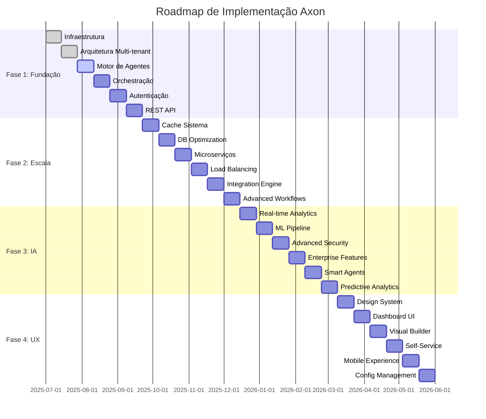

# Roadmap de Implementação - Plataforma Axon

## 🎯 Visão Geral da Implementação

Este roadmap detalha as ações técnicas específicas, sprints, dependências e entregas para implementar a plataforma Axon. Cada fase é dividida em sprints de 2 semanas com objetivos claros e mensuráveis.

---

## 🏗️ FASE 1: FUNDAÇÃO E ESTABILIZAÇÃO
*Jul-Set 2025 | 6 Sprints | 12 semanas*

### Sprint 1-2: Setup da Infraestrutura Base (Semanas 1-4)

#### 🔧 **Sprint 1: Infraestrutura e Ambiente**
**Objetivo**: Estabelecer ambiente de desenvolvimento e CI/CD

**Tarefas Técnicas:**
- [ ] Setup do repositório monorepo (Nx/Lerna)
- [ ] Configuração Docker/Docker Compose para desenvolvimento
- [ ] Pipeline CI/CD inicial (GitHub Actions/GitLab CI)
- [ ] Configuração de bancos de dados (PostgreSQL + Redis)
- [ ] Setup de observabilidade (Prometheus + Grafana)

**Entregáveis:**
- ✅ Ambiente de dev funcional
- ✅ Pipeline de CI executando
- ✅ Documentação de setup atualizada

**Responsáveis:** DevOps (Lead) + Backend Dev

---

#### 🏛️ **Sprint 2: Arquitetura Multi-tenant Core**
**Objetivo**: Implementar isolamento básico entre clientes

**Tarefas Técnicas:**
- [ ] Schema de banco multi-tenant (tenant_id em todas as tabelas)
- [ ] Middleware de tenant resolution
- [ ] Sistema de configuração por tenant
- [ ] Migrations e seeds para multi-tenancy
- [ ] Testes de isolamento de dados

**Entregáveis:**
- ✅ Base de dados multi-tenant funcionando
- ✅ Middleware de isolamento implementado
- ✅ Testes de isolamento passando (100%)

**Responsáveis:** Backend Dev (Lead) + Arquiteto

---

### Sprint 3-4: Integração N8N e Agentes (Semanas 5-8)

#### 🤖 **Sprint 3: Setup e Integração N8N**
**Objetivo**: Integrar N8N como motor de workflows e agentes

**Tarefas Técnicas:**
- [ ] Setup N8N cluster com multi-tenancy
- [ ] API wrapper para N8N (tenant isolation)
- [ ] Custom nodes para funcionalidades Axon
- [ ] Sistema de autenticação integrado N8N ↔ Axon
- [ ] Database schema para sincronização N8N

**Entregáveis:**
- ✅ N8N rodando com isolamento multi-tenant
- ✅ API wrapper funcionando
- ✅ Primeiros custom nodes criados

**Responsáveis:** Backend Dev (Lead) + N8N Specialist + Arquiteto

---

#### 🔄 **Sprint 4: Orquestração Avançada N8N**
**Objetivo**: Implementar recursos avançados sobre N8N

**Tarefas Técnicas:**
- [ ] Custom nodes para IA/ML workflows
- [ ] Sistema de templates de workflow
- [ ] Monitoring e logging integrado
- [ ] Webhook endpoints customizados
- [ ] Context persistence entre execuções

**Entregáveis:**
- ✅ Workflows de IA executando via N8N
- ✅ Templates funcionando
- ✅ Dashboard mostrando execuções N8N

**Responsáveis:** Backend Dev (2x) + N8N Specialist

---

### Sprint 5-6: API e Autenticação (Semanas 9-12)

#### 🔐 **Sprint 5: Sistema de Autenticação**
**Objetivo**: Implementar autenticação robusta e autorização

**Tarefas Técnicas:**
- [ ] JWT authentication com refresh tokens
- [ ] Role-based access control (RBAC)
- [ ] API rate limiting por tenant
- [ ] Session management
- [ ] Middleware de autorização

**Entregáveis:**
- ✅ Autenticação JWT funcionando
- ✅ RBAC implementado e testado
- ✅ Rate limiting ativo por tenant

**Responsáveis:** Backend Dev (Lead) + Security Engineer

---

#### 📡 **Sprint 6: REST API Completa**
**Objetivo**: Finalizar APIs REST e documentação

**Tarefas Técnicas:**
- [ ] CRUD completo para agentes e workflows
- [ ] API de monitoramento e logs
- [ ] Documentação OpenAPI/Swagger
- [ ] SDK básico (JavaScript/Python)
- [ ] Testes de integração da API

**Entregáveis:**
- ✅ API REST 100% funcional
- ✅ Documentação interativa (Swagger)
- ✅ SDK básico para desenvolvedores

**Responsáveis:** Backend Dev (2x) + Technical Writer

---

## 🚀 FASE 2: ESCALABILIDADE E PERFORMANCE
*Out-Dez 2025 | 6 Sprints | 12 semanas*

### Sprint 7-8: Cache e Otimização (Semanas 13-16)

#### ⚡ **Sprint 7: Sistema de Cache Distribuído**
**Objetivo**: Implementar cache para melhorar performance

**Tarefas Técnicas:**
- [ ] Implementação Redis cluster
- [ ] Cache de queries frequentes
- [ ] Cache de sessões e contexto
- [ ] Invalidação inteligente de cache
- [ ] Métricas de hit/miss ratio

**Entregáveis:**
- ✅ Redis cluster funcionando
- ✅ Cache reduzindo latência em 60%+
- ✅ Dashboard de métricas de cache

**Responsáveis:** Backend Dev (Lead) + DevOps

---

#### 🔍 **Sprint 8: Otimização de Database**
**Objetivo**: Otimizar queries e performance do banco

**Tarefas Técnicas:**
- [ ] Query optimization e indexação
- [ ] Connection pooling otimizado
- [ ] Read replicas para queries pesadas
- [ ] Database monitoring e alertas
- [ ] Cleanup automatizado de dados antigos

**Entregáveis:**
- ✅ Queries 80% mais rápidas
- ✅ Read replicas funcionando
- ✅ Monitoring de performance DB

**Responsáveis:** Backend Dev (Lead) + DBA

---

### Sprint 9-10: Microserviços (Semanas 17-20)

#### 🏗️ **Sprint 9: Decomposição em Microserviços**
**Objetivo**: Separar componentes críticos em microserviços

**Tarefas Técnicas:**
- [ ] Agent Service independente
- [ ] Notification Service
- [ ] Configuration Service
- [ ] Service discovery (Consul/etcd)
- [ ] Inter-service communication (gRPC)

**Entregáveis:**
- ✅ 3 microserviços funcionando independentemente
- ✅ Service mesh configurado
- ✅ Health checks e discovery ativo

**Responsáveis:** Backend Dev (3x) + Arquiteto

---

#### 🔄 **Sprint 10: Load Balancing e Auto-scaling**
**Objetivo**: Implementar balanceamento e escala automática

**Tarefas Técnicas:**
- [ ] HAProxy/Nginx como load balancer
- [ ] Auto-scaling baseado em CPU/Memory
- [ ] Circuit breaker pattern
- [ ] Distributed tracing (Jaeger)
- [ ] Chaos engineering básico

**Entregáveis:**
- ✅ Load balancer distribuindo tráfego
- ✅ Auto-scaling funcionando
- ✅ Tracing distribuído ativo

**Responsáveis:** DevOps (Lead) + Backend Dev

---

### Sprint 11-12: Integrações Avançadas (Semanas 21-24)

#### 🔌 **Sprint 11: N8N Custom Nodes e Conectores**
**Objetivo**: Expandir capacidades N8N com nodes customizados

**Tarefas Técnicas:**
- [ ] Custom nodes para sistemas populares (Slack, Teams, Email)
- [ ] N8N marketplace interno para nodes
- [ ] Node generator/scaffolding tools
- [ ] Versioning system para custom nodes
- [ ] Testing framework para nodes

**Entregáveis:**
- ✅ 5+ custom nodes funcionando
- ✅ Marketplace interno ativo
- ✅ Framework de testes para nodes

**Responsáveis:** N8N Specialist (Lead) + Backend Dev + Integration Specialist

---

#### 📊 **Sprint 12: N8N Advanced Workflows**
**Objetivo**: Implementar workflows complexos no N8N

**Tarefas Técnicas:**
- [ ] Sub-workflow support
- [ ] Conditional routing avançado
- [ ] Loop e iteration nodes
- [ ] Error handling workflows
- [ ] Workflow performance optimization

**Entregáveis:**
- ✅ Sub-workflows funcionando
- ✅ Conditional logic avançada
- ✅ Error handling robusto

**Responsáveis:** N8N Specialist (Lead) + Workflow Designer

---

## 🧠 FASE 3: INTELIGÊNCIA AVANÇADA
*Jan-Mar 2026 | 6 Sprints | 12 semanas*

### Sprint 13-14: Analytics e ML (Semanas 25-28)

#### 📈 **Sprint 13: Real-time Analytics**
**Objetivo**: Implementar analytics em tempo real

**Tarefas Técnicas:**
- [ ] Event streaming (Apache Kafka)
- [ ] Time-series database (InfluxDB)
- [ ] Real-time dashboards
- [ ] Alert system baseado em métricas
- [ ] Data pipeline para analytics

**Entregáveis:**
- ✅ Streaming de eventos funcionando
- ✅ Dashboards em tempo real
- ✅ Sistema de alertas ativo

**Responsáveis:** Data Engineer (Lead) + Backend Dev

---

#### 🤖 **Sprint 14: Machine Learning Pipeline**
**Objetivo**: Criar pipeline básico de ML

**Tarefas Técnicas:**
- [ ] Feature store para dados de agentes
- [ ] Model training pipeline
- [ ] A/B testing framework
- [ ] Model versioning e deployment
- [ ] Anomaly detection básica

**Entregáveis:**
- ✅ Pipeline de ML funcionando
- ✅ Primeiro modelo em produção
- ✅ A/B testing implementado

**Responsáveis:** ML Engineer (Lead) + Data Engineer

---

### Sprint 15-16: Segurança Enterprise (Semanas 29-32)

#### 🔒 **Sprint 15: Advanced Security**
**Objetivo**: Implementar segurança enterprise-grade

**Tarefas Técnicas:**
- [ ] End-to-end encryption
- [ ] Secret management (Vault)
- [ ] Audit logging completo
- [ ] Security scanning automatizado
- [ ] Compliance reporting

**Entregáveis:**
- ✅ E2E encryption ativo
- ✅ Audit logs completos
- ✅ Security scan passando

**Responsáveis:** Security Engineer (Lead) + DevOps

---

#### 🏢 **Sprint 16: Enterprise Features**
**Objetivo**: Adicionar recursos enterprise essenciais

**Tarefas Técnicas:**
- [ ] SSO/SAML integration
- [ ] Multi-region deployment
- [ ] Backup/restore automatizado
- [ ] Disaster recovery plan
- [ ] Compliance frameworks (SOC2)

**Entregáveis:**
- ✅ SSO funcionando
- ✅ Backup automatizado
- ✅ DR plan testado

**Responsáveis:** Backend Dev (Lead) + Compliance Officer

---

### Sprint 17-18: Intelligence Features (Semanas 33-36)

#### 🧠 **Sprint 17: N8N AI Nodes e Integração ML**
**Objetivo**: Criar nodes específicos para IA e ML

**Tarefas Técnicas:**
- [ ] Custom AI nodes (OpenAI, Claude, local LLMs)
- [ ] ML pipeline nodes (preprocessing, training, inference)
- [ ] Vector database integration nodes
- [ ] RAG (Retrieval Augmented Generation) nodes
- [ ] AI agent orchestration nodes

**Entregáveis:**
- ✅ 5+ AI nodes funcionando no N8N
- ✅ ML pipeline executando via workflows
- ✅ RAG system implementado

**Responsáveis:** ML Engineer (Lead) + N8N Specialist + AI Engineer

---

#### 🔮 **Sprint 18: Intelligent N8N Workflows**
**Objetivo**: Implementar workflows inteligentes e adaptativos

**Tarefas Técnicas:**
- [ ] Self-optimizing workflows
- [ ] AI-powered node recommendations
- [ ] Automated workflow generation
- [ ] Performance-based routing
- [ ] Intelligent error recovery

**Entregáveis:**
- ✅ Workflows auto-otimizando
- ✅ Recomendações de nodes funcionando
- ✅ Geração automática de workflows básica

**Responsáveis:** AI Engineer (Lead) + ML Engineer + N8N Specialist

---

## 💻 FASE 4: EXPERIÊNCIA DO USUÁRIO
*Abr-Jun 2026 | 6 Sprints | 12 semanas*

### Sprint 19-20: Modern UI/UX (Semanas 37-40)

#### 🎨 **Sprint 19: Design System e UI Components**
**Objetivo**: Criar design system consistente

**Tarefas Técnicas:**
- [ ] Design system (Storybook)
- [ ] Component library (React/Vue)
- [ ] Responsive design
- [ ] Accessibility compliance (WCAG)
- [ ] Design tokens

**Entregáveis:**
- ✅ Design system funcionando
- ✅ Component library publicada
- ✅ Accessibility score > 95%

**Responsáveis:** Frontend Dev (Lead) + UI/UX Designer

---

#### 📱 **Sprint 20: Dashboard e Monitoring UI**
**Objetivo**: Criar dashboards modernos e responsivos

**Tarefas Técnicas:**
- [ ] Real-time dashboard widgets
- [ ] Customizable dashboard layouts
- [ ] Mobile-responsive design
- [ ] Dark/light theme support
- [ ] Progressive Web App (PWA)

**Entregáveis:**
- ✅ Dashboard responsivo funcionando
- ✅ PWA instalável
- ✅ Temas implementados

**Responsáveis:** Frontend Dev (2x) + UI Designer

---

### Sprint 21-22: No-Code Tools (Semanas 41-44)

#### 🔧 **Sprint 21: N8N UI Customização**
**Objetivo**: Customizar interface N8N para Axon

**Tarefas Técnicas:**
- [ ] N8N white-label customization
- [ ] Embedded N8N editor no Axon
- [ ] Custom theme para match Axon design
- [ ] Multi-tenant UI separation
- [ ] Permission-based node visibility

**Entregáveis:**
- ✅ N8N editor embarcado no Axon
- ✅ UI customizada com branding Axon
- ✅ Permissões por tenant funcionando

**Responsáveis:** Frontend Dev (Lead) + N8N Specialist + UI Designer

---

#### 🚀 **Sprint 22: Self-Service N8N Templates**
**Objetivo**: Sistema de templates e self-service

**Tarefas Técnicas:**
- [ ] Template marketplace N8N
- [ ] Workflow import/export system
- [ ] Self-service template deployment
- [ ] Template versioning e updates
- [ ] Community template sharing

**Entregáveis:**
- ✅ Marketplace de templates funcionando
- ✅ Import/export de workflows
- ✅ Self-service deployment ativo

**Responsáveis:** Frontend Dev (Lead) + Product Manager + N8N Specialist

---

### Sprint 23-24: Mobile e Offline (Semanas 45-48)

#### 📱 **Sprint 23: Mobile Experience**
**Objetivo**: Otimizar experiência mobile

**Tarefas Técnicas:**
- [ ] Mobile app (React Native/Flutter)
- [ ] Push notifications
- [ ] Offline-first architecture
- [ ] Mobile-specific workflows
- [ ] Touch-optimized interfaces

**Entregáveis:**
- ✅ Mobile app funcional
- ✅ Push notifications ativas
- ✅ Offline capabilities básicas

**Responsáveis:** Mobile Dev (Lead) + Frontend Dev

---

#### 🔄 **Sprint 24: Configuration Management**
**Objetivo**: Avançar gerenciamento de configurações

**Tarefas Técnicas:**
- [ ] Configuration as Code
- [ ] Environment promotion
- [ ] Rollback capabilities
- [ ] Configuration diff/comparison
- [ ] Automated testing de configs

**Entregáveis:**
- ✅ Config as Code implementado
- ✅ Environment promotion funcionando
- ✅ Rollback testado e funcionando

**Responsáveis:** DevOps (Lead) + Backend Dev

---

## 📊 Cronograma de Dependências

---

## 🎯 Marcos de Entrega (Milestones)

### 🏁 **Milestone 1** - MVP Funcional (Final Sprint 6)
- ✅ Plataforma multi-tenant funcionando
- ✅ N8N integrado com isolamento por tenant
- ✅ Workflows básicos executando via N8N
- ✅ API REST completa e documentada
- ✅ Autenticação e autorização robustas

### 🚀 **Milestone 2** - Produção Ready (Final Sprint 12)
- ✅ Sistema escalável com microserviços
- ✅ N8N cluster otimizado e performante
- ✅ Custom nodes para integrações principais
- ✅ Cache e otimizações implementadas
- ✅ Monitoring e observabilidade completos

### 🧠 **Milestone 3** - IA Avançada (Final Sprint 18)
- ✅ Analytics em tempo real
- ✅ N8N AI nodes funcionando
- ✅ Workflows inteligentes e adaptativos
- ✅ Segurança enterprise-grade
- ✅ ML pipeline integrado via N8N

### 💻 **Milestone 4** - Experiência Completa (Final Sprint 24)
- ✅ N8N editor embarcado e customizado
- ✅ Template marketplace funcionando
- ✅ Self-service completo via N8N
- ✅ Experiência mobile otimizada
- ✅ Workflow generation automática

---

## 🔄 Processo de Implementação

### Daily Standups
- **Quando**: Todos os dias às 9:00
- **Duração**: 15 minutos
- **Foco**: Bloqueios, progresso, próximos passos

### Sprint Planning
- **Quando**: Início de cada sprint (segunda-feira)
- **Duração**: 2 horas
- **Participantes**: Todo o time de desenvolvimento

### Sprint Review & Retrospective
- **Quando**: Final de cada sprint (sexta-feira)
- **Duração**: 2 horas (1h review + 1h retro)
- **Foco**: Demo, feedback, melhorias

### Technical Reviews
- **Quando**: Meio de cada sprint
- **Duração**: 1 hora
- **Foco**: Arquitetura, code review, standards

---

## ⚠️ Gestão de Riscos Técnicos

### Sprint-Level Risk Mitigation
- **Buffer de 20%** em cada sprint para imprevistos
- **Proof of Concepts** para features complexas
- **Spike stories** para investigação técnica
- **Fallback plans** para features críticas

### Continuous Integration
- **Testes automatizados** em cada PR
- **Security scanning** em cada build
- **Performance testing** semanal
- **Dependency updates** automáticas

---

## 📋 Definition of Done

### Feature Level
- [ ] Code desenvolvido e testado
- [ ] Testes unitários passando (>90% coverage)
- [ ] Testes de integração passando
- [ ] Code review aprovado
- [ ] Documentação atualizada

### Sprint Level
- [ ] Todas as features do sprint completas
- [ ] Performance benchmarks atingidos
- [ ] Security scan passando
- [ ] Demo executada com sucesso
- [ ] Deployment para staging realizado

### Milestone Level
- [ ] Todos os sprints da fase completos
- [ ] Testes de aceitação passando
- [ ] Load testing realizado
- [ ] Documentação de release atualizada
- [ ] Go/No-Go decision para próxima fase

---

**📅 Última atualização**: 29 de Junho de 2025  
**🔄 Próxima revisão**: 15 de Julho de 2025