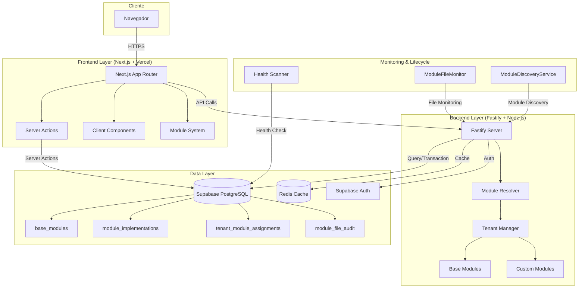

# Visão Geral da Arquitetura Axon - 2025

## 1. Princípios Fundamentais

A arquitetura da plataforma Axon evoluiu para um sistema enterprise-grade baseado nos seguintes princípios:

- **Modularidade Avançada:** Sistema de 3 camadas (Base Modules → Implementações → Atribuições) permite máxima flexibilidade e reutilização. Separação completa entre frontend (Next.js) e backend (Fastify) com sistema modular independente.
- **Escalabilidade Horizontal:** Cada componente é projetado para escalar independentemente, incluindo backend modular com resolução automática por tenant e sistema de health monitoring.
- **Multi-tenancy Nativo:** Isolamento completo por organização com Row-Level Security (RLS), configurações personalizadas por tenant, e gestão granular de módulos e permissões.
- **Segurança Enterprise:** Autenticação robusta, auditoria completa de mudanças, controle de acesso granular, e monitoramento automático de integridade do sistema.
- **Lifecycle Management:** Sistema robusto de monitoramento de saúde, descoberta automática de módulos, e auditoria de mudanças com recuperação automática.

## 2. Arquitetura Moderna

A plataforma evoluiu para uma arquitetura distribuída com frontend e backend independentes:

### **Frontend Layer (Next.js 14)**
- **App Router**: Roteamento avançado com Server Components e Client Components
- **Server Actions**: Execução server-side integrada para operações de dados
- **Module System**: Sistema de módulos baseado em `tenant_module_assignments`
- **Multi-Client**: Suporte dinâmico para diferentes clientes (`NEXT_PUBLIC_CLIENT_TYPE`)
- **Component Loading**: Carregamento dinâmico baseado em implementações específicas

### **Backend Layer (Fastify)**
- **High Performance**: API Node.js otimizada para alta throughput
- **Module Resolver**: Resolução automática de módulos por tenant
- **Tenant Manager**: Gestão multi-tenant com isolamento completo
- **Base Modules**: Módulos reutilizáveis (`performance-base`, etc.)
- **Custom Modules**: Módulos específicos por cliente (`banban-performance`, etc.)
- **Webhook System**: Processamento de integrações externas

### **Data Layer**
- **PostgreSQL (Supabase)**: Banco principal com RLS nativo
  - `base_modules`: Catálogo de módulos disponíveis
  - `module_implementations`: Implementações específicas de módulos
  - `tenant_module_assignments`: Atribuições por organização
  - `module_file_audit`: Auditoria completa de mudanças
- **Redis Cache**: Cache distribuído para performance
- **Supabase Auth**: Autenticação JWT com MFA

### **Monitoring & Lifecycle**
- **ModuleFileMonitor**: Monitoramento automático de arquivos de módulos
- **ModuleDiscoveryService**: Descoberta automática de novos módulos
- **Health Scanner**: Verificação periódica de integridade do sistema
- **Audit System**: Rastreamento completo de mudanças e eventos

## 3. Fluxo Modular Avançado

### **Ciclo de Vida de Módulos**

1. **Descoberta e Registro**
   - `ModuleDiscoveryService` escaneia filesystem para novos módulos
   - Módulos são registrados em `base_modules` (catálogo)
   - Implementações específicas são criadas em `module_implementations`

2. **Atribuição por Tenant**
   - Admin atribui módulos para organizações via `assignModuleToOrg()`
   - Sistema cria registros em `tenant_module_assignments`
   - Configurações específicas são armazenadas em `custom_config`

3. **Resolução em Runtime**
   - Frontend consulta `getVisibleModulesForTenant()` para carregar sidebar
   - Backend usa `TenantManager` para resolver módulos ativos
   - Componentes são carregados dinamicamente baseado em `component_path`

### **Fluxo de Requisição Moderna**

1. **Cliente acessa** sistema via URL (`/tenant-slug/module-path`)
2. **Next.js** identifica tenant via slug e carrega configuração específica
3. **Server Actions** executam operações de dados com RLS automático
4. **Module System** carrega apenas módulos atribuídos ao tenant
5. **Backend** resolve módulos via `ModuleResolver` e `TenantManager`
6. **Health Monitor** verifica integridade e detecta mudanças
7. **Audit System** registra todas as operações para compliance

### **Sistema de Segurança Multi-Camada**

- **Row-Level Security (RLS)**: Isolamento automático por `tenant_id`
- **Module Permissions**: Controle granular via `permissions_override`
- **Component Isolation**: Componentes carregados apenas se autorizados
- **Audit Trail**: Registro completo em `module_file_audit`
- **Health Monitoring**: Detecção proativa de problemas de segurança

## 4. Benefícios da Nova Arquitetura

### **Escalabilidade Enterprise**
- Backend independente permite escala horizontal
- Sistema modular suporta múltiplos clientes simultaneamente
- Cache inteligente reduz carga de banco
- Health monitoring previne degradação

### **Flexibilidade Total**
- Módulos base reutilizáveis entre clientes
- Implementações específicas por necessidade
- Configuração granular por tenant
- Sistema de templates automáticos

### **Manutenibilidade Avançada**
- Separação clara entre base/implementações/atribuições
- Auditoria completa de mudanças
- Monitoramento automático de saúde
- Recuperação automática de problemas

Este design moderno garante um sistema **enterprise-grade** onde a modularidade, segurança e performance são otimizadas para suportar crescimento exponencial mantendo simplicidade operacional. 