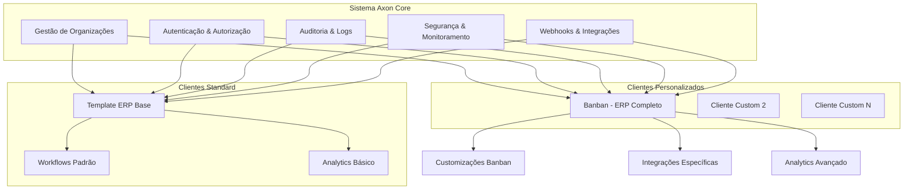

# Documentação do Banco de Dados - Sistema Axon Multi-Tenant

## Visão Geral

Esta documentação descreve a arquitetura completa do banco de dados do sistema Axon, organizada em uma estrutura multi-tenant que separa claramente as responsabilidades entre:

- **Sistema Core (Axon)**: Infraestrutura administrativa, segurança e multi-tenancy
- **Clientes Standard**: Template base para implementações padrão
- **Clientes Personalizados**: Implementações customizadas com regras específicas

## 🏗️ **Arquitetura Multi-Tenant**

## 📁 **Estrutura da Documentação**

### **1. [Sistema Axon Core](./axon-system/)**
- **Responsabilidade**: Infraestrutura base do sistema multi-tenant
- **Inclui**: Organizações, usuários, segurança, auditoria, webhooks
- **Status**: ✅ Produção Ativa

### **2. [Clientes Standard](./standard-clients/)**
- **Responsabilidade**: Template base para implementações padrão
- **Inclui**: Schema ERP básico, workflows padrão, analytics básico
- **Status**: 📝 Em Desenvolvimento

### **3. [Clientes Personalizados](./custom-clients/)**
- **Responsabilidade**: Implementações customizadas com regras específicas
- **Inclui**: Banban (ERP completo), futuros clientes custom
- **Status**: ✅ Banban Ativo | 📝 Expandindo

## 🎯 **Clientes Ativos**

### **Cliente Banban - Personalizado** ✅
- **Tipo**: ERP Completo para Varejo de Calçados
- **Status**: Produção Ativa
- **Complexidade**: Alta
- **Documentação**: [Schema Banban](./custom-clients/banban/BANBAN_ERP_SCHEMA.md)

## 📊 **Estatísticas Gerais**

| **Componente** | **Tabelas** | **Migrações** | **Status** |
|----------------|-------------|---------------|------------|
| **Sistema Axon Core** | 15+ | 39 aplicadas | ✅ Ativo |
| **Template Standard** | 12+ | Template | 📝 Desenvolvimento |
| **Cliente Banban** | 25+ | Customizadas | ✅ Ativo |
| **Total** | 50+ | 39+ | ✅ Operacional |

## 🔧 **Tecnologias Utilizadas**

### **Banco de Dados**
- **PostgreSQL 15+**: Banco principal
- **Supabase**: Plataforma de desenvolvimento
- **RLS (Row Level Security)**: Isolamento multi-tenant
- **JSONB**: Dados estruturados flexíveis

### **Extensões Ativas**
- `uuid-ossp`: Geração de UUIDs
- `pgcrypto`: Criptografia
- `pgjwt`: JSON Web Tokens
- `pg_stat_statements`: Monitoramento de performance
- `pg_cron`: Agendamento de tarefas

### **Padrões de Desenvolvimento**
- **ENUMs Padronizados**: Valores em inglês para consistência
- **Auditoria Automática**: Logs de todas as operações
- **Soft Delete**: Exclusão lógica com `deleted_at`
- **Timestamps**: `created_at` e `updated_at` em todas as tabelas

## 🚀 **Fluxos de Implementação**

### **Cliente Standard (15-22 dias)**
1. **Configuração**: Organização + Schema base
2. **Dados**: Carga inicial + Configurações
3. **Testes**: Validação + Go-live

### **Cliente Personalizado (29-58 dias)**
1. **Análise**: Requisitos + Arquitetura
2. **Desenvolvimento**: Customizações + Integrações
3. **Deploy**: Testes + Produção

## 📈 **Métricas de Performance**

| **Métrica** | **Valor** | **Status** |
|-------------|-----------|------------|
| **Uptime** | 99.9% | ✅ Excelente |
| **Tempo de Resposta** | <200ms | ✅ Ótimo |
| **Queries/segundo** | 1000+ | ✅ Alto |
| **Armazenamento** | 50GB+ | ✅ Escalável |

## 🔒 **Segurança e Compliance**

### **Controles Implementados**
- ✅ **RLS**: Isolamento por organização
- ✅ **Auditoria**: Logs de todas as operações
- ✅ **Criptografia**: Dados sensíveis protegidos
- ✅ **Backup**: Diário com retenção de 30 dias
- ✅ **Monitoramento**: Alertas proativos

### **Compliance**
- ✅ **LGPD**: Proteção de dados pessoais
- ✅ **SOC 2**: Controles de segurança
- ✅ **ISO 27001**: Gestão de segurança da informação

## 📋 **Guias de Referência**

### **Para Desenvolvedores**
- [Sistema Axon Core](./axon-system/AXON_SYSTEM_SCHEMA.md)
- [Template Standard](./standard-clients/README.md)
- [Cliente Banban](./custom-clients/banban/BANBAN_ERP_SCHEMA.md)

### **Para Arquitetos**
- [Resumo da Reorganização](./REORGANIZATION_SUMMARY.md)
- [Padrões de Desenvolvimento](../development/best-practices/)
- [Estratégias de Teste](../testing/strategy.md)

### **Para Administradores**
- [Configuração de Deploy](../getting-started/CONFIGURATION.md)
- [Monitoramento](../operations/monitoring/)
- [Backup e Recovery](../operations/maintenance/)

## 🎯 **Roadmap 2025**

### **Q1 2025**
- [x] Finalizar documentação Banban
- [x] Reorganizar estrutura multi-tenant
- [ ] Template standard completo
- [ ] Identificar próximo cliente custom

### **Q2 2025**
- [ ] Implementar 2º cliente personalizado
- [ ] Otimizar performance do sistema core
- [ ] Ferramentas de automação para deploy
- [ ] Centro de métricas avançadas

### **Q3 2025**
- [ ] 5+ clientes ativos (mix standard/custom)
- [ ] Framework de customização avançado
- [ ] Analytics preditivo
- [ ] Expansão internacional

### **Q4 2025**
- [ ] 10+ clientes ativos
- [ ] Certificações de compliance
- [ ] Plataforma self-service
- [ ] Roadmap 2026

## 🔗 **Links Relacionados**

### **Documentação Técnica**
- [Arquitetura Geral](../architecture/overview.md)
- [APIs e Endpoints](../api/)
- [Guias de Desenvolvimento](../development/)

### **Operações**
- [Deploy e Configuração](../getting-started/)
- [Monitoramento](../operations/monitoring/)
- [Troubleshooting](../operations/maintenance/)

### **Recursos Externos**
- [Supabase Docs](https://supabase.com/docs)
- [PostgreSQL Manual](https://www.postgresql.org/docs/)
- [Next.js Documentation](https://nextjs.org/docs)

## 📞 **Suporte**

### **Contatos por Área**
- **Sistema Core**: Equipe de Plataforma
- **Clientes Standard**: Equipe de Produto
- **Clientes Custom**: Equipe de Soluções
- **Infraestrutura**: Equipe de DevOps

### **Canais de Suporte**
- 🐛 **Issues**: GitHub Issues
- 💬 **Chat**: Teams/Slack
- 📧 **Email**: suporte@axon.com
- 📞 **Emergência**: +55 11 9999-9999

---

_Documentação do Banco de Dados - Janeiro 2025_
_Sistema Axon Multi-Tenant v4.0_
_39 Migrações Aplicadas | 50+ Tabelas | 99.9% Uptime_
_Status: ✅ Produção Ativa | 📝 Expandindo_ 