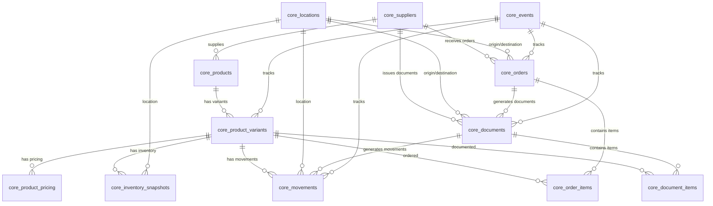

# Schema ERP Banban - Cliente Personalizado

## Visão Geral

O Banban é um cliente personalizado do sistema Axon com implementação específica de ERP para gestão de produtos, estoque e operações de varejo. Este schema representa a customização desenvolvida especificamente para as necessidades do cliente Banban.

## 📋 Informações do Cliente

- **Cliente**: Banban
- **Tipo**: Personalizado (Custom)
- **Implementação**: ERP Completo
- **Versão**: 3.0
- **Status**: ✅ Ativo em Produção

## 📋 Índice

1. [Módulo de Produtos](#módulo-de-produtos)
2. [Módulo de Localizações](#módulo-de-localizações)
3. [Módulo de Fornecedores](#módulo-de-fornecedores)
4. [Módulo de Pedidos](#módulo-de-pedidos)
5. [Módulo de Documentos](#módulo-de-documentos)
6. [Módulo de Movimentações](#módulo-de-movimentações)
7. [Módulo de Eventos](#módulo-de-eventos)
8. [Módulo de Estoque](#módulo-de-estoque)
9. [Módulo de Analytics](#módulo-de-analytics)
10. [Customizações Específicas](#customizações-específicas)
11. [Relacionamentos e Integridade](#relacionamentos-e-integridade)
12. [Queries Comuns](#queries-comuns)

---

## Módulo de Produtos

### `core_products`

**Função**: Catálogo principal de produtos da empresa Banban.

| Campo                  | Tipo        | Obrigatório | Descrição                          | Exemplo                                |
| ---------------------- | ----------- | ----------- | ---------------------------------- | -------------------------------------- |
| `id`                   | UUID        | ✅          | PK interna, gerada automaticamente | `uuid_generate_v4()`                   |
| `external_id`          | TEXT        | ✅          | Código do produto no ERP Banban    | `VONBX2099`                            |
| `product_name`         | TEXT        | ✅          | Nome do produto                    | `Tênis Vonpar Boost`                   |
| `description`          | TEXT        | ✅          | Descrição detalhada                | `Tênis esportivo com tecnologia boost` |
| `category`             | TEXT        | ✅          | Categoria principal                | `CALÇADOS`                             |
| `sub_category`         | TEXT        | ❌          | Subcategoria                       | `TÊNIS ESPORTIVO`                      |
| `gtin`                 | TEXT        | ✅          | Código de barras do produto        | `7891234567890`                        |
| `unit_measure`         | ENUM        | ✅          | Unidade de medida                  | `PAR`, `UND`, `CX`                     |
| `folder`               | TEXT        | ✅          | Pasta/coleção                      | `VERÃO 2024`                           |
| `type`                 | TEXT        | ✅          | Tipo do produto                    | `CALÇADO`                              |
| `gender`               | ENUM        | ✅          | Gênero alvo                        | `MAS`, `FEM`, `USX`                    |
| `supplier_external_id` | TEXT        | ✅          | ID do fornecedor no ERP            | `FORN001`                              |
| `status`               | TEXT        | ✅          | Status do produto                  | `Ativo`, `Inativo`                     |
| `created_at`           | TIMESTAMPTZ | ✅          | Data de criação                    | `now()`                                |
| `updated_at`           | TIMESTAMPTZ | ✅          | Data de atualização                | `now()`                                |

**Customizações Banban**:
- Campo `folder` usado para coleções sazonais específicas do Banban
- Campo `gender` com valores específicos para segmentação de mercado
- Integração com sistema ERP proprietário via `external_id`

### `core_product_variants`

**Função**: Variações de produtos (cor, tamanho, etc.) específicas do catálogo Banban.

| Campo          | Tipo        | Obrigatório | Descrição                   | Exemplo              |
| -------------- | ----------- | ----------- | --------------------------- | -------------------- |
| `id`           | UUID        | ✅          | PK interna                  | `uuid_generate_v4()` |
| `product_id`   | UUID        | ✅          | FK → `core_products.id`     | —                    |
| `external_id`  | TEXT        | ❌          | Código da variação no ERP   | `VONBX2099AZUL34`    |
| `size`         | TEXT        | ✅          | Tamanho                     | `34`, `M`, `GG`      |
| `color`        | TEXT        | ✅          | Cor                         | `AZUL`, `PRETO`      |
| `gtin_variant` | TEXT        | ❌          | GTIN específico da variação | `7891234567891`      |
| `sku`          | TEXT        | ❌          | SKU gerado automaticamente  | `VONBX2099-34-AZUL`  |
| `created_at`   | TIMESTAMPTZ | ✅          | Data de criação             | `now()`              |
| `updated_at`   | TIMESTAMPTZ | ✅          | Data de atualização         | `now()`              |

**Customizações Banban**:
- SKU gerado automaticamente seguindo padrão específico do Banban
- Integração com sistema de cores e tamanhos do ERP proprietário

### `core_product_pricing`

**Função**: Histórico de preços por variação de produto com regras específicas do Banban.

| Campo               | Tipo          | Obrigatório | Descrição                       | Exemplo                         |
| ------------------- | ------------- | ----------- | ------------------------------- | ------------------------------- |
| `id`                | UUID          | ✅          | PK interna                      | `uuid_generate_v4()`            |
| `product_id`        | UUID          | ❌          | FK → `core_products.id`         | —                               |
| `variant_id`        | UUID          | ✅          | FK → `core_product_variants.id` | —                               |
| `price_type`        | TEXT          | ✅          | Tipo de preço                   | `BASE`, `CUSTO`, `PROMO`, `VIP` |
| `price_value`       | NUMERIC(12,4) | ✅          | Valor do preço                  | `199.90`                        |
| `cost_price`        | NUMERIC(12,4) | ❌          | Preço de custo                  | `89.50`                         |
| `margin_percentage` | NUMERIC       | ❌          | Margem percentual               | `55.2`                          |
| `markup_percentage` | NUMERIC       | ❌          | Markup percentual               | `123.4`                         |
| `valid_from`        | DATE          | ✅          | Data início vigência            | `2024-01-01`                    |
| `valid_to`          | DATE          | ❌          | Data fim vigência               | `2024-12-31`                    |
| `change_reason`     | TEXT          | ❌          | Motivo da alteração             | `Reajuste sazonal`              |
| `created_at`        | TIMESTAMPTZ   | ✅          | Data de criação                 | `now()`                         |
| `updated_at`        | TIMESTAMPTZ   | ✅          | Data de atualização             | `now()`                         |

**Customizações Banban**:
- Tipos de preço específicos: `BASE`, `CUSTO`, `PROMO`, `VIP`
- Cálculo automático de margem e markup
- Controle de vigência para campanhas promocionais

---

## Módulo de Localizações

### `core_locations`

**Função**: Centros de distribuição e lojas da rede Banban.

| Campo           | Tipo        | Obrigatório | Descrição                    | Exemplo                            |
| --------------- | ----------- | ----------- | ---------------------------- | ---------------------------------- |
| `id`            | UUID        | ✅          | PK interna                   | `uuid_generate_v4()`               |
| `external_id`   | TEXT        | ✅          | Código da localização no ERP | `CD001`, `LOJA045`                 |
| `name`          | TEXT        | ✅          | Nome da localização          | `Centro de Distribuição Principal` |
| `location_type` | ENUM        | ✅          | Tipo de localização          | `CD`, `STORE`                      |
| `address`       | TEXT        | ❌          | Endereço completo            | `Rua das Flores, 123`              |
| `created_at`    | TIMESTAMPTZ | ✅          | Data de criação              | `now()`                            |
| `updated_at`    | TIMESTAMPTZ | ✅          | Data de atualização          | `now()`                            |

**Customizações Banban**:
- Integração com sistema de logística proprietário
- Códigos de localização seguem padrão específico do Banban

---

## Módulo de Fornecedores

### `core_suppliers`

**Função**: Cadastro de fornecedores específicos do Banban.

| Campo         | Tipo        | Obrigatório | Descrição                   | Exemplo                             |
| ------------- | ----------- | ----------- | --------------------------- | ----------------------------------- |
| `id`          | UUID        | ✅          | PK interna                  | `uuid_generate_v4()`                |
| `external_id` | TEXT        | ✅          | Código do fornecedor no ERP | `FORN001`                           |
| `trade_name`  | TEXT        | ✅          | Nome fantasia               | `Vonpar Calçados`                   |
| `legal_name`  | TEXT        | ❌          | Razão social                | `Vonpar Indústria de Calçados Ltda` |
| `cnpj`        | TEXT        | ❌          | CNPJ                        | `12.345.678/0001-90`                |
| `created_at`  | TIMESTAMPTZ | ✅          | Data de criação             | `now()`                             |
| `updated_at`  | TIMESTAMPTZ | ✅          | Data de atualização         | `now()`                             |

**Customizações Banban**:
- Integração com sistema de compras proprietário
- Validação específica de CNPJ para fornecedores brasileiros

---

## Módulo de Pedidos

### `core_orders`

**Função**: Pedidos de compra e transferência específicos do fluxo Banban.

| Campo                | Tipo        | Obrigatório | Descrição                          | Exemplo                  |
| -------------------- | ----------- | ----------- | ---------------------------------- | ------------------------ |
| `id`                 | UUID        | ✅          | PK interna                         | `uuid_generate_v4()`     |
| `external_id`        | TEXT        | ✅          | Número do pedido no ERP            | `PC2024001`              |
| `supplier_id`        | UUID        | ❌          | FK → `core_suppliers.id`           | —                        |
| `origin_location_id` | UUID        | ❌          | FK → `core_locations.id` (origem)  | —                        |
| `dest_location_id`   | UUID        | ❌          | FK → `core_locations.id` (destino) | —                        |
| `order_type`         | ENUM        | ✅          | Tipo do pedido                     | `PURCHASE`, `TRANSFER`   |
| `status`             | ENUM        | ✅          | Status do pedido                   | `NEW`, `APPROVED`, `CANCELLED` |
| `issue_timestamp`    | TIMESTAMPTZ | ✅          | Data/hora de emissão               | `2024-01-15 10:30:00`    |
| `created_at`         | TIMESTAMPTZ | ✅          | Data de criação                    | `now()`                  |
| `updated_at`         | TIMESTAMPTZ | ✅          | Data de atualização                | `now()`                  |

**Customizações Banban**:
- Workflow de aprovação específico para pedidos
- Integração com sistema de compras proprietário
- Regras de negócio específicas para transferências entre lojas

---

## Módulo de Documentos

### `core_documents`

**Função**: Notas fiscais e documentos de movimentação específicos do Banban.

| Campo                | Tipo        | Obrigatório | Descrição                          | Exemplo                     |
| -------------------- | ----------- | ----------- | ---------------------------------- | --------------------------- |
| `id`                 | UUID        | ✅          | PK interna                         | `uuid_generate_v4()`        |
| `external_id`        | TEXT        | ✅          | Número do documento no ERP         | `NF000123456`               |
| `order_id`           | UUID        | ❌          | FK → `core_orders.id`              | —                           |
| `supplier_id`        | UUID        | ❌          | FK → `core_suppliers.id`           | —                           |
| `origin_location_id` | UUID        | ❌          | FK → `core_locations.id` (origem)  | —                           |
| `dest_location_id`   | UUID        | ❌          | FK → `core_locations.id` (destino) | —                           |
| `doc_type`           | ENUM        | ✅          | Tipo do documento                  | `SUPPLIER_IN`, `TRANSFER_OUT` |
| `status`             | ENUM        | ✅          | Status do documento                | `PENDING`, `EFFECTIVE_CD`   |
| `issue_date`         | DATE        | ✅          | Data de emissão                    | `2024-01-15`                |
| `due_date`           | DATE        | ❌          | Data de vencimento                 | `2024-02-15`                |
| `total_value`        | NUMERIC(12,2) | ❌        | Valor total do documento           | `4550.00`                   |
| `created_at`         | TIMESTAMPTZ | ✅          | Data de criação                    | `now()`                     |
| `updated_at`         | TIMESTAMPTZ | ✅          | Data de atualização                | `now()`                     |

**Customizações Banban**:
- Status de documento com 25 valores específicos do workflow Banban
- Integração com sistema fiscal proprietário
- Controle de vencimento para gestão financeira

---

## Módulo de Movimentações

### `core_movements`

**Função**: Registro de todas as movimentações de estoque específicas do Banban.

| Campo           | Tipo          | Obrigatório | Descrição                       | Exemplo                  |
| --------------- | ------------- | ----------- | ------------------------------- | ------------------------ |
| `id`            | UUID          | ✅          | PK interna                      | `uuid_generate_v4()`     |
| `variant_id`    | UUID          | ✅          | FK → `core_product_variants.id` | —                        |
| `location_id`   | UUID          | ✅          | FK → `core_locations.id`        | —                        |
| `document_id`   | UUID          | ❌          | FK → `core_documents.id`        | —                        |
| `movement_type` | ENUM          | ✅          | Tipo de movimentação            | `CD_RECEIPT`, `SALE`     |
| `qty_moved`     | INTEGER       | ✅          | Quantidade movimentada          | `50`                     |
| `unit_cost`     | NUMERIC(12,4) | ❌          | Custo unitário                  | `45.50`                  |
| `movement_ts`   | TIMESTAMPTZ   | ✅          | Timestamp da movimentação       | `2024-01-15 14:30:00`    |
| `created_at`    | TIMESTAMPTZ   | ✅          | Data de criação                 | `now()`                  |

**Customizações Banban**:
- Tipos de movimentação específicos do fluxo Banban
- Integração com sistema de estoque proprietário
- Rastreabilidade completa de movimentações

---

## Módulo de Eventos

### `core_events`

**Função**: Log de eventos do sistema ERP específico do Banban.

| Campo         | Tipo        | Obrigatório | Descrição                    | Exemplo                      |
| ------------- | ----------- | ----------- | ---------------------------- | ---------------------------- |
| `id`          | UUID        | ✅          | PK interna                   | `uuid_generate_v4()`         |
| `entity_type` | ENUM        | ✅          | Tipo de entidade             | `ORDER`, `DOCUMENT`          |
| `entity_id`   | UUID        | ✅          | ID da entidade               | —                            |
| `event_code`  | ENUM        | ✅          | Código do evento             | `purchase_order_created`     |
| `event_data`  | JSONB       | ❌          | Dados do evento              | `{"order_total": 1000.00}`   |
| `timestamp`   | TIMESTAMPTZ | ✅          | Timestamp do evento          | `2024-01-15 10:00:00`        |
| `created_at`  | TIMESTAMPTZ | ✅          | Data de criação              | `now()`                      |

**Customizações Banban**:
- Códigos de evento específicos do workflow Banban
- Integração com sistema de auditoria proprietário
- Dados de evento customizados para análises específicas

---

## Módulo de Estoque

### `core_inventory_snapshots`

**Função**: Snapshots de estoque por localização e data específicos do Banban.

| Campo         | Tipo        | Obrigatório | Descrição                       | Exemplo              |
| ------------- | ----------- | ----------- | ------------------------------- | -------------------- |
| `id`          | UUID        | ✅          | PK interna                      | `uuid_generate_v4()` |
| `variant_id`  | UUID        | ✅          | FK → `core_product_variants.id` | —                    |
| `location_id` | UUID        | ✅          | FK → `core_locations.id`        | —                    |
| `qty_on_hand` | INTEGER     | ✅          | Quantidade em estoque           | `150`                |
| `snapshot_ts` | TIMESTAMPTZ | ✅          | Timestamp do snapshot           | `2024-01-15 23:59:59`|
| `created_at`  | TIMESTAMPTZ | ✅          | Data de criação                 | `now()`              |

**Customizações Banban**:
- Snapshots diários automáticos às 23:59
- Integração com sistema de inventário proprietário
- Alertas automáticos para estoque baixo

---

## Módulo de Analytics

### `mart_sales_summary`

**Função**: Resumo de vendas para análises específicas do Banban.

| Campo           | Tipo          | Obrigatório | Descrição                | Exemplo              |
| --------------- | ------------- | ----------- | ------------------------ | -------------------- |
| `id`            | UUID          | ✅          | PK interna               | `uuid_generate_v4()` |
| `date`          | DATE          | ✅          | Data da venda            | `2024-01-15`         |
| `location_id`   | UUID          | ✅          | FK → `core_locations.id` | —                    |
| `variant_id`    | UUID          | ✅          | FK → `core_product_variants.id` | —         |
| `qty_sold`      | INTEGER       | ✅          | Quantidade vendida       | `10`                 |
| `revenue`       | NUMERIC(12,2) | ✅          | Receita                  | `1999.00`            |
| `cost`          | NUMERIC(12,2) | ✅          | Custo                    | `895.00`             |
| `profit`        | NUMERIC(12,2) | ✅          | Lucro                    | `1104.00`            |
| `created_at`    | TIMESTAMPTZ   | ✅          | Data de criação          | `now()`              |

### `mart_inventory_summary`

**Função**: Resumo de estoque para análises específicas do Banban.

| Campo           | Tipo          | Obrigatório | Descrição                | Exemplo              |
| --------------- | ------------- | ----------- | ------------------------ | -------------------- |
| `id`            | UUID          | ✅          | PK interna               | `uuid_generate_v4()` |
| `date`          | DATE          | ✅          | Data do snapshot         | `2024-01-15`         |
| `location_id`   | UUID          | ✅          | FK → `core_locations.id` | —                    |
| `variant_id`    | UUID          | ✅          | FK → `core_product_variants.id` | —         |
| `qty_on_hand`   | INTEGER       | ✅          | Quantidade em estoque    | `150`                |
| `inventory_value`| NUMERIC(12,2)| ✅          | Valor do estoque         | `6750.00`            |
| `created_at`    | TIMESTAMPTZ   | ✅          | Data de criação          | `now()`              |

**Customizações Analytics Banban**:
- ETL diário automático às 02:00
- Dashboards específicos para gestão Banban
- KPIs customizados para performance de vendas

---

## Customizações Específicas

### **1. Webhooks Banban**

#### Sales Flow
- `sale_completed` - Venda finalizada
- `sale_cancelled` - Venda cancelada  
- `return_processed` - Devolução processada

#### Purchase Flow
- `purchase_completed` - Compra finalizada
- `purchase_cancelled` - Compra cancelada
- `purchase_returned` - Compra devolvida

#### Inventory Flow
- `inventory_adjustment` - Ajuste de estoque
- `inventory_count` - Contagem de estoque
- `inventory_transfer` - Transferência de estoque

#### Transfer Flow
- `transfer_initiated` - Transferência iniciada
- `transfer_completed` - Transferência finalizada
- `transfer_cancelled` - Transferência cancelada

### **2. ENUMs Customizados Banban**

Todos os ENUMs foram padronizados em inglês para o cliente Banban:

```sql
-- Status de documento (25 valores específicos do workflow Banban)
doc_status_enum: {
  'PENDING', 'AWAITING_CD_VERIFICATION', 'IN_CD_VERIFICATION',
  'CD_VERIFIED_NO_DISCREPANCY', 'CD_VERIFIED_WITH_DISCREPANCY', 'EFFECTIVE_CD',
  'TRANSFER_ORDER_CREATED', 'SEPARATION_MAP_CREATED', 'AWAITING_CD_SEPARATION',
  'IN_CD_SEPARATION', 'CD_SEPARATED_NO_DISCREPANCY', 'CD_SEPARATED_WITH_DISCREPANCY',
  'SEPARATED_PRE_DOCK', 'SHIPPED_CD', 'CDH_TRANSFER_INVOICED',
  'AWAITING_STORE_VERIFICATION', 'IN_STORE_VERIFICATION', 'STORE_VERIFIED_NO_DISCREPANCY',
  'STORE_VERIFIED_WITH_DISCREPANCY', 'EFFECTIVE_STORE', 'SALE_COMPLETED',
  'RETURN_AWAITING', 'RETURN_COMPLETED', 'STORE_TO_STORE_TRANSFER', 'CANCELLED'
}
```

### **3. Integrações Específicas**

- **Sistema ERP Proprietário**: Integração via API REST
- **Sistema Fiscal**: Integração para emissão de NF-e
- **Sistema de Logística**: Controle de entregas e transferências
- **Sistema de BI**: Dashboards customizados para gestão

### **4. Regras de Negócio Específicas**

- Aprovação automática de pedidos até R$ 10.000
- Alertas de estoque baixo quando < 10 unidades
- Transferências automáticas entre CD e lojas
- Cálculo automático de preços promocionais

---

## Relacionamentos e Integridade

### Diagrama de Relacionamentos Banban



---

## Queries Comuns Banban

### 1. Estoque Atual por Loja
```sql
SELECT
    l.name as loja,
    p.product_name,
    pv.sku,
    i.qty_on_hand,
    pp.price_value as preco_venda
FROM core_inventory_snapshots i
JOIN core_product_variants pv ON i.variant_id = pv.id
JOIN core_products p ON pv.product_id = p.id
JOIN core_locations l ON i.location_id = l.id
JOIN core_product_pricing pp ON pv.id = pp.variant_id
WHERE i.snapshot_ts = (
    SELECT MAX(snapshot_ts) 
    FROM core_inventory_snapshots i2 
    WHERE i2.variant_id = i.variant_id 
    AND i2.location_id = i.location_id
)
AND pp.price_type = 'BASE'
AND pp.valid_from <= CURRENT_DATE
AND (pp.valid_to IS NULL OR pp.valid_to >= CURRENT_DATE)
ORDER BY l.name, p.product_name;
```

### 2. Performance de Vendas por Categoria
```sql
SELECT
    p.category,
    COUNT(DISTINCT pv.id) as total_produtos,
    SUM(ms.qty_sold) as qtd_vendida,
    SUM(ms.revenue) as receita_total,
    SUM(ms.profit) as lucro_total,
    ROUND(AVG(ms.profit / NULLIF(ms.revenue, 0) * 100), 2) as margem_media
FROM mart_sales_summary ms
JOIN core_product_variants pv ON ms.variant_id = pv.id
JOIN core_products p ON pv.product_id = p.id
WHERE ms.date >= CURRENT_DATE - INTERVAL '30 days'
GROUP BY p.category
ORDER BY receita_total DESC;
```

### 3. Análise de Transferências Entre Lojas
```sql
SELECT
    lo.name as origem,
    ld.name as destino,
    COUNT(*) as total_transferencias,
    SUM(oi.qty_ordered) as qtd_total_transferida,
    AVG(oi.qty_ordered) as qtd_media_por_item
FROM core_orders o
JOIN core_locations lo ON o.origin_location_id = lo.id
JOIN core_locations ld ON o.dest_location_id = ld.id
JOIN core_order_items oi ON o.id = oi.order_id
WHERE o.order_type = 'TRANSFER'
AND o.issue_timestamp >= CURRENT_DATE - INTERVAL '30 days'
GROUP BY lo.name, ld.name
ORDER BY total_transferencias DESC;
```

---

## Configuração de Deploy

### **Variáveis de Ambiente Banban**
```env
# Cliente específico
CLIENT_NAME=banban
CLIENT_TYPE=custom
ORGANIZATION_SLUG=banban

# Integrações
BANBAN_ERP_API_URL=https://erp.banban.com.br/api
BANBAN_ERP_API_KEY=banban_api_key_secret
BANBAN_FISCAL_API_URL=https://fiscal.banban.com.br/api

# Webhooks
BANBAN_WEBHOOK_SECRET=banban_webhook_secret
BANBAN_WEBHOOK_ENDPOINTS=sales,purchase,inventory,transfer

# Analytics
BANBAN_ETL_SCHEDULE=0 2 * * *  # Diário às 02:00
BANBAN_SNAPSHOT_SCHEDULE=59 23 * * *  # Diário às 23:59
```

### **Configurações Específicas**
- **Backup**: Diário às 03:00 (após ETL)
- **Monitoramento**: Alertas específicos para fluxo Banban
- **Performance**: Índices otimizados para queries Banban
- **Segurança**: RLS aplicado conforme organização Banban

---

## Status de Implementação

| Módulo | Status | Última Atualização | Observações |
|--------|--------|-------------------|-------------|
| **Produtos** | ✅ Completo | Janeiro 2025 | ENUMs padronizados |
| **Estoque** | ✅ Completo | Janeiro 2025 | Snapshots automáticos |
| **Pedidos** | ✅ Completo | Janeiro 2025 | Workflow customizado |
| **Documentos** | ✅ Completo | Janeiro 2025 | 25 status específicos |
| **Analytics** | ✅ Completo | Janeiro 2025 | ETL diário funcionando |
| **Webhooks** | ✅ Completo | Janeiro 2025 | 4 flows implementados |
| **Integrações** | ✅ Completo | Janeiro 2025 | ERP + Fiscal + BI |

---

_Documentação do Cliente Banban - Janeiro 2025_
_Versão 3.0 - ENUMs 100% padronizados em inglês_
_Cliente Personalizado - Sistema Axon Core v4.0_
_Status: ✅ Produção Ativa_ 