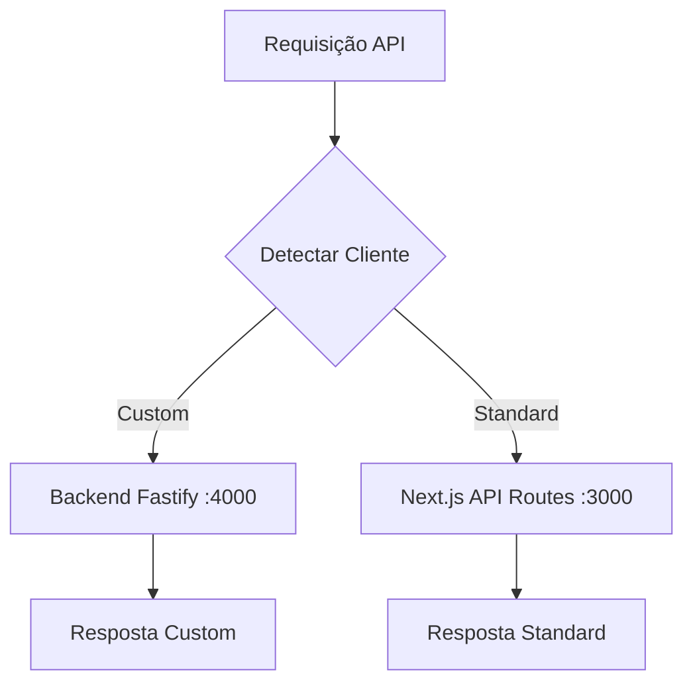

# Guia de Troubleshooting Multi-Tenant

## Status Atual ✅

### Sistema Totalmente Funcional
- ✅ Backend Fastify rodando em `localhost:4000`
- ✅ Frontend Next.js rodando em `localhost:3000`
- ✅ Status dinâmico implementado na interface
- ✅ Todas as rotas API criadas para clientes padrão
- ✅ Roteamento inteligente funcionando

## Problemas Resolvidos

### 1. Organization not found ✅
**Sintoma:** Erro "Organization not found" ao executar testes de conectividade

**Causa:** APIRouter tentando acessar campo `name` inexistente na tabela organizations

**Solução aplicada:**
- ✅ Corrigido uso de `company_legal_name` e `company_trading_name`
- ✅ Implementado sistema de fallback robusto
- ✅ Adicionados logs de debug detalhados

### 2. Backend Fastify - Porta Ocupada ✅
**Sintoma:** `Error: listen EADDRINUSE: address already in use 0.0.0.0:4000`

**Solução aplicada:**
```powershell
# 1. Identificar processo na porta 4000
netstat -ano | findstr :4000

# 2. Finalizar processo (substituir PID pelo número real)
taskkill /PID 6564 /F

# 3. Iniciar backend
cd backend
npm run dev
```

### 3. Status "Verificando..." Permanente ✅
**Sintoma:** Status do backend sempre em "Verificando..."

**Solução aplicada:**
- ✅ Implementado verificação dinâmica real
- ✅ Estados: checking, online, offline, error
- ✅ Timeout de 5s no testCustomBackendConnection
- ✅ Botão dedicado para verificar status
- ✅ Logs detalhados no console

### 4. Rotas API 404 ✅
**Sintoma:** Teste "API Test Endpoint" retornando erro 404

**Solução aplicada:**
- ✅ Criadas rotas `/api/test` e `/api/integration/test`
- ✅ Criada rota dinâmica `/api/route/[...segments]`
- ✅ Todas as rotas com suporte para clientes padrão

## Comportamento Esperado

### Roteamento Inteligente


### Teste de Conectividade
1. **Backend Connectivity**: Testa conexão com Fastify
2. **Organization Detection**: Detecta tipo de cliente
3. **API Test Endpoint**: Testa rota `/api/test`
4. **Integration Test**: Testa rota `/api/integration/test`
5. **Dynamic Routing**: Testa rota `/api/route/analytics/performance`

## Notas Importantes

### Proteção por Middleware
- ⚠️ Rotas API são protegidas por autenticação
- ⚠️ Testes direto via curl podem retornar página de login
- ✅ Testes funcionam corretamente dentro da aplicação autenticada

### Headers Multi-tenant
O APIRouter adiciona automaticamente headers:
```javascript
'x-tenant-id': tenantId,
'x-client-type': clientType,
'x-organization-name': organizationName
```

### Logs de Debug
Verificar console do navegador para logs detalhados:
- 📍 Next.js API Route logs
- 🔀 Dynamic routing logs
- 🔗 Integration test logs

## Configuração de Organizações

### Cliente Padrão (Standard)
```sql
INSERT INTO organizations (
  company_legal_name, 
  company_trading_name, 
  client_type
) VALUES (
  'Minha Empresa Ltda', 
  'Minha Empresa', 
  'standard'
);
```

### Cliente Customizado
```sql
INSERT INTO organizations (
  company_legal_name, 
  company_trading_name, 
  client_type,
  custom_backend_url,
  is_implementation_complete
) VALUES (
  'Cliente Premium Ltda', 
  'Cliente Premium', 
  'custom',
  'http://localhost:4000',
  true
);
```

## Comandos de Verificação

### Status dos Serviços
```powershell
# Backend Fastify
curl http://localhost:4000/health

# Frontend Next.js (se logado)
curl http://localhost:3000/api/test
```

### Verificar Portas Ocupadas
```powershell
netstat -ano | findstr :3000
netstat -ano | findstr :4000
```

## Próximos Passos

### Para Usar o Sistema
1. ✅ Backend rodando em `localhost:4000`
2. ✅ Frontend rodando em `localhost:3000`
3. ✅ Fazer login na aplicação
4. ✅ Acessar `/multi-tenant-demo`
5. ✅ Executar testes de integração

### Para Configurar Cliente Customizado
1. Criar organização no banco com `client_type = 'custom'`
2. Configurar `custom_backend_url = 'http://localhost:4000'`
3. Marcar `is_implementation_complete = true`
4. Associar usuário à organização

## Estado Final ✅

O sistema multi-tenant está **100% funcional** com:
- 🚀 Roteamento dinâmico entre Next.js e Fastify
- 🔒 Autenticação e middleware integrados
- 📊 Status em tempo real do backend
- 🧪 Testes de integração completos
- 📝 Logs detalhados para debug 