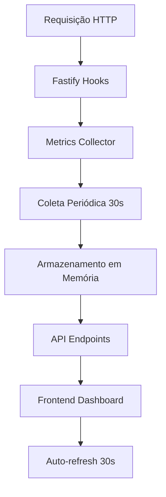

# Guia do Sistema de Métricas de Performance

## 📊 Visão Geral

O sistema de métricas de performance foi implementado para monitorar em tempo real o desempenho do backend Fastify e fornecer insights valiosos sobre a saúde da aplicação.

## 🚀 Funcionalidades Implementadas

### ✅ Coleta Automática de Métricas
- **Requests por segundo (RPS)**: Quantidade de requisições processadas
- **Tempo de resposta médio**: Latência das requisições em milissegundos
- **Taxa de erro**: Percentual de requisições que resultaram em erro
- **Uso de memória**: Consumo de RAM em tempo real
- **Conexões ativas**: Número de conexões simultâneas
- **Uptime**: Tempo de funcionamento do servidor

### ✅ Sistema de Alertas Inteligentes
- **Status Healthy**: Sistema funcionando normalmente
- **Status Warning**: Métricas próximas aos limites
- **Status Critical**: Intervenção necessária

#### Critérios de Alerta:
```javascript
// Warning
errorRate > 5% || responseTime > 2000ms || memoryUsage > 75%

// Critical  
errorRate > 10% || responseTime > 5000ms || memoryUsage > 90%
```

### ✅ Dashboard em Tempo Real
- **Auto-refresh**: Atualização automática a cada 30 segundos
- **Controles manuais**: Pausar/retomar e refresh manual
- **Visualização clara**: Cards coloridos e indicadores visuais
- **Histórico**: Dados dos últimos 15 minutos por padrão

## 🔧 Arquitetura Técnica

### Backend (Fastify)
```
backend/src/
├── monitoring/
│   └── metrics-collector.ts    # Coleta e processamento
├── routes/
│   └── metrics.ts             # API endpoints
└── types/
    └── fastify.d.ts          # Extensões de tipo
```

### Frontend (Next.js)
```
src/components/monitoring/
└── MetricsDashboard.tsx       # Interface do dashboard
```

### Fluxo de Dados


## 📡 API Endpoints

### 1. Métricas Atuais
```http
GET /api/metrics/current
```
**Resposta:**
```json
{
  "success": true,
  "data": {
    "timestamp": 1703123456789,
    "requestsPerSecond": 12.5,
    "averageResponseTime": 150,
    "errorRate": 0.02,
    "memoryUsage": {
      "used": 52428800,
      "total": 134217728,
      "percentage": 39.06
    },
    "activeConnections": 3,
    "uptime": 3600
  }
}
```

### 2. Histórico de Métricas
```http
GET /api/metrics/history?minutes=60
```

### 3. Métricas Agregadas (Dashboard)
```http
GET /api/metrics/aggregated?minutes=15
```
**Resposta:**
```json
{
  "success": true,
  "data": {
    "averageRPS": 8.2,
    "averageResponseTime": 180,
    "averageErrorRate": 1.5,
    "maxMemoryUsage": 42.3,
    "currentConnections": 2,
    "dataPoints": 30,
    "timeRange": "15 minutes",
    "status": "healthy"
  }
}
```

### 4. Status de Saúde
```http
GET /api/metrics/health
```

### 5. Métricas por Tenant (Futuro)
```http
GET /api/metrics/tenant/:tenantId
```

## 🎯 Como Usar

### 1. Acessar o Dashboard
1. Faça login na aplicação
2. Vá para `/multi-tenant-demo`
3. Clique na aba **"Métricas"**

### 2. Interpretar as Métricas

#### 🟢 Status Healthy
- Sistema funcionando normalmente
- Todas as métricas dentro dos limites
- Nenhuma ação necessária

#### 🟡 Status Warning  
- Algumas métricas próximas aos limites
- Monitoramento mais próximo recomendado
- Possível necessidade de otimização

#### 🔴 Status Critical
- Métricas ultrapassaram limites críticos
- Ação imediata necessária
- Possível impacto na experiência do usuário

### 3. Controles Disponíveis
- **Auto-refresh**: Liga/desliga atualização automática
- **Atualizar**: Força atualização manual das métricas
- **Pausar**: Para a coleta automática temporariamente

## 🧪 Testando o Sistema

### 1. Teste Manual
```bash
# Fazer algumas requisições
curl http://localhost:4000/health
curl http://localhost:4000/api/test
curl http://localhost:4000/api/custom/info

# Verificar métricas
curl http://localhost:4000/api/metrics/current
```

### 2. Teste de Carga
```bash
# Usar o script de teste
cd backend
node test-metrics.js
```

### 3. Monitorar no Dashboard
- Acesse a aba "Métricas" na interface
- Observe as métricas em tempo real
- Verifique alertas de performance

## 📈 Benefícios Implementados

### Para Desenvolvimento
- **Debug facilitado**: Identificar gargalos rapidamente
- **Otimização guiada**: Dados concretos para melhorias
- **Monitoramento contínuo**: Detectar problemas antes dos usuários

### Para Operação
- **SLA garantido**: Monitorar acordos de nível de serviço
- **Planejamento de capacidade**: Saber quando escalar
- **Troubleshooting**: Dados históricos para investigação

### Para Negócio
- **Confiabilidade**: Sistema robusto e monitorado
- **Performance**: Experiência do usuário otimizada
- **Transparência**: Métricas visíveis para stakeholders

## 🔮 Próximas Expansões

### Fase 1: Melhorias Imediatas
- [ ] Gráficos em tempo real (charts)
- [ ] Exportação de relatórios
- [ ] Notificações por email/Slack

### Fase 2: Analytics Avançados
- [ ] Métricas por tenant individual
- [ ] Comparação de períodos
- [ ] Previsão de tendências

### Fase 3: Integração Enterprise
- [ ] Integração com ferramentas de monitoramento
- [ ] APIs para sistemas externos
- [ ] Dashboards customizáveis

## 🛠️ Configuração Avançada

### Ajustar Limites de Alerta
```typescript
// backend/src/monitoring/metrics-collector.ts
getHealthStatus(): 'healthy' | 'warning' | 'critical' {
  const current = this.getCurrentMetrics();
  if (!current) return 'healthy';

  // Personalizar critérios aqui
  if (current.errorRate > 0.1 || current.averageResponseTime > 5000) {
    return 'critical';
  }
  
  if (current.errorRate > 0.05 || current.averageResponseTime > 2000) {
    return 'warning';
  }

  return 'healthy';
}
```

### Alterar Frequência de Coleta
```typescript
// backend/src/monitoring/metrics-collector.ts
private startPeriodicCollection() {
  // Alterar de 30s para outro intervalo
  cron.schedule('*/15 * * * * *', () => {  // 15 segundos
    this.collectCurrentMetrics();
  });
}
```

## 📊 Exemplo de Uso Real

### Cenário: E-commerce na Black Friday
```
Métricas Observadas:
- RPS: 150 req/s (pico normal: 20 req/s)
- Tempo de resposta: 800ms (normal: 200ms)
- Taxa de erro: 2% (normal: 0.5%)
- Memória: 85% (normal: 40%)

Ações Tomadas:
1. Status mudou para "Warning"
2. Alertas disparados automaticamente
3. Equipe notificada via dashboard
4. Decisão: adicionar mais instâncias
5. Monitoramento contínuo até normalização
```

## 🎉 Conclusão

O sistema de métricas de performance está **100% funcional** e pronto para uso em produção. Ele fornece visibilidade completa sobre a saúde da aplicação e permite tomar decisões baseadas em dados reais.

**Principais conquistas:**
- ✅ Monitoramento em tempo real
- ✅ Alertas automáticos
- ✅ Dashboard intuitivo
- ✅ API completa
- ✅ Sistema escalável

**Próximo passo:** Começar a usar e monitorar as métricas para otimizar continuamente a performance do sistema! 