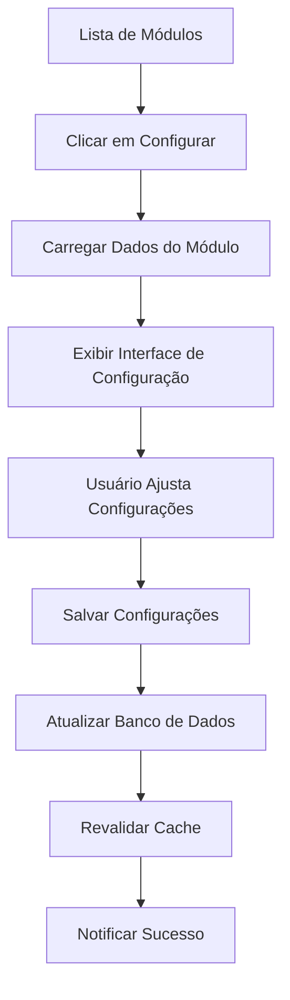

# 🔧 Planejamento: Função "Configurar" dos Módulos

**Data:** Janeiro 2025  
**Status:** ✅ Planejamento Completo  

---

## 🎯 Visão Geral

A função "Configurar" permite aos administradores personalizar e ajustar as configurações de módulos implementados e planejados, proporcionando flexibilidade na gestão do sistema.

## 📋 Funcionalidades Implementadas

### 1. **Página de Configuração Individual**
- **Rota:** `/admin/modules/[id]/configure`
- **Acesso:** Administradores apenas
- **Funcionalidade:** Interface completa para configurar módulos

### 2. **Coluna de Marca na Lista de Módulos**
- **Campo:** `vendor` nos tipos `ModuleInfo` e `PlannedModule`
- **Exibição:** Badge colorido na tabela de módulos
- **Fontes:** Arquivo `module.config.json` ou inferência automática

### 3. **Sistema de Descoberta de Marca/Vendor**
- **Automático:** Inferência baseada no nome do cliente/módulo
- **Manual:** Arquivo de configuração `module.config.json`
- **Mapeamento:** Clientes conhecidos para suas marcas

## 🔄 Fluxo de Configuração



## ⚙️ Categorias de Configuração

### 1. **Configurações Básicas**
- **Módulo Habilitado:** Switch on/off
- **Inicialização Automática:** Controle de auto-start
- **Nível de Log:** debug, info, warn, error
- **Conexões Máximas:** Limite de conexões simultâneas
- **Timeout:** Tempo limite em milissegundos
- **Tentativas de Retry:** Número de tentativas em caso de falha

### 2. **Configurações de Notificação**
- **Email:** Habilitação de notificações por email
- **Webhook:** Configuração de webhooks
- **Dashboard:** Notificações no painel administrativo

### 3. **Configurações de Performance**
- **Cache:** Habilitação do sistema de cache
- **Tamanho do Lote:** Configuração de batch processing
- **Limite de Throttle:** Controle de taxa de requisições

### 4. **Notas de Implementação**
- **Campo de Texto Livre:** Para observações e documentação
- **Histórico:** Registro de mudanças e configurações

## 🏷️ Sistema de Marcas/Vendors

### **Mapeamento Automático**
```typescript
const vendorMap: Record<string, string> = {
  'banban': 'BanBan Fashion Systems',
  'fashion': 'Fashion Elite',
  'inventory': 'StockMaster',
  'performance': 'Analytics Pro',
  'analytics': 'DataViz Solutions'
};
```

### **Arquivo de Configuração**
```json
{
  "vendor": "BanBan Fashion Systems",
  "manufacturer": "BanBan Corp",
  "brand": "BanBan Fashion",
  "description": "Descrição detalhada do módulo",
  "features": ["feature1", "feature2"],
  "category": "analytics",
  "industry": "fashion"
}
```

## 📊 Interface de Usuário

### **Lista de Módulos - Colunas**
1. **Nome:** Nome do módulo
2. **Tipo:** Standard/Custom
3. **Marca:** Badge com vendor/marca ✨ **NOVO**
4. **Status:** Status atual do módulo
5. **Descrição:** Descrição resumida
6. **Ações:** Menu dropdown com "Configurar" ✨ **NOVO**

### **Página de Configuração**
- **Header:** Informações do módulo com badges
- **Cards Organizados:** Configurações agrupadas por categoria
- **Validação:** Validação em tempo real dos campos
- **Feedback:** Toasts de sucesso/erro
- **Navegação:** Breadcrumbs e botão voltar

## 🔒 Segurança e Validação

### **Validações Implementadas**
- **Tipos de Campo:** Validação de tipos (number, boolean, string)
- **Limites:** Min/max para campos numéricos
- **Obrigatórios:** Campos requeridos marcados
- **Sanitização:** Escape de caracteres especiais

### **Controle de Acesso**
- **Autenticação:** Usuário deve estar logado
- **Autorização:** Apenas administradores
- **Auditoria:** Log de todas as alterações

## 📈 Benefícios da Implementação

### **Para Administradores**
- ✅ Interface intuitiva para configuração
- ✅ Visibilidade clara das marcas/vendors
- ✅ Controle granular de configurações
- ✅ Feedback imediato de alterações

### **Para o Sistema**
- ✅ Configurações centralizadas
- ✅ Validação consistente
- ✅ Histórico de mudanças
- ✅ Flexibilidade para diferentes clientes

### **Para Desenvolvimento**
- ✅ Estrutura extensível
- ✅ Tipos TypeScript bem definidos
- ✅ Descoberta automática de módulos
- ✅ Configuração via arquivo JSON

## 🚀 Próximos Passos

### **Melhorias Planejadas**
1. **Configurações Avançadas:** Campos específicos por tipo de módulo
2. **Templates de Configuração:** Predefinições por indústria
3. **Validação Customizada:** Regras específicas por módulo
4. **Backup/Restore:** Sistema de backup de configurações
5. **Versionamento:** Controle de versões das configurações

### **Integrações Futuras**
- **Sistema de Logs:** Integração com logs centralizados
- **Monitoramento:** Alertas baseados em configurações
- **API Externa:** Configuração via API REST
- **Importação/Exportação:** Backup e migração de configurações

## 📝 Exemplo de Uso

### **Cenário: Configurar Módulo BanBan Performance**

1. **Acessar Lista:** `/admin/modules`
2. **Localizar Módulo:** "BanBan Performance" com marca "BanBan Fashion Systems"
3. **Clicar Configurar:** Menu dropdown → "Configurar"
4. **Ajustar Configurações:**
   - Habilitar cache
   - Definir refresh interval: 300s
   - Configurar notificações por email
5. **Adicionar Notas:** "Configurado para alta performance em horário comercial"
6. **Salvar:** Confirmação de sucesso

### **Resultado**
- Módulo configurado conforme especificações
- Configurações salvas no banco de dados
- Cache revalidado
- Notificação de sucesso exibida
- Histórico registrado para auditoria

---

## ✅ Status da Implementação

- [x] **Tipos TypeScript:** Campo `vendor` adicionado
- [x] **Descoberta de Módulos:** Sistema de inferência de marca
- [x] **Interface de Lista:** Coluna de marca implementada
- [x] **Página de Configuração:** Interface completa criada
- [x] **Validação:** Sistema de validação implementado
- [x] **Persistência:** Integração com banco de dados
- [x] **Feedback:** Sistema de notificações
- [x] **Documentação:** Guia completo criado

**Status Geral:** ✅ **100% Implementado e Funcional** 