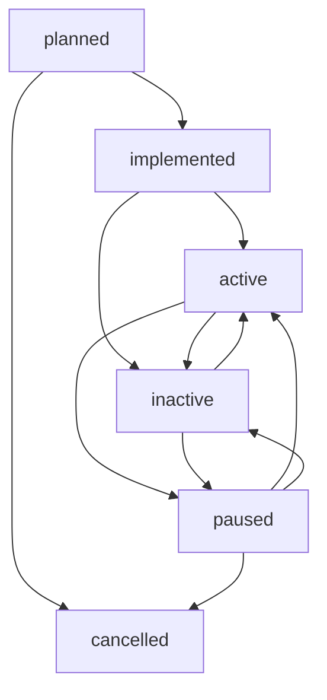

# 📋 Guia: Fluxo de Status dos Módulos

**Data:** Janeiro 2025  
**Status:** ✅ Documentação Completa  

---

## 🎯 Visão Geral

O sistema de módulos possui um fluxo de status bem definido que acompanha o ciclo de vida completo de um módulo, desde o planejamento até a implementação e uso em produção.

## 🔄 Fluxo de Status



## 📊 Estados dos Módulos

### 1. **Planned** (Planejado)
- **Descrição**: Módulo especificado mas ainda não implementado no código
- **Quando usar**: Durante o planejamento de novos módulos ou ao criar organizações sem módulos implementados
- **Ações disponíveis**: Editar, Cancelar, Marcar como Implementado
- **Cor**: Azul (`blue-100`)

**Exemplo**: Uma organização precisa de um módulo de "Gestão de Estoque" mas o código ainda não foi desenvolvido.

### 2. **Implemented** (Implementado)
- **Descrição**: Código foi desenvolvido e está disponível no sistema, mas não está ativo
- **Quando usar**: Após a implementação do código, antes da ativação
- **Ações disponíveis**: Ativar, Configurar, Pausar
- **Cor**: Verde (`green-100`)

**Exemplo**: O módulo de "Gestão de Estoque" foi desenvolvido em `src/core/modules/inventory/` mas ainda não foi ativado para uso.

### 3. **Active** (Ativo)
- **Descrição**: Módulo funcionando e sendo usado por organizações
- **Quando usar**: Quando o módulo está em uso produtivo
- **Ações disponíveis**: Desativar, Configurar, Pausar
- **Cor**: Verde (`green-100`)

**Exemplo**: O módulo está ativo e sendo usado pela organização BanBan para controle de estoque.

### 4. **Inactive** (Inativo)
- **Descrição**: Módulo implementado mas temporariamente desativado
- **Quando usar**: Para desabilitar temporariamente um módulo sem removê-lo
- **Ações disponíveis**: Ativar, Configurar
- **Cor**: Cinza (`gray-100`)

**Exemplo**: Módulo foi desativado para manutenção ou por decisão estratégica.

### 5. **Paused** (Pausado)
- **Descrição**: Módulo pausado temporariamente (pode estar implementado ou ativo)
- **Quando usar**: Durante manutenções ou atualizações
- **Ações disponíveis**: Reativar, Cancelar
- **Cor**: Amarelo (`yellow-100`)

**Exemplo**: Módulo pausado durante uma migração de dados.

### 6. **Cancelled** (Cancelado)
- **Descrição**: Planejamento ou implementação foi cancelada
- **Quando usar**: Quando um módulo planejado não será mais desenvolvido
- **Ações disponíveis**: Reativar planejamento
- **Cor**: Vermelho (`red-100`)

**Exemplo**: Módulo planejado foi cancelado por mudança de estratégia.

## 🏗️ Cenários de Uso

### Cenário A: Módulo Já Implementado
```
1. Descoberta → implemented
2. Configuração → implemented
3. Ativação → active
4. Uso em produção → active
```

### Cenário B: Módulo Planejado
```
1. Planejamento → planned
2. Desenvolvimento → planned
3. Implementação → implemented
4. Ativação → active
```

### Cenário C: Manutenção
```
1. Módulo ativo → active
2. Pausar para manutenção → paused
3. Realizar manutenção → paused
4. Reativar → active
```

## 🎛️ Gestão no Admin

### Interface de Gestão
- **Lista de Módulos**: Visualiza todos os módulos com seus status
- **Filtros**: Permite filtrar por status (todos, implementados, planejados, ativos)
- **Ações**: Botões contextuais baseados no status atual
- **Analytics**: Cards com estatísticas de cada status

### Fluxo de Criação de Organização

#### Com Módulos Implementados:
1. Admin seleciona módulos disponíveis
2. Configura cada módulo
3. Módulos ficam ativos para a organização

#### Sem Módulos Implementados:
1. Admin planeja módulos necessários (status: `planned`)
2. Desenvolvedor implementa baseado no planejamento
3. Admin ativa módulos quando prontos

## 🔍 Identificação de Módulos

### Módulos Implementados
- Descobertos automaticamente em `src/core/modules/`
- Possuem arquivo de configuração e interface
- Status inicial: `implemented`

### Módulos Planejados
- Criados manualmente no banco de dados
- Contêm especificações e configurações esperadas
- Status inicial: `planned`

## 📋 Campos de um Módulo Planejado

```typescript
interface PlannedModule {
  id: string;
  organization_id: string;
  module_id: string;
  module_name: string;
  module_type: 'standard' | 'custom';
  status: 'planned';
  expected_features: string[];
  implementation_notes: string;
  priority: 'low' | 'medium' | 'high';
  configuration: Record<string, any>;
  created_at: Date;
  updated_at: Date;
}
```

## 🚀 Benefícios do Sistema

### Para Admins
- **Visibilidade**: Acompanha progresso de implementação
- **Planejamento**: Define módulos antes da implementação
- **Controle**: Ativa/desativa módulos conforme necessário

### Para Desenvolvedores
- **Clareza**: Especificações claras do que implementar
- **Priorização**: Sabe quais módulos são mais urgentes
- **Feedback**: Vê como módulos são usados

### Para o Sistema
- **Escalabilidade**: Cresce conforme demanda
- **Rastreabilidade**: Histórico completo de mudanças
- **Flexibilidade**: Suporta diferentes cenários de uso

---

**Documentação criada em**: Janeiro 2025  
**Responsável**: AI Agent  
**Status**: ✅ Completo 