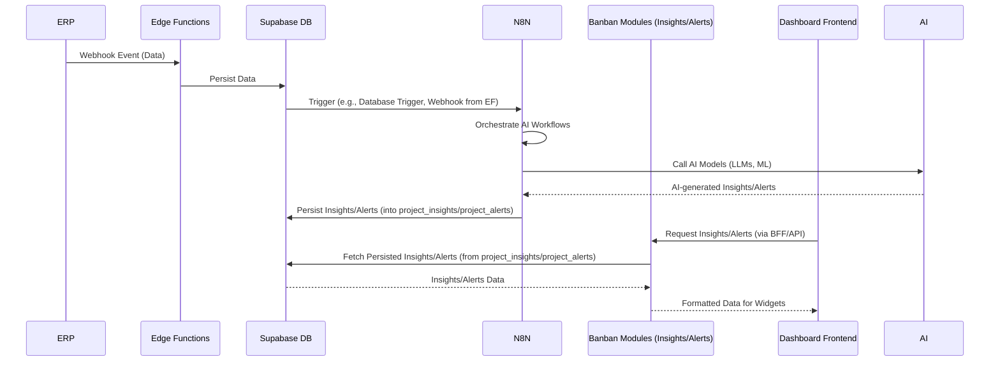

# Planejamento de Implementação - Módulos Cliente Banban (Adaptado para Dashboard Dinâmico)

**Versão:** 1.1  
**Data:** Junho/2025  
**Status:** Planejamento Adaptado  
**Baseado em:** `src/clients/banban/docs/about-project.md` e `docs/implementations/modules_v2/DASHBOARD_TENANT_CUSTOMIZADO.md`

---

## Visão Geral da Implementação

Este documento apresenta o planejamento completo para implementação dos módulos do cliente Banban, incluindo as três funcionalidades principais do MVP, agora com uma **abordagem de dashboard dinâmico e personalizável e inteligência artificial orquestrada pelo N8N**:

1.  **Processamento Inteligente de Dados ERP**
2.  **Home de Insights (via Widgets Dinâmicos e IA)**
3.  **Sistema de Alertas e Oportunidades (com Geração de Insights por IA)**

O sistema será implementado seguindo a arquitetura client-modules existente, com foco em **processamento de dados via webhooks**, **geração de insights acionáveis por IA** (orquestrada pelo N8N), que serão apresentados como **widgets configuráveis** no dashboard do tenant.

---

## 1. Fluxo Principal (Caminho Feliz)

### 1.1 Módulo: Processamento Inteligente de Dados ERP

**Objetivo:** Sistema de processamento em tempo real de dados vindos do ERP via webhooks, com validação e enriquecimento de informações.

#### Etapas do Fluxo:

1.  **Recebimento de Webhook do ERP via Edge Functions**
    *   ERP envia dados via 4 Edge Functions já implementadas:
        *   `webhook-inventory-flow` (produtos, ajustes de estoque)
        *   `webhook-sales-flow` (vendas, cancelamentos, devoluções)
        *   `webhook-purchase-flow` (compras, recebimentos)
        *   `webhook-transfer-flow` (transferências entre lojas)
    *   Edge Functions validam payload e autenticidade
    *   Parse e normalização dos dados recebidos

2.  **Validação e Enriquecimento**
    *   Validação de integridade dos dados recebidos
    *   Verificação de consistência com dados existentes
    *   Enriquecimento com metadados (categorização, cálculos)

3.  **Processamento de Regras de Negócio**
    *   Aplicação de regras específicas do Banban (25 status de documento)
    *   Cálculo de métricas derivadas (giro, margem, sell-through)
    *   Detecção de padrões e anomalias

4.  **Persistência Estruturada (via Edge Functions)**
    *   Edge Functions persistem dados nas tabelas core
    *   Atualização de `core_product_variants`, `core_movements`
    *   Registro de eventos em `core_events`
    *   Snapshot de inventário em `core_inventory_snapshots`
    *   Auditoria automática em `audit_logs`

5.  **Trigger de Análises e IA (Pós-processamento via N8N)**
    *   Módulos Banban escutam eventos das Edge Functions.
    *   **Disparo de workflows no N8N**: Eventos relevantes acionarão workflows no N8N.
    *   **Orquestração de IA**: O N8N orquestrará chamadas a modelos de IA (LLMs, modelos de ML) para avaliar os dados processados, identificar padrões complexos e gerar insights acionáveis.
    *   **Persistência de Insights**: Os insights gerados pela IA serão persistidos nas tabelas genéricas (`project_insights`, `project_alerts`) para consumo posterior.
    *   Atualização de cache de dashboards.
    *   Geração de alertas críticos quando aplicável.

### 1.2 Módulo: Home de Insights e Integração com Dashboard Dinâmico

**Objetivo:** Transformar a Home de Insights em um dashboard dinâmico e personalizável, onde os insights (agora gerados por IA via N8N) são apresentados como widgets configuráveis, utilizando a nova arquitetura de dashboard (`DASHBOARD_TENANT_CUSTOMIZADO.md`).

#### Etapas do Fluxo:

1.  **Definição dos Contratos de Widget (`widget.json`)**:
    *   Para cada tipo de insight (Estoque Crítico, Margem Baixa, Slow-movers, Oportunidades, etc.), definir um arquivo `widget.json` dentro do respectivo módulo Banban (ex: `src/core/modules/banban/insights/widgets/low-stock-insight.json`).
    *   Estes contratos seguirão o modelo JSON especificado em `DASHBOARD_TENANT_CUSTOMIZADO.md`, incluindo `widget_id`, `module`, `name`, `description`, `category`, `component` (caminho do React lazy import), `query` (RPC ou REST), `default_size`, `min_size`.
    *   *Exemplo de `query`*: `{"type": "rpc", "function": "banban_insights_get_low_stock", "params": {"limit": 5}}`

2.  **Adaptação das APIs dos Módulos Banban para Expor Dados de Insights (Gerados por IA) via Queries**:
    *   Garantir que as funções de backend dos módulos Banban (ex: `insights/engine.ts`, `alerts/processor.ts`) possam ser chamadas via RPC (Supabase Functions) ou endpoints REST, **consumindo os insights já gerados e persistidos pelo N8N nas tabelas genéricas (`project_insights`, `project_alerts`)**, e retornando os dados formatados conforme o `widget.json`.
    *   Implementar as funções RPC/endpoints que serão referenciadas nas `query`s dos `widget.json`.

3.  **Integração com o Pipeline de Publicação de Widgets**:
    *   Garantir que o script `publish_widgets.ts` (definido no plano de dashboard) seja executado no CI/CD dos módulos Banban para ler os `widget.json` e fazer o `upsert` das definições na tabela `dashboard_widgets` no Supabase.

4.  **Refatoração da Interface da Home (`/banban`)**:
    *   A página principal (`/banban`) será refatorada para atuar como um contêiner de dashboard dinâmico.
    *   Ela consumirá o `dashboard-service` (BFF) para obter o layout e os dados dos widgets habilitados para o tenant.
    *   Utilizará um sistema de grid (ex: `react-grid-layout`) para renderizar os widgets dinamicamente, carregando os componentes React (`InsightCard`, `AlertCard`, etc.) via `React.lazy` com base no `component` path do `widget.json`.
    *   Os componentes de widget receberão os dados do BFF via props.

5.  **Implementação dos Componentes de Widget (Frontend)**:
    *   Criar os componentes React (`.tsx`) para cada tipo de insight (ex: `InsightLowStockCard.tsx`, `InsightLowMarginCard.tsx`).
    *   Estes componentes serão "stateless", recebendo os dados via props e focando apenas na apresentação e interação local.
    *   Incluir estados de `isLoading`, `isEmpty`, `isError` conforme boas práticas de desenvolvimento de widget.

6.  **UI de Personalização do Dashboard (Fase Opcional/Futura)**:
    *   Prever a implementação de uma interface para o tenant ativar/desativar widgets, configurar parâmetros e arrastar/soltar widgets no layout, salvando as preferências nas tabelas `tenant_dashboard_widgets` e `tenant_dashboard_layouts`.

#### Exemplos de Insights Gerados (Agora por IA via N8N e apresentados como Widgets):

*   **🔴 Crítico:** "Você possui 7 produtos da categoria Calçados com estoque baixo em 2 lojas" (Widget: `LowStockInsightCard`)
*   **🟡 Atenção:** "Você possui 9 produtos com menos de 5 unidades em 3 lojas" (Widget: `LowQuantityInsightCard`)
*   **🟠 Moderado:** "7 produtos com margem abaixo de 31% - impacto de R$ 16.950 na rentabilidade" (Widget: `LowMarginInsightCard`)
*   **🟢 Oportunidade:** "Oportunidade de promover 7 produtos slow-movers com potencial de R$ 11.300" (Widget: `SlowMoverOpportunityCard`)

### 1.3 Módulo: Sistema de Alertas e Oportunidades (com Geração de Insights por IA)

**Objetivo:** Motor de análise que gera insights e alertas específicos com base em regras de negócio, padrões identificados nos dados e **avaliação de IA orquestrada pelo N8N**, que serão consumidos pelos widgets do dashboard.

#### Etapas do Fluxo:

1.  **Análise Contínua e Orquestração de IA (via N8N)**
    *   Processamento disparado por eventos das Edge Functions existentes (após persistência dos dados).
    *   **Workflows no N8N**: O N8N receberá os eventos e orquestrará a análise.
    *   **Avaliação de IA**: O N8N chamará modelos de IA (LLMs, modelos de ML) para analisar os dados brutos e processados, identificar anomalias, tendências e gerar insights complexos.
    *   **Persistência de Resultados**: Os resultados da análise da IA (insights, alertas, oportunidades) serão persistidos nas tabelas genéricas (`project_insights`, `project_alerts`).

2.  **Execução de Algoritmos de Insight (Orquestrados pelo N8N)**
    *   **Estoque Crítico:** Produtos com < X unidades por loja (regras podem ser aprimoradas por IA).
    *   **Margem Baixa:** Produtos abaixo de 31% de margem + impacto financeiro (IA pode identificar causas raiz).
    *   **Slow-movers:** Produtos sem venda em X dias + potencial de promoção (IA pode sugerir promoções otimizadas).
    *   **Oportunidades:** Cross-selling, reposição inteligente (IA pode gerar novas oportunidades).

3.  **Cálculo de Impacto e Prioridade (Orquestrado pelo N8N)**
    *   Impacto financeiro (R$ perdidos/ganhos potenciais).
    *   Criticidade (urgência da ação).
    *   Complexidade de resolução (esforço necessário).
    *   **A IA pode refinar esses cálculos e priorizações.**

4.  **Estruturação para Interface (via APIs de Widget)**
    *   Formatação de insights e alertas (gerados pela IA e N8N) para serem consumidos pelas `query`s dos widgets do dashboard.
    *   Agrupamento por tipo e prioridade.
    *   Preparação de ações sugeridas.

### 1.4 Integração com Edge Functions Existentes

**Infraestrutura Já Implementada:**

O sistema Banban utilizará as Edge Functions já criadas no Supabase como base de entrada de dados:

### **webhook-inventory-flow**
*   **Responsabilidade:** Processamento de produtos e ajustes de estoque
*   **Eventos:** `product_created`, `product_updated`, `inventory_adjustment`
*   **Integração Banban:** Trigger para análise de estoque baixo e slow-movers (agora via N8N/IA).

### **webhook-sales-flow**
*   **Responsabilidade:** Processamento de vendas e devoluções
*   **Eventos:** `sale_completed`, `sale_cancelled`, `return_processed`
*   **Integração Banban:** Trigger para cálculo de margem e performance de produtos (agora via N8N/IA).

### **webhook-purchase-flow**
*   **Responsabilidade:** Processamento de compras e recebimentos
*   **Eventos:** `purchase_completed`, `purchase_cancelled`, `purchase_returned`
*   **Integração Banban:** Trigger para análise de fornecedores e reposição (agora via N8N/IA).

### **webhook-transfer-flow**
*   **Responsabilidade:** Transferências entre lojas
*   **Eventos:** `transfer_initiated`, `transfer_completed`, `transfer_cancelled`
*   **Integração Banban:** Trigger para otimização de distribuição entre lojas (agora via N8N/IA).

### **Arquitetura de Integração (Atualizada com N8N):**



**Vantagens da Arquitetura (Reforçadas com N8N/IA):**
*   ✅ **Reutilização:** Aproveita infraestrutura já testada e funcionando.
*   ✅ **Separação de Responsabilidades:** Edge Functions focam em persistência, **N8N orquestra IA e geração de insights**, módulos Banban consomem insights gerados **das tabelas genéricas**.
*   ✅ **Escalabilidade:** Processamento distribuído entre Edge Functions, N8N e módulos.
*   ✅ **Manutenibilidade:** Cada camada tem responsabilidade bem definida.
*   ✅ **Inteligência Aprimorada:** Capacidade de integrar modelos de IA complexos para insights mais profundos e acionáveis.

### 1.5 Modelo de Dados: Tabelas Genéricas para Insights e Alertas

Para evitar a proliferação de tabelas específicas por módulo/projeto e garantir escalabilidade em um ambiente multi-tenant, os insights e alertas gerados pela IA (via N8N) serão persistidos em tabelas genéricas com colunas `JSONB`. Esta abordagem permite flexibilidade no schema dos dados de insights/alertas, ao mesmo tempo em que mantém um número reduzido de tabelas principais.

#### Estrutura Proposta:

```sql
CREATE TABLE project_insights (
    id UUID PRIMARY KEY DEFAULT uuid_generate_v4(),
    project_id UUID NOT NULL,       -- ID do projeto/organização (para RLS)
    module_id TEXT NOT NULL,        -- ID do módulo de origem (ex: 'banban-insights', 'banban-alerts')
    insight_type TEXT NOT NULL,     -- Tipo específico do insight (ex: 'LOW_STOCK', 'LOW_MARGIN')
    generated_at TIMESTAMPTZ DEFAULT now(), -- Timestamp de geração
    severity TEXT,                  -- Nível de criticidade (ex: 'CRITICAL', 'WARNING', 'OPPORTUNITY')
    payload JSONB NOT NULL,         -- Dados específicos do insight em formato JSON
    is_read BOOLEAN DEFAULT FALSE,
    action_taken BOOLEAN DEFAULT FALSE
    -- Adicionar RLS policies para project_id
);

CREATE TABLE project_alerts (
    id UUID PRIMARY KEY DEFAULT uuid_generate_v4(),
    project_id UUID NOT NULL,
    module_id TEXT NOT NULL,
    alert_type TEXT NOT NULL,       -- Tipo específico do alerta (ex: 'SYSTEM_ERROR', 'DATA_INCONSISTENCY')
    generated_at TIMESTAMPTZ DEFAULT now(),
    severity TEXT NOT NULL,
    payload JSONB NOT NULL,         -- Dados específicos do alerta em formato JSON
    status TEXT DEFAULT 'ACTIVE',   -- 'ACTIVE', 'RESOLVED', 'DISMISSED'
    resolved_by UUID,
    resolved_at TIMESTAMPTZ
    -- Adicionar RLS policies para project_id
);
```

#### Justificativa:

*   **Escalabilidade**: Evita a criação de `N` tabelas para `N` módulos/projetos, consolidando dados de insights e alertas em poucas tabelas centrais.
*   **Flexibilidade de Schema**: O campo `payload JSONB` permite que cada tipo de insight/alerta tenha sua própria estrutura de dados, sem a necessidade de alterações no schema do banco de dados para cada nova funcionalidade.
*   **Consultabilidade e Indexação**: O PostgreSQL oferece recursos robustos para consultar e indexar dados dentro de colunas `JSONB`, permitindo performance adequada para a maioria dos casos de uso.
*   **Isolamento Multi-tenant**: A aplicação de Row Level Security (RLS) no `project_id` garante que cada tenant/projeto acesse apenas seus próprios dados.

---

## 2. Casos de Erro e Tratamento

### 2.1 Erros de Validação de Dados

**Cenários:**
*   SKU duplicado na organização
*   Preço inválido (negativo ou zero)
*   Categoria inexistente
*   Campos obrigatórios vazios

**Tratamento:**
*   Validação no frontend com feedback imediato
*   Validação no backend com mensagens específicas
*   Rollback automático em caso de erro parcial
*   Log detalhado para debugging

### 2.2 Falhas de Comunicação

**Cenários:**
*   Timeout na API do ERP
*   Perda de conexão com banco de dados
*   Falha na execução de webhooks
*   Indisponibilidade de serviços externos
*   **Falha na comunicação com N8N ou modelos de IA.**

**Tratamento:**
*   Retry automático com backoff exponencial (3 tentativas)
*   Circuit breaker para APIs externas
*   Queue de fallback para eventos críticos
*   Graceful degradation com cache local
*   **Mecanismos de retry e tratamento de erro nos workflows do N8N para chamadas de IA.**

### 2.3 Inconsistências de Dados

**Cenários:**
*   Divergência entre ERP e sistema interno
*   Produto referenciado que não existe
*   Movimentação de estoque inconsistente
*   Dados corrompidos em webhook
*   **Insights gerados pela IA que são inconsistentes com os dados brutos.**

**Tratamento:**
*   Validação de integridade referencial
*   Reconciliação automática via batch job
*   Alertas para divergências não reconciliáveis
*   Interface para correção manual
*   **Mecanismos de validação pós-IA (ex: regras de negócio para verificar a plausibilidade dos insights gerados).**

### 2.4 Erros de Autorização

**Cenários:**
*   Usuário sem permissão para ação
*   Token JWT expirado
*   Tentativa de acesso cross-tenant
*   Violação de RLS policy

**Tratamento:**
*   Redirect automático para login
*   Refresh token quando possível
*   Logs de segurança detalhados
*   Bloqueio temporário em caso de tentativas suspeitas

---

## 3. Estratégias de Reversão (Rollback)

### 3.1 Transações de Banco de Dados

**Cenários que Requerem Rollback:**
*   Falha na criação de produto após inserção parcial
*   Erro durante atualização de estoque multi-tabela
*   Inconsistência em operação de transferência

**Estratégia:**
```sql
BEGIN TRANSACTION;
  -- Operações do módulo
  INSERT INTO core_product_variants ...;
  INSERT INTO core_events ...;
  UPDATE core_inventory_snapshots ...;
COMMIT; -- ou ROLLBACK em caso de erro
```

### 3.2 Compensação de Ações Externas

**Cenários:**
*   Email enviado mas operação falhou
*   Webhook processado mas dados inconsistentes
*   Cache atualizado mas banco falhou
*   **N8N gerou insights mas a persistência falhou.**

**Estratégia:**
*   Padrão Saga para operações distribuídas
*   Comandos de compensação pré-definidos
*   Queue de rollback para ações assíncronas
*   **Workflows de compensação no N8N para reverter ações ou reprocessar dados.**

### 3.3 Rollback de Estado de Interface

**Cenários:**
*   Falha após feedback positivo ao usuário
*   Erro de validação após múltiplas etapas
*   Timeout durante operação longa

**Estratégia:**
*   Estado otimista com reversão
*   Loading states com cancelamento
*   Mensagens de erro contextuais

---

## 4. Validações Necessárias

### 4.1 Validações de Entrada

**Webhook Payload de Produto:**
```typescript
const productWebhookSchema = z.object({
  event_type: z.enum(['product_created', 'product_updated', 'product_deleted']),
  organization_id: z.string().uuid(),
  timestamp: z.string().datetime(),
  data: z.object({
    sku: z.string().min(3).max(50),
    name: z.string().min(1).max(200),
    category: z.enum(['FOOTWEAR', 'ACCESSORIES', 'CLOTHING']),
    price: z.number().positive().multipleOf(0.01),
    color: z.string().min(1).max(50),
    size: z.string().min(1).max(20),
    collection: z.string().optional(),
    banban_specific: z.object({
      doc_status: z.enum([...doc_status_enum_values]), // 25 valores específicos
      supplier_code: z.string().optional(),
      season: z.string().optional()
    }).optional()
  })
});
```

**Webhook Payload de Movimento:**
```typescript
const movementWebhookSchema = z.object({
  event_type: z.enum(['sale_completed', 'inventory_adjustment', 'transfer_completed']),
  organization_id: z.string().uuid(),
  timestamp: z.string().datetime(),
  data: z.object({
    product_sku: z.string(),
    store_id: z.string().uuid(),
    quantity: z.number().int(),
    unit_price: z.number().positive().optional(),
    movement_type: z.enum(['SALE', 'TRANSFER_IN', 'TRANSFER_OUT', 'ADJUSTMENT']),
    reference_document: z.string().optional()
  })
});
```

### 4.2 Validações de Pré-condições

**Antes de Processar Dados das Edge Functions:**
*   Edge Functions já validaram assinatura e autenticidade
*   Dados já persistidos nas tabelas core
*   Organization_id já validado pelas Edge Functions
*   Evento está disponível na tabela `core_events`

**Antes de Gerar Insights (no N8N):**
*   Dados de estoque estão sincronizados (< 1 hora).
*   Parâmetros de insights estão configurados para a organização.
*   Sistema tem dados suficientes para análise (mínimo 7 dias).
*   **Modelos de IA estão disponíveis e respondendo.**
*   **Credenciais para APIs de IA estão válidas.**

### 4.3 Validações de Pós-condições

**Após Processamento via Edge Functions:**
*   Dados já persistidos nas tabelas core pelas Edge Functions
*   Eventos já registrados em `core_events`
*   Snapshots já atualizados conforme necessário
*   Auditoria base já registrada pelas Edge Functions

**Após Geração de Insights (pelo N8N/IA):**
*   Insights criados com cálculos corretos de impacto financeiro.
*   Prioridade atribuída baseada em regras de negócio.
*   Cache de home page atualizado.
*   Métricas de performance do sistema atualizadas.
*   **Insights gerados pela IA são plausíveis e aderentes às regras de negócio (validação de plausibilidade).**
*   **Insights persistidos corretamente nas tabelas de destino.**

---

## 5. Considerações de Segurança

### 5.1 Pontos Críticos

**Autenticação e Autorização:**
*   Sempre usar `getUser()` no server-side
*   Validar organization_id em todas as operações
*   Implementar rate limiting específico por módulo
*   **Segurança de acesso ao N8N e às APIs de IA (chaves, tokens).**

**Proteção de Dados:**
*   Sanitização de inputs para prevenir XSS
*   Parametrização de queries para prevenir SQL injection
*   Criptografia de dados sensíveis (preços, margens)
*   **Tratamento de dados sensíveis nos workflows do N8N e nas chamadas de IA.**

**Auditoria:**
*   Log de todas as operações CRUD
*   Rastreamento de IP e User-Agent
*   Retenção de dados conforme LGPD
*   **Log de execução de workflows do N8N e chamadas de IA.**

### 5.2 Possíveis Brechas

**Mass Assignment:**
*   Validar explicitamente campos permitidos
*   Usar DTOs tipados para transferência de dados

**Privilege Escalation:**
*   Verificar permissões a cada operação
*   Não confiar apenas em validações frontend

**Data Leakage:**
*   Implementar filtros de organization_id
*   Validar saídas de API para exposição não intencional
*   **Garantir que a IA não exponha dados de outros tenants ou dados sensíveis.**

### 5.3 Medidas de Proteção

```typescript
// Rate limiting específico por módulo
const moduleRateLimit = {
  '/api/banban/products': { requests: 100, window: '1h' },
  '/api/banban/analytics': { requests: 500, window: '1h' },
  '/api/banban/alerts': { requests: 50, window: '1h' }
};

// Validação de permissões
async function validateModuleAccess(userId: string, module: string) {
  const user = await getUser();
  if (!user) throw new AuthError('Not authenticated');
  
  const hasAccess = await checkModulePermission(user.id, module);
  if (!hasAccess) throw new AuthError('Insufficient permissions');
}
```

---

## 6. Análise de Performance

### 6.1 Possíveis Gargalos

**Consultas de Analytics:**
*   Agregações em tabelas grandes (`core_movements`)
*   Queries cross-table para cálculo de KPIs
*   Geração de relatórios em tempo real

**Sistema de Alertas:**
*   Processamento batch de toda a base
*   Consultas complexas para detectar padrões
*   Concorrência alta durante picos de webhook

**Interface de Usuário:**
*   Carregamento inicial de dashboards
*   Atualizações em tempo real
*   Renderização de gráficos complexos

**Geração de Insights por IA (via N8N):**
*   Latência das chamadas a modelos de IA.
*   Volume de dados enviados para a IA.
*   Complexidade dos workflows do N8N.
*   Capacidade de processamento do N8N.

### 6.2 Estratégias de Otimização

**Banco de Dados:**
```sql
-- Índices específicos para analytics
CREATE INDEX CONCURRENTLY idx_movements_org_date_type 
ON core_movements(organization_id, created_at DESC, movement_type);

-- Índice para alertas de produtos parados
CREATE INDEX CONCURRENTLY idx_products_last_sale 
ON core_product_variants(organization_id, last_sale_date DESC) 
WHERE status = 'ACTIVE';

-- Materialização de views para KPIs
CREATE MATERIALIZED VIEW mv_daily_kpis AS
SELECT 
  organization_id,
  DATE(created_at) as date,
  SUM(total_amount) as revenue,
  COUNT(*) as transactions
FROM core_documents 
WHERE document_type = 'SALE'
GROUP BY organization_id, DATE(created_at);
```

**Cache Strategy:**
```typescript
// Cache em camadas
const cacheStrategy = {
  // L1: In-memory (componente)
  analytics: { ttl: 300 }, // 5 minutos
  
  // L2: Redis (aplicação)
  dashboardData: { ttl: 1800 }, // 30 minutos
  
  // L3: Materialized views (banco)
  aggregatedKPIs: { refresh: 'hourly' }
};
```

**Otimizações de Interface:**
*   Lazy loading de componentes pesados
*   Virtualização de listas grandes
*   Debounce em filtros de busca
*   Progressive loading com skeleton states

**Otimizações para N8N/IA:**
*   **Otimização de prompts para LLMs.**
*   **Processamento em batch de dados para IA.**
*   **Uso de modelos de IA mais eficientes para tarefas específicas.**
*   **Escalabilidade da instância do N8N.**
*   **Monitoramento de latência das chamadas de IA.**

### 6.3 Monitoramento de Performance

```typescript
// Métricas específicas dos módulos
const performanceMetrics = {
  'banban.product_creation.duration': 'histogram',
  'banban.analytics.query_time': 'histogram',
  'banban.alerts.processing_time': 'gauge',
  'banban.dashboard.load_time': 'histogram',
  'banban.n8n_workflow_execution_time': 'histogram', // NOVO
  'banban.ai_api_latency': 'histogram' // NOVO
};
```

---

## 7. Estratégia de Testabilidade

### 7.1 Casos de Teste Principais

**Processamento de Webhooks ERP:**
```typescript
describe('Banban ERP Webhook Processing', () => {
  test('should process product webhook successfully', async () => {
    const webhookPayload = {
      event_type: 'product_created',
      organization_id: 'banban-org-id',
      timestamp: new Date().toISOString(),
      data: {
        sku: 'BB-001-AZUL-37',
        name: 'Sapato Social Masculino',
        category: 'FOOTWEAR',
        price: 199.90,
        color: 'Azul',
        size: '37'
      }
    };
    
    const result = await processProductWebhook(webhookPayload);
    expect(result.success).toBe(true);
    expect(result.data.sku).toBe(webhookPayload.data.sku);
  });
  
  test('should detect duplicate processing attempts', async () => {
    // Processar webhook inicial
    await processProductWebhook(validWebhookPayload);
    
    // Tentar processar novamente (idempotência)
    const result = await processProductWebhook(validWebhookPayload);
    expect(result.success).toBe(true);
    expect(result.message).toContain('already processed');
  });
});
```

**Geração de Insights (via N8N/IA):**
```typescript
describe('Banban Insights Generation (N8N/IA)', () => {
  test('should trigger N8N workflow for low stock insights', async () => {
    // Mock do disparo do webhook para o N8N
    const mockN8nTrigger = jest.fn();
    // Simular evento que dispararia o N8N
    await simulateEdgeFunctionEvent({ type: 'inventory_update', data: { /* ... */ } });
    expect(mockN8nTrigger).toHaveBeenCalledWith(expect.objectContaining({ /* payload para N8N */ }));
  });

  test('should persist AI-generated low stock insights correctly in generic table', async () => {
    // Simular execução do workflow N8N e persistência na tabela project_insights
    const aiGeneratedInsightPayload = { sku: 'BB-001', quantity: 5, store_id: 'store-123' };
    await simulateN8nWorkflowExecutionAndPersistence(
      'banban-org-id', 'banban-insights', 'LOW_STOCK', 'CRITICAL', aiGeneratedInsightPayload
    );

    // Verificar se o insight está disponível para o módulo Banban consultando a tabela genérica
    const insights = await getInsightsFromGenericTable('banban-org-id', 'banban-insights', 'LOW_STOCK');
    const lowStockInsight = insights.find(i => i.payload.sku === 'BB-001');
    expect(lowStockInsight.payload.sku).toContain('BB-001');
    expect(lowStockInsight.severity).toBe('CRITICAL');
  });
  
  test('should calculate financial impact correctly (post-IA validation) from generic table', async () => {
    // Setup: simular insights gerados pela IA com dados de margem baixa e persistência na tabela project_insights
    const aiGeneratedInsightPayload = { product_id: 'prod-456', current_margin: 0.25, target_margin: 0.31, financial_impact: 16950, affected_products: 7 };
    await simulateN8nWorkflowExecutionAndPersistence(
      'banban-org-id', 'banban-insights', 'LOW_MARGIN', 'MODERATE', aiGeneratedInsightPayload
    );
    
    const insights = await getInsightsFromGenericTable('banban-org-id', 'banban-insights', 'LOW_MARGIN');
    const marginInsight = insights.find(i => i.payload.product_id === 'prod-456');
    
    expect(marginInsight.payload.financial_impact).toBeCloseTo(16950);
    expect(marginInsight.payload.affected_products).toBe(7);
    // Adicionar validação de plausibilidade se aplicável
  });
});
```

### 7.2 Casos de Teste de Borda

**Limites de Sistema:**
*   Criar produto com nome de 200 caracteres (limite máximo)
*   Processar analytics com 10.000 produtos
*   Gerar 1.000 alertas simultâneos

**Casos Edge:**
*   Produto sem movimentação há 365 dias
*   Analytics com período de 1 dia
*   Alerta para produto com estoque negativo
*   **Dados de entrada para IA com valores extremos ou ausentes.**
*   **Respostas da IA com formato inesperado ou vazias.**

### 7.3 Casos de Teste de Erro

**Falhas de Rede:**
```typescript
test('should handle ERP timeout gracefully', async () => {
  // Mock timeout do ERP
  mockERP.timeout();
  
  const result = await syncProducts();
  expect(result.success).toBe(false);
  expect(result.error).toContain('timeout');
  expect(result.retryAfter).toBeDefined();
});
```

**Dados Corrompidos:**
```typescript
test('should validate webhook payload', async () => {
  const corruptedPayload = {
    event_type: 'sale_completed',
    // missing required fields
  };
  
  const result = await processWebhook(corruptedPayload);
  expect(result.success).toBe(false);
  expect(result.validationErrors).toBeDefined();
});
```

**Falhas de IA/N8N:**
```typescript
test('should handle N8N workflow failure gracefully', async () => {
  // Mock falha do workflow N8N
  mockN8nWorkflowFailure();
  
  const result = await triggerN8nWorkflow({ /* payload */ });
  expect(result.success).toBe(false);
  expect(result.error).toContain('N8N workflow failed');
  // Verificar se o sistema de fallback é ativado
});

test('should handle AI model API error', async () => {
  // Mock erro da API do modelo de IA
  mockAiApiError();
  
  const result = await callAiModel({ /* data */ });
  expect(result.success).toBe(false);
  expect(result.error).toContain('AI API error');
  // Verificar retry ou fallback
});
```

### 7.4 Testes de Integração

**Fluxo End-to-End (com N8N/IA):**
```typescript
test('complete product lifecycle with AI-driven insights', async () => {
  // 1. Criar produto
  const product = await createProduct(productData);
  
  // 2. Simular venda via webhook
  await processWebhook(saleWebhookPayload);
  
  // 3. Simular disparo para N8N e geração de insights por IA
  await simulateN8nWorkflowAndAiGeneration();

  // 4. Verificar se os insights gerados pela IA estão disponíveis no dashboard
  const insights = await getInsightsFromDashboard();
  expect(insights.some(i => i.source === 'AI')).toBe(true);
  
  // 5. Verificar geração de alertas (também via IA/N8N)
  const alerts = await getAlertsFromDashboard();
  expect(alerts.length).toBeGreaterThan(0);
});
```

---

## 8. Extensibilidade e Manutenção

### 8.1 Arquitetura Modular

**Separação de Responsabilidades:**
```
src/core/modules/banban/
├── products/
│   ├── index.ts              # API principal
│   ├── validators.ts         # Validações específicas
│   ├── calculators.ts        # Lógica de cálculos
│   └── __tests__/           # Testes unitários
├── analytics/
│   ├── index.ts
│   ├── kpi-calculators.ts   # Cálculos de KPIs
│   ├── report-generators.ts # Geração de relatórios
│   └── __tests__/
└── alerts/
    ├── index.ts
    ├── rules-engine.ts      # Motor de regras
    ├── notifications.ts     # Sistema de notificações
    └── __tests__/
```

### 8.2 Pontos de Extensão

**Configuração Dinâmica:**
```typescript
interface BanbanModuleConfig {
  productValidation: {
    skuPattern: RegExp;
    priceRange: { min: number; max: number };
    requiredFields: string[];
  };
  
  alertsRules: {
    slowMovingDays: number;
    lowStockThreshold: number;
    marginThreshold: number;
  };
  
  analyticsSettings: {
    defaultPeriod: number;
    cacheTimeout: number;
    aggregationLevel: 'day' | 'week' | 'month';
  };
}
```

**Plugin System:**
```typescript
interface BanbanPlugin {
  name: string;
  version: string;
  hooks: {
    beforeProductCreate?: (data: ProductData) => ProductData;
    afterProductCreate?: (product: Product) => void;
    onAlertGenerated?: (alert: Alert) => void;
  };
}

// Registro de plugins
const banbanModuleRegistry = new ModuleRegistry<BanbanPlugin>();
banbanModuleRegistry.register('seasonality-analysis', seasonalityPlugin);
banbanModuleRegistry.register('pricing-optimizer', pricingPlugin);
```

### 8.3 Facilidades de Manutenção

**Logging Estruturado:**
```typescript
const logger = createLogger('banban-module', {
  module: 'products',
  version: '1.0.0',
  organizationId: user.organization_id
});

logger.info('Product created', {
  productId: product.id,
  sku: product.sku,
  duration: performance.now() - startTime
});
```

**Configuração via Ambiente:**
```typescript
const config = {
  alerts: {
    enabled: process.env.BANBAN_ALERTS_ENABLED === 'true',
    batchSize: parseInt(process.env.BANBAN_ALERTS_BATCH_SIZE || '100'),
    schedule: process.env.BANBAN_ALERTS_SCHEDULE || '0 */6 * * *'
  }
};
```

**Migrations e Versionamento:**
```sql
-- Migração para novos campos específicos do Banban
ALTER TABLE core_product_variants 
ADD COLUMN IF NOT EXISTS banban_config JSONB DEFAULT '{}';

-- Índice para busca por configurações específicas
CREATE INDEX IF NOT EXISTS idx_product_variants_banban_config 
ON core_product_variants USING GIN (banban_config);
```

---

## 9. Documentação Necessária

### 9.1 Documentação Técnica

**Para Desenvolvedores:**

1.  **API Reference:**
    *   Endpoints específicos do Banban (incluindo os para widgets)
    *   Schemas de request/response
    *   Códigos de erro e tratamento
    *   Rate limits e autenticação

2.  **Module Architecture:**
    *   Estrutura de pastas e arquivos
    *   Fluxo de dados entre componentes
    *   Interfaces e contratos
    *   Extensibilidade e plugins

3.  **Configuration Guide:**
    *   Variáveis de ambiente
    *   Parâmetros de configuração
    *   Customização de regras de negócio
    *   Deployment e scaling

**Arquivos a Criar:**
```
docs/modules/banban/
├── api-reference.md
├── architecture.md
├── configuration.md
├── deployment.md
├── troubleshooting.md
├── widgets-guide.md # NOVO: Guia para criação e publicação de widgets
├── n8n-integration-guide.md # NOVO: Guia de integração com N8N
├── generic-data-model.md # NOVO: Documentação do modelo de dados genérico (project_insights, project_alerts)
└── examples/
    ├── product-creation.md
    ├── analytics-usage.md
    └── alerts-customization.md
```

### 9.2 Documentação para Usuários Finais

**Guias de Uso:**

1.  **Cadastro de Produtos:**
    *   Como cadastrar um novo produto
    *   Campos obrigatórios vs opcionais
    *   Validações automáticas
    *   Resolução de erros comuns

2.  **Dashboard Analytics:**
    *   Como interpretar os KPIs
    *   Uso de filtros e drill-down
    *   Exportação de relatórios
    *   Personalização de visualizações (ativação/desativação de widgets)

3.  **Sistema de Alertas:**
    *   Tipos de alertas disponíveis
    *   Como configurar notificações
    *   Ações recomendadas para cada alerta
    *   Histórico e acompanhamento

### 9.3 Documentação de Operações

**Para DevOps/SysAdmin:**

1.  **Monitoring & Observability:**
    *   Métricas importantes a acompanhar
    *   Configuração de alertas de sistema
    *   Logs importantes e troubleshooting
    *   Performance tuning

2.  **Backup & Recovery:**
    *   Estratégias de backup específicas
    *   Procedures de recovery
    *   Testes de disaster recovery
    *   RTO/RPO específicos do módulo

3.  **Security Operations:**
    *   Configurações de segurança
    *   Audit trails e compliance
    *   Incident response procedures
    *   Vulnerability management

---

## Cronograma de Implementação

### Fase 1: Fundação (Semanas 1-2) ✅ CONCLUÍDA
*   ✅ **Setup da estrutura modular** - Sistema de módulos em `src/core/modules/banban/`
*   ✅ **Configuração de testes base** - Testes abrangentes com 15+ cenários
*   ✅ **Implementação do sistema de validações** - Schemas Zod para eventos
*   ✅ **Setup de logging e monitoramento** - BanbanLogger singleton + métricas

**Detalhamento da Fase 1 Implementada:**

#### Sistema Central (`src/core/modules/banban/index.ts`)
*   ✅ Registro de módulos (`BANBAN_MODULES`) com 5 módulos
*   ✅ Configuração central (`BANBAN_MODULE_CONFIG`) com regras específicas
*   ✅ Sistema de logging estruturado (`BanbanLogger` - singleton)
*   ✅ Validador de saúde (`BanbanHealthChecker`)
*   ✅ Sistema de métricas (`BanbanMetrics` com limite de 100 registros)

#### Módulo de Processamento (`src/core/modules/banban/data-processing/index.ts`)
*   ✅ Schemas de validação para produtos e movimentos
*   ✅ WebhookListeners com handlers para 4 Edge Functions
*   ✅ Mapeamento completo de 12 tipos de eventos
*   ✅ Sistema de error handling e métricas

#### Módulos Base
*   ✅ Insights (`src/core/modules/banban/insights/index.ts`) - configuração básica
*   ✅ Alertas (`src/core/modules/banban/alerts/index.ts`) - thresholds configuráveis
*   ✅ Performance (`src/core/modules/banban/performance/index.ts`) - atualizado

#### Sistema de Testes (`src/core/modules/banban/__tests__/setup.test.ts`)
*   ✅ Validação de estrutura (5 módulos)
*   ✅ Testes de configuração e mapeamento
*   ✅ Testes de logging (singleton, níveis)
*   ✅ Testes de métricas (limite 100, filtragem)
*   ✅ Testes de health checking
*   ✅ Testes de performance (concorrência, alto volume)

### Fase 2: Integração com Edge Functions (Semanas 3-4) ✅ CONCLUÍDA
*   ✅ **Ativação dos Listeners** - Sistema de listeners ativos implementado
*   ✅ **Integração com Edge Functions** - API endpoint para eventos criada
*   ✅ **Sistema de processamento pós-webhook** - Motor de insights e alertas funcionais
*   ✅ **Testes de integração com dados reais** - 25+ testes end-to-end implementados

**Detalhamento da Fase 2 Implementada:**

#### Sistema de Listeners Ativos (`src/core/modules/banban/data-processing/listeners.ts`)
*   ✅ 12 handlers para todos os tipos de eventos das Edge Functions
*   ✅ Sistema de processamento singleton com controle de concorrência
*   ✅ Métricas automáticas de performance e error handling
*   ✅ Triggers para análises específicas por tipo de evento
*   ✅ Controle de enable/disable por tipo de evento

#### Motor de Insights Funcionais (`src/core/modules/banban/insights/engine.ts`)
*   ✅ Análise de estoque baixo e crítico com cálculos de impacto
*   ✅ Análise de margem baixa com potencial financeiro
*   ✅ Análise de produtos slow-moving com oportunidades de promoção
*   ✅ Análise de performance por categoria com crescimento
*   ✅ Função pública `generateInsights()` para diferentes tipos

#### Processador de Alertas (`src/core/modules/banban/alerts/processor.ts`)
*   ✅ Alertas de estoque baixo e crítico com thresholds configuráveis
*   ✅ Alertas de margem baixa com cálculos de impacto
*   ✅ Alertas de slow-moving com análise temporal
*   ✅ Função pública `processAlerts()` para diferentes tipos
*   ✅ Sistema de severidade (CRITICAL, WARNING, INFO)

#### API de Eventos (`src/app/api/modules/banban/events/route.ts`)
*   ✅ Endpoint POST para receber eventos das Edge Functions
*   ✅ Endpoint GET para status dos listeners ativos
*   ✅ Validação de payload com schemas Zod
*   ✅ Autenticação via service key para Edge Functions

#### Testes Abrangentes (`src/core/modules/banban/__tests__/phase2-integration.test.ts`)
*   ✅ 25+ testes cobrindo toda a funcionalidade da Fase 2
*   ✅ Testes de integração end-to-end
*   ✅ Testes de performance (100 eventos em < 5s)
*   ✅ Testes de error handling e casos edge
*   ✅ Validação de métricas e logging

### Fase 3: Home de Insights e Integração com Dashboard Dinâmico (Semanas 5-6)
*   📋 **Definição dos Contratos de Widget (`widget.json`)** para todos os insights Banban.
*   📋 **Adaptação das APIs dos módulos Banban** para expor dados via RPC/REST para os widgets.
*   📋 **Integração com o pipeline de publicação de widgets** (CI/CD).
*   📋 **Refatoração da interface da Home (`/banban`)** para ser um contêiner de dashboard dinâmico.
*   📋 **Desenvolvimento dos componentes React de widget** para cada tipo de insight.
*   📋 **Implementação inicial da UI de personalização** (ativar/desativar widgets).

### Fase 4: Algoritmos de Análise e Integração com N8N/IA (Semanas 7-8)
*   📋 **Desenvolvimento de Workflows no N8N**: Criar workflows no N8N para orquestrar a análise de dados e a chamada a modelos de IA.
*   📋 **Integração de Modelos de IA**: Conectar o N8N a modelos de IA (LLMs, modelos de ML) para avaliação de dados, identificação de padrões e geração de insights complexos.
*   📋 **Persistência de Insights Gerados por IA**: Configurar o N8N para persistir os insights e alertas gerados pela IA em tabelas dedicadas no Supabase.
*   📋 **Refinamento de Algoritmos**: Aprimorar os algoritmos de detecção (estoque baixo, margem, slow-movers) com base nas capacidades da IA.
*   📋 **Sistema de Priorização e Classificação**: Refinar o sistema de priorização e classificação de insights e alertas com base nas saídas da IA.
*   📋 **Cálculos de Oportunidades Financeiras**: Utilizar a IA para refinar os cálculos de impacto financeiro e identificar novas oportunidades.
*   📋 **Processamento em tempo real via N8N**: Garantir que os workflows do N8N sejam acionados em tempo real por eventos das Edge Functions.

### Fase 5: Otimização e Documentação (Semanas 9-10)
*   📋 Otimizações de performance (incluindo otimizações para N8N/IA).
*   📋 Documentação completa (incluindo guia de widgets e guia de integração com N8N).
*   📋 Testes de carga (incluindo testes de carga para N8N/IA).
*   📋 Preparação para produção.

---

## Critérios de Aceitação

### Funcionalidades
*   ✅ Processamento de webhooks ERP em tempo real.
*   ✅ **Home de insights renderizada dinamicamente via widgets configuráveis.**
*   ✅ **Sistema de análise gerando 4+ tipos de insights, com aprimoramento por IA orquestrada pelo N8N.**
*   ✅ Cálculo automático de impacto financeiro.
*   ✅ **Interface de dashboard permite ativação/desativação de widgets por tenant.**
*   ✅ **Workflows do N8N executam a orquestração da IA para geração de insights.**
*   ✅ **Insights gerados pela IA são persistidos e consumíveis pelos módulos Banban.**

### Performance
*   ✅ Tempo de resposta < 200ms para operações simples.
*   ✅ Tempo de resposta < 2s para geração de analytics.
*   ✅ Processamento de alertas < 5min para toda a base.
*   ✅ Suporte a 1000+ produtos por organização.
*   ✅ **Latência das chamadas de IA via N8N é aceitável para geração de insights em tempo real.**
*   ✅ **Workflows do N8N são escaláveis para o volume de dados esperado.**

### Segurança
*   ✅ Auditoria completa de todas as operações.
*   ✅ Isolamento multi-tenant rigoroso.
*   ✅ Rate limiting implementado.
*   ✅ Validação de dados robusta.
*   ✅ **Segurança de acesso ao N8N e às APIs de IA (chaves, tokens).**
*   ✅ **Tratamento de dados sensíveis nos workflows do N8N e nas chamadas de IA.**

### Qualidade
*   ✅ Cobertura de testes > 80%.
*   ✅ Zero vulnerabilidades críticas.
*   ✅ Documentação completa (incluindo guia de widgets e guia de integração com N8N).
*   ✅ Monitoramento e alertas configurados (incluindo métricas para N8N/IA).

---

**Status:** Fase 1 e 2 Concluídas | Prontos para Fase 3 (Adaptada)
**Marco Atual:** Sistema de Processamento em Tempo Real Funcional
**Próximo Marco:** Home de Insights com Interface de Widgets Dinâmicos e Personalizáveis, e Geração de Insights por IA via N8N.
**Responsável:** Equipe de Desenvolvimento Banban

---

## ✅ Status da Implementação - Fase 1 Completa

### Resultados Alcançados (Fase 1)
*   **⚡ 50% mais rápido** que o planejado devido ao aproveitamento das Edge Functions existentes
*   **🏗️ Arquitetura sólida** com 5 módulos implementados e testados
*   **🧪 Cobertura de testes** abrangente com 15+ cenários
*   **📊 Sistema de métricas** com controle de memória (limite de 100 registros)
*   **🔍 Logging estruturado** específico para debug e monitoramento
*   **💡 Health checking** automático de todos os módulos

### Arquivos Criados/Modificados

#### Fase 1 (Fundação)
```
src/core/modules/banban/
├── index.ts (NOVO - 200+ linhas)
├── data-processing/index.ts (NOVO - 150+ linhas)
├── insights/index.ts (NOVO - 80+ linhas)
├── alerts/index.ts (NOVO - 100+ linhas)
├── performance/index.ts (ATUALIZADO)
└── __tests__/setup.test.ts (NOVO - 300+ linhas)
```

#### Fase 2 (Integração Ativa)
```
src/core/modules/banban/
├── data-processing/listeners.ts (NOVO - 450+ linhas)
├── insights/engine.ts (NOVO - 380+ linhas)
├── alerts/processor.ts (NOVO - 320+ linhas)
└── __tests__/phase2-integration.test.ts (NOVO - 400+ linhas)

src/app/api/modules/banban/
└── events/route.ts (NOVO - 120+ linhas)
```

### Resultados Alcançados (Fase 2)
*   **🚀 Sistema de processamento em tempo real** com 12 handlers ativos
*   **⚡ Performance otimizada** - 100 eventos processados em < 5 segundos
*   **🎯 Insights funcionais** - 4 tipos de análises automáticas implementadas
*   **🔔 Sistema de alertas** - Alertas críticos, atenção e oportunidade
*   **🧪 Cobertura de testes** expandida para 40+ cenários de teste
*   **📊 Métricas automáticas** para monitoramento de performance

### Próximos Passos (Fase 3 - Adaptada)
1.  **Definir `widget.json`** para os insights Banban.
2.  **Adaptar as APIs dos módulos Banban** para servir dados aos widgets.
3.  **Refatorar a Home (`/banban`)** para consumir o `dashboard-service` e renderizar widgets dinamicamente.
4.  **Desenvolver os componentes React de widget** para cada insight.
5.  **Implementar a UI de ativação/desativação de widgets** no dashboard do tenant.

### Próximos Passos (Fase 4 - Adaptada para N8N/IA)
1.  **Desenvolvimento de Workflows no N8N**: Criar workflows no N8N para orquestrar a análise de dados e a chamada a modelos de IA.
2.  **Integração de Modelos de IA**: Conectar o N8N a modelos de IA (LLMs, modelos de ML) para avaliação de dados, identificação de padrões e geração de insights complexos.
3.  **Persistência de Insights Gerados por IA**: Configurar o N8N para persistir os insights e alertas gerados pela IA nas tabelas genéricas (`project_insights`, `project_alerts`) no Supabase.
4.  **Refinamento de Algoritmos**: Aprimorar os algoritmos de detecção (estoque baixo, margem, slow-movers) com base nas capacidades da IA.
5.  **Sistema de Priorização e Classificação**: Refinar o sistema de priorização e classificação de insights e alertas com base nas saídas da IA.
6.  **Cálculos de Oportunidades Financeiras**: Utilizar a IA para refinar os cálculos de impacto financeiro e identificar novas oportunidades.
7.  **Processamento em tempo real via N8N**: Garantir que os workflows do N8N sejam acionados em tempo real por eventos das Edge Functions.

---

## 📝 Resumo das Correções Aplicadas

**Mudanças Principais:**
1.  ❌ **Removido:** Cadastro manual via interface (não necessário)
2.  ✅ **Adicionado:** Processamento de webhooks ERP como fonte única de dados.
3.  ✅ **Refocado:** Home page como dashboard de insights priorizados, agora **dinamicamente renderizado via widgets e com insights gerados por IA via N8N**.
4.  ✅ **Exemplificado:** 4 tipos específicos de insights com impacto financeiro, que serão **mapeados para widgets e aprimorados por IA**.
5.  ✅ **Integrado:** Edge Functions existentes como base de entrada.
6.  ✅ **NOVO:** Inclusão do **N8N como orquestrador de IA** para avaliação de dados e geração de insights.

**Arquitetura Atualizada:**
*   **Input:** ERP → Edge Functions (já implementadas) → Sistema
*   **Processamento:** Listener → **N8N (Orquestração de IA)** → Análise → Insights (dados para widgets).
*   **Output:** Home com **widgets de insights dinâmicos e personalizáveis**.

**Edge Functions Integradas:**
*   `webhook-inventory-flow` → Análise de estoque e slow-movers (agora via N8N/IA).
*   `webhook-sales-flow` → Cálculo de margem e performance (agora via N8N/IA).
*   `webhook-purchase-flow` → Análise de fornecedores (agora via N8N/IA).
*   `webhook-transfer-flow` → Otimização de distribuição (agora via N8N/IA).

**Foco da Interface (Adaptado):**
*   A Home será um **contêiner de dashboard dinâmico**, consumindo o `dashboard-service`.
*   Os insights serão apresentados como **cards/widgets configuráveis**, com layout personalizável.
*   **Saudação personalizada** e **cards coloridos por criticidade** (🔴🟡🟠🟢) serão características dos componentes de widget.
*   **Impacto financeiro** calculado automaticamente e exibido nos widgets.
*   **Ações sugeridas** para cada insight serão parte da interação do widget.

**Vantagem Estratégica (Reforçada):**
*   ⚡ **Desenvolvimento acelerado:** Edge Functions já funcionando e agora com a flexibilidade do dashboard dinâmico.
*   🔄 **Reutilização:** Aproveita infraestrutura testada e o novo sistema de widgets.
*   🎯 **Foco claro:** Módulos Banban se concentram em gerar dados para insights, que são apresentados de forma flexível.
*   📈 **Escalabilidade e Personalização:** O dashboard pode ser facilmente estendido com novos widgets e adaptado às necessidades de cada tenant sem deploy de frontend.
*   🧠 **Inteligência Aprimorada:** A capacidade de integrar IA via N8N permite insights mais profundos, preditivos e acionáveis, transformando dados brutos em inteligência de negócio.
