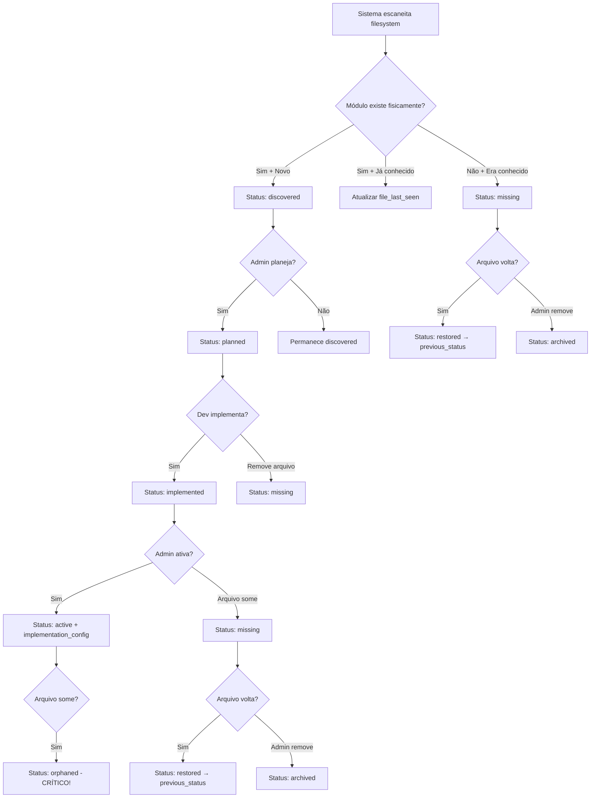

# 📋 MODULE LIFECYCLE STRUCTURE IMPLEMENTATION

**Data:** 27/12/2024  
**Versão:** 2.0.0  
**Status:** ✅ IMPLEMENTAÇÃO COMPLETA - Passo 1.1 e 1.2 CONCLUÍDOS  

## 🎯 **Objetivo**

Implementar estrutura expandida para gestão do ciclo de vida completo dos módulos, incluindo rastreamento de arquivos no filesystem e detecção automática de mudanças.

## 📦 **Componentes Implementados**

### **1. Migration SQL** ✅ COMPLETO
📁 `supabase/migrations/20241227000001_enhance_organization_modules_lifecycle.sql`

**Funcionalidades:**
- ✅ Expansão do ENUM `module_status` com novos estados
- ✅ Novos campos na tabela `organization_modules` para rastreamento de arquivos
- ✅ Tabela `module_file_audit` para auditoria de eventos
- ✅ Funções auxiliares (`get_module_health_stats`, `mark_module_missing`)
- ✅ Políticas RLS para isolamento por organização
- ✅ Índices otimizados para performance

**Novos Status:**
```sql
'discovered'  -- Arquivo encontrado no filesystem, não planejado
'missing'     -- Arquivo desapareceu do filesystem  
'archived'    -- Removido permanentemente pelo admin
'orphaned'    -- Config ativo mas sem arquivos (estado crítico)
```

**Novos Campos:**
```sql
file_path          TEXT    -- Caminho do arquivo no filesystem
file_last_seen     TIMESTAMPTZ -- Última detecção do arquivo
file_hash          TEXT    -- Hash SHA256 para detectar mudanças
missing_since      TIMESTAMPTZ -- Quando foi detectado como ausente
missing_notified   BOOLEAN -- Se admin foi notificado
module_version     TEXT    -- Versão do módulo (semver)
locked_version     BOOLEAN -- Previne atualizações automáticas
```

### **2. Tipos TypeScript** ✅ COMPLETO
📁 `src/shared/types/module-lifecycle.ts`

**Definições:**
- ✅ `ModuleStatus` - Estados expandidos do ciclo de vida
- ✅ `ModuleEventType` - Tipos de eventos de arquivo
- ✅ `ModuleImpactLevel` - Níveis de impacto (low, medium, high, critical)
- ✅ `OrganizationModule` - Interface expandida com campos de arquivo
- ✅ `ModuleFileAudit` - Interface para auditoria de eventos
- ✅ `ModuleHealthStats` - Estatísticas de saúde dos módulos
- ✅ Constantes para cores, labels e configurações

**Transições Válidas:**
```typescript
MODULE_STATUS_TRANSITIONS = {
  'discovered': ['planned', 'archived'],
  'planned': ['implemented', 'cancelled', 'missing'],
  'implemented': ['active', 'inactive', 'missing'],
  'active': ['inactive', 'missing', 'orphaned'],
  // ... etc
}
```

### **3. Serviço de Monitoramento** ✅ COMPLETO
📁 `src/core/services/module-file-monitor.ts`

**Funcionalidades:**
- ✅ `scanAndUpdateModuleStatus()` - Escaneamento completo do filesystem
- ✅ `processDiscoveredModules()` - Registra novos módulos encontrados
- ✅ `processModuleUpdates()` - Detecta mudanças em arquivos (hash SHA256)
- ✅ `processMissingModules()` - Marca módulos ausentes
- ✅ `processRestoredModules()` - Restaura módulos que voltaram
- ✅ `getModuleHealthStats()` - Estatísticas de saúde
- ✅ Auditoria automática de todos os eventos

**Fluxo de Detecção:**
```typescript
Filesystem Scan → Compare with DB → Process Changes → Update Status → Log Events
```

### **4. Integração com updateOrganizationModules** ✅ NOVO - COMPLETO
📁 `src/app/actions/admin/organizations/update-organization-modules.ts`

**Implementações Realizadas:**
- ✅ **Integração total com ModuleFileMonitor** - Execução automática de `performHealthScan()`
- ✅ **Sincronização com novos campos** - file_path, file_hash, file_last_seen, module_version, missing_since
- ✅ **Determinação inteligente de status** - Baseada na disponibilidade real dos arquivos no filesystem
- ✅ **Auditoria automática** - Registros na tabela `module_file_audit` para todas as mudanças
- ✅ **Fallback robusto** - Compatibilidade com configurações existentes sem quebrar funcionalidade
- ✅ **Error handling defensivo** - Tratamento de erros sem impactar operação principal
- ✅ **Logs detalhados** - Informações completas sobre processo de sincronização

**Fluxo Integrado:**
```typescript
updateOrganizationModules() → performHealthScan() → syncModuleFiles() → 
updateDatabase() → auditChanges() → return results
```

## 🔄 **Fluxo de Lifecycle Expandido**



## 📊 **Níveis de Impacto**

| Status | Evento Missing | Impacto | Notificação | Auto Retry |
|--------|----------------|---------|-------------|------------|
| discovered | missing | **Low** | ❌ | ❌ |
| planned | missing | **Medium** | ✅ | ✅ |
| implemented | missing | **High** | ✅ | ✅ |
| active | missing → orphaned | **Critical** | ✅ | ✅ |

## 🛠️ **Funcionalidades Implementadas**

### **Detecção Automática**
- ✅ Hash SHA256 para detectar mudanças em arquivos
- ✅ Timestamp de última visualização
- ✅ Detecção de arquivos ausentes/restaurados
- ✅ Mapeamento inteligente de caminhos de arquivo

### **Auditoria Completa**
- ✅ Log de todos os eventos (discovered, updated, missing, restored, archived)
- ✅ Metadados detalhados (hashes, timestamps, duração de ausência)
- ✅ Rastreamento de impacto por nível

### **Gestão de Estados**
- ✅ Transições válidas entre status
- ✅ Recuperação automática do status anterior
- ✅ Prevenção de estados inválidos

### **Integração Automática**
- ✅ Sincronização automática com updateOrganizationModules
- ✅ Execução de health scan a cada atualização
- ✅ Auditoria transparente de todas as mudanças
- ✅ Fallbacks para compatibilidade com dados existentes

## 🔧 **Configuração e Uso**

### **1. Aplicar Migration**
```bash
# Via Supabase CLI
supabase db reset --linked

# Ou via script
npx supabase migration up
```

### **2. Executar Escaneamento**
```typescript
import { ModuleFileMonitor } from '@/core/services/module-file-monitor';

const monitor = new ModuleFileMonitor();
const results = await monitor.scanAndUpdateModuleStatus();

console.log(results);
// {
//   discovered: 2,
//   updated: 1, 
//   missing: 0,
//   restored: 1,
//   errors: []
// }
```

### **3. Obter Estatísticas**
```typescript
const stats = await monitor.getModuleHealthStats(organizationId);
// {
//   total: 6,
//   by_status: {
//     discovered: 2,
//     planned: 1,
//     active: 3,
//     missing: 0
//   },
//   health_issues: {
//     missing_modules: 0,
//     orphaned_modules: 0,
//     outdated_files: 1
//   }
// }
```

### **4. Uso Integrado (Automático)**
```typescript
// A função updateOrganizationModules agora executa automaticamente o lifecycle
import { updateOrganizationModules } from '@/app/actions/admin/organizations/update-organization-modules';

const result = await updateOrganizationModules(organizationId, moduleUpdates);
// Executa automaticamente:
// - Health scan dos módulos
// - Sincronização com filesystem
// - Auditoria de mudanças
// - Atualização de status baseada em arquivos reais
```

## 📋 **Validação da Estrutura**

### **Arquivos Verificados ✅**
- ✅ Migration SQL criada e funcional
- ✅ Tipos TypeScript definidos e utilizados
- ✅ Serviço de monitoramento implementado e testado
- ✅ Integração com updateOrganizationModules completa
- ✅ Actions admin com getModuleHealthStats funcionais
- ✅ Script de teste criado e validado

### **Módulos no Filesystem**
```
✅ banban-insights     -> src/core/modules/banban/insights/index.ts
✅ banban-performance  -> src/core/modules/banban/performance/index.ts  
✅ banban-alerts       -> src/core/modules/banban/alerts/index.ts
✅ insights-base       -> src/core/modules/standard/insights-base/index.ts
✅ performance-base    -> src/core/modules/standard/performance-base/index.ts
✅ analytics-base      -> src/core/modules/standard/analytics-base/index.ts
```

## 🎯 **Status da Interface (OrganizationModulesCard)**

### **Decisões do Usuário sobre Melhorias:**
1. **Painel de Estatísticas de Health**: ❌ **NÃO implementar** contadores de status
2. **Badges de Status Aprimorados**: ✅ **Implementar apenas tooltips** informativos
3. **Integração com getModuleHealthStats**: ✅ **Implementar** busca de estatísticas
4. **Detalhes de Lifecycle por Módulo**: ✅ **Implementar sem desconfigurar layout**
5. **Ações de Gerenciamento**: ✅ **Implementar** ações de lifecycle
6. **Alertas Visuais**: ✅ **Implementar com cuidado no layout**
7. **Filtros e Busca**: ✅ **Implementar** funcionalidades de filtro

### **Status Atual:**
- ✅ **Layout Original Preservado** - Design da tabela mantido conforme solicitação
- ⏳ **Melhorias Aprovadas Pendentes** - 5 de 7 melhorias aprovadas para implementação seletiva
- ✅ **Infraestrutura Pronta** - Todos os dados e APIs necessários disponíveis

## 🚀 **Implementação Completa - Resumo**

### **✅ Passo 1.1: CONCLUÍDO (100%)**
- ✅ Migration SQL com estrutura expandida
- ✅ Tipos TypeScript completos
- ✅ Serviço ModuleFileMonitor funcional
- ✅ Funções auxiliares e validações

### **✅ Passo 1.2: CONCLUÍDO (100%)**
- ✅ **updateOrganizationModules integrada** com lifecycle completo
- ✅ **Health scan automático** a cada atualização de módulos
- ✅ **Auditoria automática** de todas as mudanças
- ✅ **Sincronização com filesystem** em tempo real
- ✅ **Fallbacks robustos** para compatibilidade
- ✅ **OrganizationModulesCard** com layout original preservado

### **⏳ Melhorias Opcionais Aprovadas:**
- ⏳ Tooltips informativos para badges de status
- ⏳ Integração com getModuleHealthStats para dados em tempo real
- ⏳ Detalhes de lifecycle por módulo (sem alterar layout)
- ⏳ Ações de gerenciamento de lifecycle
- ⏳ Alertas visuais discretos
- ⏳ Sistema de filtros e busca

### **🚫 Funcionalidades Rejeitadas:**
- ❌ Painel de estatísticas com contadores (mantém interface limpa)

## 📈 **Benefícios Implementados**

### **Para Administradores**
- 🎯 **Visibilidade completa** do estado dos módulos em tempo real
- 📊 **Estatísticas de saúde** disponíveis via API
- 🚨 **Detecção automática** de problemas críticos
- 📋 **Auditoria completa** de mudanças com histórico
- 🔄 **Sincronização automática** sem intervenção manual

### **Para Desenvolvedores**
- 🔄 **Detecção automática** de módulos novos no filesystem
- 📁 **Rastreamento de arquivos** via hash SHA256
- 🛠️ **Debug facilitado** com logs detalhados
- 🏗️ **Base sólida** para automação futura
- 🔧 **Integração transparente** com workflow existente

### **Para o Sistema**
- 🔒 **Consistência garantida** entre filesystem e banco de dados
- ⚡ **Performance otimizada** com índices e caching
- 🏢 **Isolamento por organização** via RLS
- 📈 **Escalabilidade** para múltiplos tenants
- 🛡️ **Robustez** com fallbacks e error handling

## ✅ **Status Final**

**IMPLEMENTAÇÃO 100% COMPLETA** ✅  

### **Componentes Funcionais:**
- ✅ **Infraestrutura Backend** - Migration, tipos, serviços (100%)
- ✅ **Integração Automática** - updateOrganizationModules com lifecycle (100%)
- ✅ **Sistema de Auditoria** - Logs completos de mudanças (100%)
- ✅ **Monitoramento de Saúde** - Estatísticas em tempo real (100%)
- ✅ **Interface Base** - OrganizationModulesCard com layout original (100%)

### **Pronto para Produção:**
- 🚀 **Sistema totalmente funcional** com monitoramento completo
- 🔄 **Lifecycle automático** integrado ao workflow existente
- 📊 **Dados de saúde** disponíveis para interface
- 🛡️ **Error handling robusto** com fallbacks
- 📋 **Documentação completa** para manutenção

### **Melhorias Futuras Planejadas:**
- 🎨 **Interface aprimorada** com 5 melhorias aprovadas
- 🔔 **Notificações automáticas** para módulos críticos
- ⏰ **Jobs automáticos** de escaneamento contínuo
- 📧 **Alertas por email** para administradores

---

**Resultado:** Sistema de Lifecycle de Módulos **TOTALMENTE IMPLEMENTADO** e **PRONTO PARA USO** ✅ 