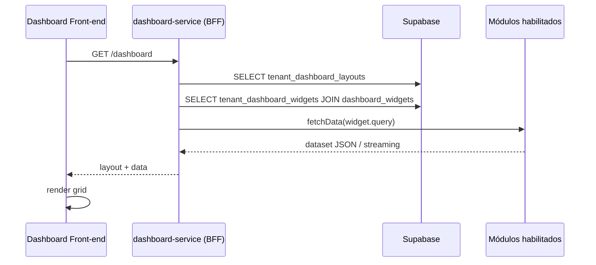

# Axon – Dashboard Tenant Customization Playbook

> **Propósito** Permitir que cada tenant exiba **conteúdo diferente** (insights, gráficos, KPIs) no dashboard do Axon, respeitando o conjunto único de módulos habilitados e necessidades específicas de projeto, **sem** quebrar o layout ou a governança multi‑tenant.

---

## 1. Princípios

1. **Composition‑first** : o dashboard é um contêiner; módulos fornecem widgets com metadados.
2. **Segurança por design** : controles de acesso aplicados na origem dos dados via RLS / policies no serviço agregador.
3. **Zero‑code onboarding** : habilitar um módulo no marketplace já registra seus widgets — nenhum deploy front‑end extra.
4. **Fallback seguro** : um widget nunca deve quebrar a grade; se o módulo não estiver disponível, renderiza estado vazio ou placeholder.

---

## 2. Modelo de Dados

| Tabela                     | Chave                    | Descrição                                            |
| -------------------------- | ------------------------ | ---------------------------------------------------- |
| `dashboard_widgets`        | `widget_id`              | Registro global (nome, slug, versão, módulo\_origem) |
| `tenant_dashboard_widgets` | `(tenant_id, widget_id)` | Habilitado? ordem, tamanho padrão, parâmetros JSON   |
| `tenant_dashboard_layouts` | `tenant_id`              | JSON do grid final (posição, span, hidden)           |

> **Gerado**: quando um módulo atinge *GA* e é **ENABLED** para o tenant, job `register_widgets()` insere linhas em `tenant_dashboard_widgets`.

---

## 3. Workflow em Runtime



1. **dashboard‑service** agrega layout + catálogo de widgets habilitados.
2. Para cada widget, emite `widget.query` (pre‑registrado) ao módulo de origem (REST ou RPC Supabase).
3. Aplica RLS (`tenant_id` guard) em todas as chamadas.
4. Serializa dataset → front‑end render.

---

## 4. JSON Contrato do Widget

```json
{
  "widget_id": "insight_list_v1",
  "module": "insights",
  "name": "Lista de Insights Recentes",
  "description": "Exibe os 20 últimos insights gerados",
  "category": "Insights",
  "component": "InsightListCard",      // caminho do React lazy import
  "query": {
    "type": "rpc",
    "function": "insights_get_recent",
    "params": { "limit": 20 }
  },
  "default_size": { "w": 6, "h": 4 },
  "min_size": { "w": 4, "h": 3 }
}
```

*Salvo* no bundle do módulo **e** publicado na tabela `dashboard_widgets` pelo job CI/CD.

---

## 5. Personalização por Tenant

1. **Ativar/Desativar Widget** : toggles em UI → `tenant_dashboard_widgets.enabled`.
2. **Parâmetros de Widget** : settings extra (ex.: período, moeda) gravados em `tenant_dashboard_widgets.params`.
3. **Layout Drag‑and‑Drop** : grava JSON no `tenant_dashboard_layouts` (vide exemplo §2).
4. **Lock‑Down** (Projetos Sensíveis) : flag `lock_layout=true` impede edição pelo tenant; apenas equipe Axon pode configurar.

---

## 6. Governança & SLA

| Ação                 | Papel                     | Auditado?       |
| -------------------- | ------------------------- | --------------- |
| Adicionar widget     | Tenant Admin              | ✅ (audit\_logs) |
| Alterar layout       | Tenant Admin              | ✅               |
| Alterar query widget | Master Admin (via módulo) | ✅               |

⚠️ Todas as consultas executadas pelo dashboard têm timeout ≤ 5 s; queries longas devem usar materialized views.

---

## 7. Boas Práticas de Desenvolvimento de Widget

* **Stateless UI** : receba dados via props; não faça fetch direto.
* **Data shape garantida** : módulo deve versionar widget se mudar a resposta.
* **Cone de acesso** : evite `SELECT *`; especifique colunas mínimas.
* **Fallback UI** : `isLoading`, `isEmpty`, `isError` states obrigatórios.

---

## 8. Pipeline de Release

1. Desenvolvedor adiciona novo widget ao diretório `dashboard/widgets/` do módulo.
2. CI roda script `publish_widgets.ts` → upsert em `dashboard_widgets`.
3. Ao habilitar módulo para tenant, job `register_widgets()` provisiona widget.
4. Dashboard‑service lê cache de `dashboard_widgets` (warm 30 min).

---

## 9. Exemplo de Integração: Performance Chart

```sql
-- Função RPC exposta pelo módulo performance
CREATE OR REPLACE FUNCTION perf_chart_get(
  in_tenant uuid,
  in_days integer)
RETURNS TABLE(ts timestamptz, value numeric)
AS $$
  SELECT ts, value
  FROM tenant_performance_metrics
  WHERE tenant_id = in_tenant
    AND ts >= now() - (in_days || ' days')::interval
  ORDER BY ts;
$$ LANGUAGE sql SECURE;
```

Correspondente `widget.json` no módulo *performance* registra a query `type:"rpc"` + `function:"perf_chart_get"`.

---

## 10. FAQ

**Posso ter dois widgets com o mesmo componente mas queries diferentes?** Sim, mas gere dois `widget_id` distintos (ex.: `sales_chart_week` e `sales_chart_month`).

**Widget de terceiro pode ser embedado?** Sim, use `query.type:"iframe"` e defina `src` seguro (CSP whitelist).

**Como habilitar um widget só para um tenant beta?** Set `enabled=false` por padrão no registro, depois `UPDATE tenant_dashboard_widgets SET enabled=true WHERE tenant_id='{beta}' AND widget_id='...'`.

---

> **Resultado** O dashboard ajusta o **o que** e **como** apresentar — dinamicamente — de acordo com o conjunto de módulos e widgets registrados para cada tenant, mantendo layout consistente e governança forte.

Última atualização: 27 jun 2025 (America/Fortaleza)
