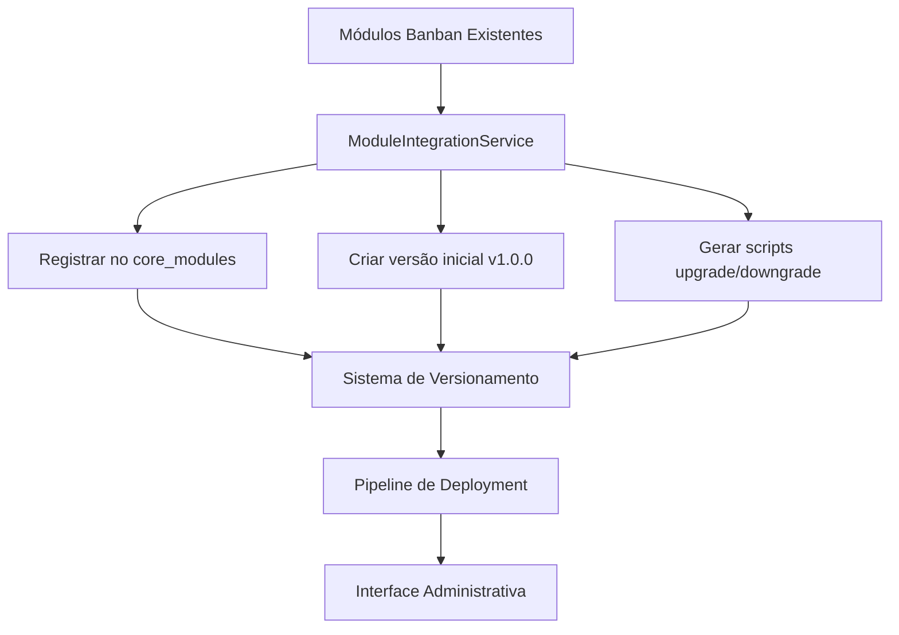

# Guia de Integração de Módulos Banban

## 📋 Visão Geral

Este guia documenta o processo de integração dos módulos Banban existentes com o sistema de versionamento semântico implementado. A integração conecta os módulos já funcionais com o novo sistema de controle de versões e deployment automatizado.

## 🎯 Objetivos da Integração

1. **Conectar módulos existentes** ao sistema de versionamento
2. **Criar versões iniciais** (v1.0.0) para todos os módulos
3. **Estabelecer pipeline de deployment** para atualizações futuras
4. **Manter compatibilidade** com implementações existentes
5. **Facilitar evolução controlada** dos módulos

## 🏗️ Arquitetura da Integração

### Componentes Principais

```
┌─────────────────────┐    ┌──────────────────────┐    ┌─────────────────────┐
│   Módulos Banban    │    │  Sistema de          │    │   Sistema de        │
│   Existentes        │───▶│  Versionamento       │───▶│   Deployment        │
│                     │    │                      │    │                     │
│ • banban-insights   │    │ • ModuleVersioning   │    │ • ModuleDeployment  │
│ • banban-performance│    │ • Validação Semântica│    │ • Pipeline Auto     │
│ • banban-inventory  │    │ • Controle de Release│    │ • Rollback Seguro   │
│ • banban-alerts     │    │ • Scripts Migração   │    │ • Logs Detalhados   │
│ • banban-data-proc  │    │                      │    │                     │
└─────────────────────┘    └──────────────────────┘    └─────────────────────┘
```

### Fluxo de Integração



## 🚀 Processo de Integração

### 1. Identificação dos Módulos

O sistema identifica automaticamente os seguintes módulos Banban:

| Módulo ID | Nome | Descrição | Status |
|-----------|------|-----------|--------|
| `banban-insights` | Insights Avançados | Sistema de insights e análises para fashion retail | ✅ GA |
| `banban-performance` | Performance Analytics | Análise de performance e métricas de negócio | ✅ GA |
| `banban-inventory` | Gestão de Estoque | Sistema avançado de gestão de estoque para fashion | ✅ GA |
| `banban-alerts` | Sistema de Alertas | Alertas inteligentes e notificações | ✅ GA |
| `banban-data-processing` | Processamento de Dados | Engine de processamento e transformação de dados | ✅ GA |

### 2. Registro no Core Modules

Para cada módulo identificado, o sistema:

```sql
INSERT INTO core_modules (
  slug,
  name,
  description,
  maturity,
  status,
  features,
  endpoints,
  metadata
) VALUES (
  'banban-insights',
  'Insights Avançados',
  'Sistema de insights e análises para fashion retail',
  'GA',
  'active',
  '["dashboard-insights", "trend-analysis", "performance-metrics"]',
  '["/api/modules/banban-insights/health", "/api/modules/banban-insights/metrics"]',
  '{"integration_date": "2025-01-15T10:00:00Z", "source": "banban-integration"}'
);
```

### 3. Criação de Versões Iniciais

Para cada módulo registrado, cria-se uma versão inicial:

```typescript
{
  module_id: "uuid-do-modulo",
  version: "1.0.0",
  changelog: "Versão inicial integrada ao sistema de versionamento",
  breaking_changes: false,
  status: "released",
  is_stable: true,
  is_latest: true,
  upgrade_script: "-- Script de upgrade automático --",
  downgrade_script: "-- Script de downgrade automático --"
}
```

### 4. Geração de Scripts

#### Script de Upgrade
```sql
-- Upgrade script for banban-insights v1.0.0
-- Generated automatically during integration

-- Ensure module is registered in tenant_modules
INSERT INTO tenant_modules (organization_id, module_id, operational_status, custom_config)
SELECT 
  o.id as organization_id,
  'banban-insights' as module_id,
  'active' as operational_status,
  '{}' as custom_config
FROM organizations o
WHERE NOT EXISTS (
  SELECT 1 FROM tenant_modules tm 
  WHERE tm.organization_id = o.id 
  AND tm.module_id = 'banban-insights'
);
```

#### Script de Downgrade
```sql
-- Downgrade script for banban-insights v1.0.0
-- This is the initial version, downgrade not supported
INSERT INTO module_deployment_logs (deployment_id, level, message, context)
VALUES (
  (SELECT id FROM module_deployments WHERE module_id = 'banban-insights' ORDER BY created_at DESC LIMIT 1),
  'warn',
  'Downgrade attempted for initial version of banban-insights',
  '{"action": "downgrade_blocked", "reason": "initial_version"}'
);
```

## 🛠️ Como Usar

### Interface Web

1. **Acesse a página de integração**:
   ```
   http://localhost:3000/admin/modules/integration
   ```

2. **Verifique o status atual**:
   - Total de módulos detectados
   - Módulos já integrados
   - Módulos pendentes

3. **Execute a integração**:
   - Clique em "Executar Integração Completa"
   - Acompanhe o progresso em tempo real
   - Verifique os resultados

### API REST

#### Verificar Status
```bash
curl -X GET http://localhost:3000/api/admin/modules/integration
```

**Resposta:**
```json
{
  "success": true,
  "data": {
    "totalModules": 5,
    "integratedModules": 3,
    "pendingModules": ["banban-alerts", "banban-data-processing"],
    "details": [...]
  }
}
```

#### Executar Integração Completa
```bash
curl -X POST http://localhost:3000/api/admin/modules/integration \
  -H "Content-Type: application/json" \
  -d '{"action": "integrate_all"}'
```

#### Re-integrar Módulo Específico
```bash
curl -X POST http://localhost:3000/api/admin/modules/integration \
  -H "Content-Type: application/json" \
  -d '{"action": "reintegrate_module", "moduleId": "banban-insights"}'
```

### Script de Teste

Execute o script de teste automatizado:

```powershell
# Windows PowerShell
.\scripts\test-module-integration.ps1

# Ou via npm
npm run test:integration
```

## 📊 Monitoramento

### Status de Integração

A página de integração fornece:

- **Overview Cards**: Total, integrados, pendentes, progresso
- **Lista Detalhada**: Status por módulo (registrado, versionado)
- **Ações Individuais**: Re-integração de módulos específicos
- **Logs em Tempo Real**: Acompanhamento do processo

### Métricas Importantes

| Métrica | Descrição | Meta |
|---------|-----------|------|
| Taxa de Integração | % de módulos integrados com sucesso | 100% |
| Tempo de Integração | Tempo médio para integrar um módulo | < 30s |
| Taxa de Erro | % de falhas na integração | < 5% |
| Módulos Órfãos | Módulos registrados sem implementação | 0 |

## 🔧 Solução de Problemas

### Problemas Comuns

#### 1. Módulo não encontrado no core_modules
**Erro**: `Módulo banban-insights não encontrado no core_modules`

**Solução**:
```typescript
// Verificar se o módulo foi registrado corretamente
const { data } = await supabase
  .from('core_modules')
  .select('*')
  .eq('slug', 'banban-insights');
```