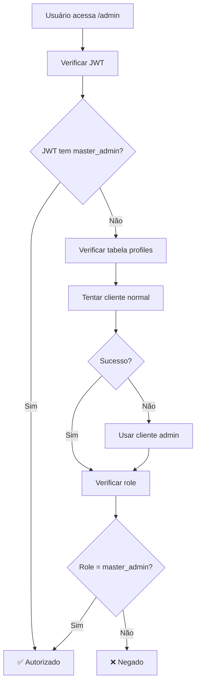

# Fix: Erro de Permissões - "Acesso negado: Apenas master admins podem acessar esta função"

## Problema Identificado

O dashboard admin estava retornando o erro:
```
Acesso negado: Apenas master admins podem acessar esta função.
```

### Causa Raiz

O problema estava na **dessincronização entre duas fontes de verdade** para a role do usuário:

1. **Tabela `profiles`**: Contém `role = 'master_admin'` ✅
2. **Supabase Auth `app_metadata`**: Não contém `user_role = 'master_admin'` ❌

A verificação de permissões estava dependendo exclusivamente do `app_metadata` do JWT token, que não estava sincronizado.

## Solução Implementada

### 1. Verificação com Fallback Inteligente

Modificada a função `verifyMasterAdminAccess()` para usar uma abordagem em duas etapas:

```typescript
async function verifyMasterAdminAccess() {
  // 1. PREFERENCIAL: Verificar role no JWT token
  const userRoleFromJWT = user.app_metadata?.user_role;
  if (userRoleFromJWT === 'master_admin') {
    return { authorized: true, userId: user.id };
  }

  // 2. FALLBACK: Verificar role na tabela profiles
  let { data: profile } = await supabase
    .from('profiles')
    .select('role')
    .eq('id', user.id)
    .single();

  // Se falhar com cliente normal, usar admin
  if (profileError) {
    const adminSupabase = createUnsafeSupabaseAdminClient();
    const adminResult = await adminSupabase
      .from('profiles')
      .select('role')
      .eq('id', user.id)
      .single();
    profile = adminResult.data;
  }

  return { authorized: profile.role === 'master_admin', userId: user.id };
}
```

### 2. Logs Detalhados para Debug

Adicionados logs específicos para identificar onde a verificação falha:

```typescript
console.log('[AUTH] Role do JWT:', userRoleFromJWT);
console.log('[AUTH] JWT não tem master_admin, verificando tabela profiles...');
console.log('[AUTH] Role da tabela profiles:', profile.role);
```

### 3. Página de Debug

Criada página `/admin/debug` para diagnóstico completo:

- ✅ Dados de autenticação (Supabase Auth)
- ✅ Dados do perfil (Tabela profiles)
- ✅ Diagnóstico de permissões
- ✅ Status de sincronização

### 4. Script de Sincronização

Criado script SQL para sincronizar as roles:

```sql
-- Atualizar app_metadata no auth.users
UPDATE auth.users 
SET raw_app_meta_data = COALESCE(raw_app_meta_data, '{}'::jsonb) || 
    jsonb_build_object('user_role', p.role)
FROM profiles p
WHERE auth.users.id = p.id 
  AND p.email = 'brcomdiego@gmail.com'
  AND p.role = 'master_admin';
```

## Arquitetura de Segurança Robusta

### Múltiplas Camadas de Verificação

1. **JWT Token** (Preferencial)
   - Rápido e eficiente
   - Não requer consulta ao banco
   - Atualizado apenas no login

2. **Tabela Profiles** (Fallback)
   - Fonte de verdade autoritativa
   - Sempre atualizada
   - Requer consulta ao banco

3. **Cliente Admin** (Último recurso)
   - Bypass RLS se necessário
   - Logs de uso para auditoria

### Fluxo de Verificação



## Solução do Problema

### ✅ Antes da Correção
- ❌ Dependência exclusiva do JWT
- ❌ Falha se app_metadata dessincronizado
- ❌ Sem fallback para verificação

### ✅ Depois da Correção
- ✅ Verificação dupla (JWT + tabela)
- ✅ Fallback automático e inteligente
- ✅ Logs detalhados para debug
- ✅ Página de diagnóstico completa

## Como Testar

### 1. Página de Debug
```
http://localhost:3000/admin/debug
```

Verifique se:
- ✅ Usuário autenticado
- ✅ Role no app_metadata OU na tabela profiles = `master_admin`
- ✅ "Pode acessar admin" = Sim

### 2. Dashboard Admin
```
http://localhost:3000/admin
```

Deve carregar sem erro de permissões.

### 3. Logs do Console

Procure por logs `[AUTH]` que mostram o fluxo de verificação:
```
[AUTH] Iniciando verificação de permissões...
[AUTH] Role do JWT: undefined
[AUTH] JWT não tem master_admin, verificando tabela profiles...
[AUTH] Role da tabela profiles: master_admin
[AUTH] Usuário autorizado via tabela profiles como master_admin
```

## Sincronização Permanente

Para evitar o problema no futuro:

### 1. Executar Script de Sincronização
```powershell
.\scripts\sync-user-role.ps1
```

### 2. Logout/Login
Após sincronizar, faça logout e login para atualizar o JWT.

### 3. Verificar Funcionamento
Teste ambas as páginas:
- `/admin/debug` - Para diagnóstico
- `/admin` - Para funcionalidade

## Monitoramento

### Logs a Observar

- `[AUTH] Role do JWT:` - Deve ser `master_admin`
- `[AUTH] Role da tabela profiles:` - Deve ser `master_admin`
- `[AUTH] Usuário autorizado via...` - Indica método usado

### Alertas

Se aparecer frequentemente:
- `JWT não tem master_admin, verificando tabela profiles`

Indica que a sincronização precisa ser executada.

## Resultado Final

✅ **Dashboard admin funcionando**
✅ **Verificação robusta com fallback**
✅ **Logs detalhados para troubleshooting**
✅ **Página de debug para diagnóstico**
✅ **Scripts de sincronização disponíveis**

O sistema agora é resiliente a problemas de sincronização entre JWT e tabela profiles, garantindo que usuários `master_admin` sempre tenham acesso, independentemente do estado do `app_metadata`. 