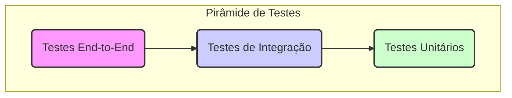

# Estratégia de Testes da Plataforma Axon

## 1. Filosofia de Testes

Nossa abordagem de testes é baseada na "Pirâmide de Testes". Priorizamos uma base sólida de testes unitários rápidos, complementados por testes de integração para verificar a interação entre os módulos, e uma camada mais fina de testes End-to-End (E2E) para validar os fluxos críticos do usuário.

O objetivo principal dos testes é:
- **Garantir a Correção:** Verificar se o software funciona conforme o esperado.
- **Prevenir Regressões:** Garantir que novas alterações não quebrem funcionalidades existentes.
- **Facilitar a Refatoração:** Permitir que os desenvolvedores alterem o código com confiança.
- **Servir como Documentação:** Os testes devem descrever claramente o comportamento esperado do sistema.

## 2. A Pirâmide de Testes na Axon

### 2.1. Testes Unitários (Base da Pirâmide)

- **O que testam:** Funções, métodos, hooks e componentes individuais de forma isolada.
- **Ferramentas:** **Jest**, **React Testing Library**.
- **Onde ficam:** No diretório `__tests__` mais próximo do arquivo que está sendo testado.
- **Características:**
  - **Rápidos:** Devem executar em milissegundos.
  - **Isolados:** Usam mocks para simular dependências (outras funções, chamadas de API, etc.).
  - **Foco:** Testam a lógica interna de uma unidade de código.
- **Exemplo:** Testar um hook `useCounter` para garantir que o contador incrementa corretamente.

### 2.2. Testes de Integração (Meio da Pirâmide)

- **O que testam:** A interação entre dois ou mais módulos do sistema.
- **Ferramentas:** **Jest**, **React Testing Library**, **Supertest** (para o backend).
- **Características:**
  - **Mais lentos que os unitários.**
  - **Menos mocks:** Podem interagir com um banco de dados de teste ou com a API real (em ambiente de teste).
  - **Foco:** Garantir que os módulos se comunicam corretamente.
- **Exemplo:** Testar se um componente de formulário (frontend) consegue enviar dados para a API (backend) e se os dados são salvos corretamente no banco de dados de teste.

### 2.3. Testes End-to-End (E2E) (Topo da Pirâmide)

- **O que testam:** Fluxos completos do usuário, simulando a interação real em um navegador.
- **Ferramentas:** **Playwright** ou **Cypress**.
- **Características:**
  - **Lentos:** Levam segundos ou minutos para executar.
  - **Frágeis:** Podem quebrar por motivos não relacionados a bugs (ex: lentidão da rede).
  - **Foco:** Validar os caminhos críticos da aplicação do ponto de vista do usuário.
- **Exemplo:** Simular um fluxo completo de "um usuário faz login, navega até o dashboard, cria um novo produto e verifica se o produto aparece na lista".

## 3. Cobertura de Código (Code Coverage)

- Usamos o Jest para gerar relatórios de cobertura de código.
- **Objetivo:** A cobertura de código é uma métrica útil, mas não é o objetivo final. O foco deve ser escrever testes de qualidade que validem o comportamento, e não apenas "cobrir linhas".
- **Meta:** Buscamos uma cobertura de **>80%** para novas funcionalidades.

## 4. Executando os Testes

Os testes podem ser executados com os seguintes comandos `pnpm`:

- `pnpm test`: Executa todos os testes uma vez.
- `pnpm test:watch`: Executa os testes em modo de observação, rodando novamente a cada alteração.
- `pnpm test:coverage`: Executa os testes e gera um relatório de cobertura de código.

Os testes são executados automaticamente em nosso pipeline de CI/CD a cada Pull Request para a branch `develop`. Um PR não pode ser mesclado se os testes falharem. 