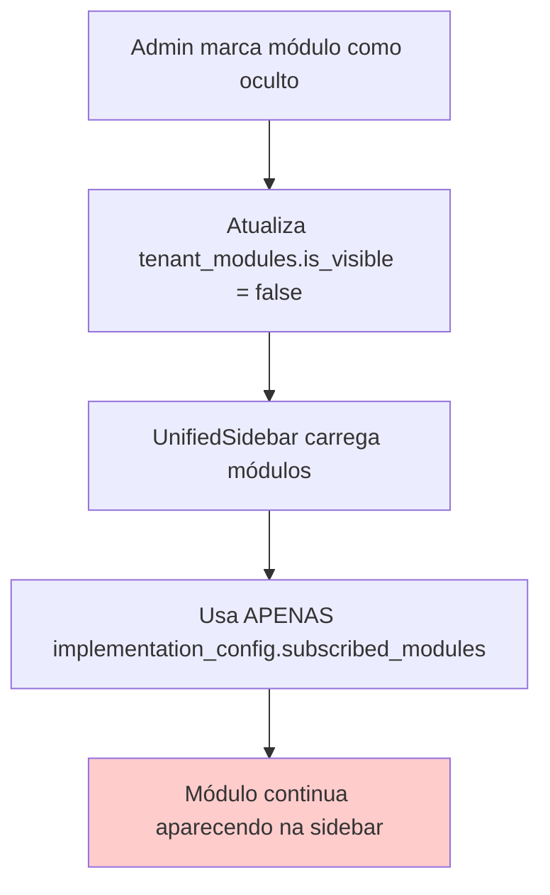
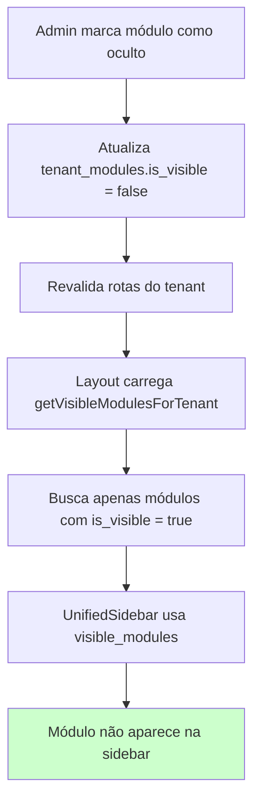

# Correção: Módulos "Ocultos" Continuavam Aparecendo na Tela do Tenant

## 🔍 **Descrição do Problema**

Quando um administrador marcava um módulo como "oculto" (is_visible = false) na interface de gestão de organizações (`OrganizationModulesCard`), o módulo continuava aparecendo na sidebar do tenant, ignorando a configuração de visibilidade.

## 🧩 **Diagnóstico da Causa Raiz**

### **Problema Principal**
A função `getSubscribedModules` na `UnifiedSidebar` estava usando apenas o campo `implementation_config.subscribed_modules` da tabela `organizations`, **ignorando completamente** o campo `is_visible` da tabela `tenant_modules`.

### **Fluxo Incorreto (ANTES)**


### **Problema de Arquitetura**
- **Tabela `tenant_modules`**: Controle granular de visibilidade por módulo (`is_visible`)
- **Campo `implementation_config.subscribed_modules`**: Lista geral de módulos atribuídos
- **Conflito**: Sidebar ignorava `tenant_modules.is_visible` e usava apenas `subscribed_modules`

## 🛠️ **Solução Implementada**

### **1. Nova Função para Buscar Módulos Visíveis**
```typescript
// src/app/actions/admin/tenant-modules.ts
export async function getVisibleModulesForTenant(organizationId: string): Promise<{ success: boolean; data?: string[]; error?: string }> {
  const { data: rawData, error } = await supabase
    .from('tenant_modules')
    .select(`
      module_id,
      core_modules (
        slug
      )
    `)
    .eq('organization_id', organizationId)
    .eq('is_visible', true); // 🔑 FILTRO CRÍTICO: Apenas módulos visíveis

  // Extrair slugs dos módulos visíveis
  const visibleModuleSlugs = rawData
    .filter(item => item.core_modules && !Array.isArray(item.core_modules))
    .map(item => (item.core_modules as any).slug)
    .filter(slug => slug);

  return { success: true, data: visibleModuleSlugs };
}
```

### **2. Modificação do Layout do Tenant**
```typescript
// src/app/(protected)/[slug]/layout.tsx
const checkAuth = async () => {
  // ... código existente ...

  // 🔑 NOVA LÓGICA: Buscar módulos realmente visíveis da tabela tenant_modules
  let visibleModules: string[] = [];
  if (organization?.id) {
    const visibleModulesResult = await getVisibleModulesForTenant(organization.id);
    if (visibleModulesResult.success && visibleModulesResult.data) {
      visibleModules = visibleModulesResult.data;
    }
  }

  // Adicionar os módulos visíveis à organização
  const organizationWithVisibleModules = {
    ...organization,
    visible_modules: visibleModules // 🔑 NOVO CAMPO
  };

  setUserProfile({ ...profile, organization: organizationWithVisibleModules });
};
```

### **3. Atualização da UnifiedSidebar**
```typescript
// src/shared/components/unified-sidebar.tsx
const getDynamicTenantConfig = (slug: string, organization?: any): SidebarConfig => {
  // 🔑 NOVA LÓGICA: Usar módulos visíveis ao invés de implementation_config
  const visibleModules = organization?.visible_modules || [];
  
  let subscribedModules: NavItem[];
  if (visibleModules.length > 0) {
    subscribedModules = getSubscribedModulesFromSlugs(visibleModules); // 🔑 NOVA FUNÇÃO
    console.log('✅ Usando módulos visíveis da tabela tenant_modules:', visibleModules);
  } else {
    subscribedModules = getSubscribedModules(organization?.implementation_config);
    console.log('⚠️ Fallback: usando módulos de implementation_config');
  }
  
  // ... resto da lógica ...
};

// 🔑 NOVA FUNÇÃO: Mapear slugs para itens de navegação
const getSubscribedModulesFromSlugs = (moduleSlugs: string[]): NavItem[] => {
  const moduleNavItems: NavItem[] = [];
  
  moduleSlugs.forEach(slug => {
    if (slug === 'insights' || slug === 'banban-insights') {
      moduleNavItems.push({
        title: 'Insights Avançados',
        icon: BarChart3,
        items: [/* ... */]
      });
    }
    // ... outros módulos ...
  });

  return moduleNavItems;
};
```

### **4. Melhoria na Revalidação de Cache**
```typescript
// src/app/actions/admin/tenant-modules.ts
export async function updateTenantModuleVisibility(/*...*/) {
  // ... atualizar tenant_modules ...

  // 🔑 REVALIDAR ROTAS DO TENANT para forçar reload da sidebar
  const { data: orgData } = await supabase
    .from('organizations')
    .select('slug')
    .eq('id', organizationId)
    .single();

  if (orgData?.slug) {
    const commonRoutes = ['', '/insights', '/performance', '/alerts', '/inventory', '/analytics', '/data-processing'];
    commonRoutes.forEach((route: string) => {
      revalidatePath(`/${orgData.slug}${route}`);
    });
  }
}
```

## ✅ **Fluxo Correto (DEPOIS)**


## 🔧 **Arquivos Modificados**

1. **`src/app/actions/admin/tenant-modules.ts`**
   - ✅ Adicionada função `getVisibleModulesForTenant()`
   - ✅ Melhorada função `updateTenantModuleVisibility()` com revalidação

2. **`src/app/(protected)/[slug]/layout.tsx`**
   - ✅ Integração com `getVisibleModulesForTenant()`
   - ✅ Adicionado campo `visible_modules` à interface `Organization`

3. **`src/shared/components/unified-sidebar.tsx`**
   - ✅ Modificada função `getDynamicTenantConfig()`
   - ✅ Adicionada função `getSubscribedModulesFromSlugs()`

## 🎯 **Resultado**

- ✅ **Problema Resolvido**: Módulos marcados como "ocultos" agora são **realmente ocultados** da sidebar do tenant
- ✅ **Fonte de Verdade**: Tabela `tenant_modules.is_visible` é respeitada
- ✅ **Performance**: Cache é revalidado automaticamente
- ✅ **Compatibilidade**: Fallback para `implementation_config` mantido
- ✅ **Logs**: Debug completo para troubleshooting

## 🔍 **Como Testar**

1. Acesse `/admin/organizations/[id]`
2. Na seção "Módulos da Organização", desative a visibilidade de um módulo
3. Acesse a URL do tenant (`/[slug]`)
4. Verifique que o módulo não aparece mais na sidebar
5. Reative a visibilidade e confirme que o módulo volta a aparecer

## 📝 **Logs de Debug**

```
🔍 getVisibleModulesForTenant: Módulos visíveis encontrados: ['insights', 'performance']
✅ Usando módulos visíveis da tabela tenant_modules: ['insights', 'performance']
✅ Rotas do tenant revalidadas para organização banban
```

---

**Status**: ✅ **RESOLVIDO**  
**Data**: Janeiro 2025  
**Impacto**: 🔥 **CRÍTICO** - Funcionalidade principal de controle de visibilidade  
**Complexidade**: 🟡 **MÉDIA** - Envolveu múltiplas camadas (DB, Actions, Layout, UI) 