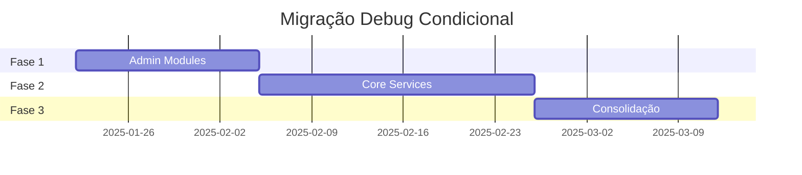

# Fases de Migração - Debug Condicional

**Cronograma:** 4-7 semanas totais  
**Abordagem:** Incremental e não-disruptiva

## 🚀 Fase 1: Fundação (Semanas 1-2)

### **Objetivo**
Estabelecer padrões e migrar módulos administrativos críticos onde o debug condicional trará maior valor.

### **Escopo - Módulos Administrativos**
```
src/app/actions/admin/modules/
├── auto-config-applier.ts          ⭐ CRÍTICO
├── base-modules.ts                  ⭐ CRÍTICO  
├── module-implementations.ts        ⭐ CRÍTICO
├── tenant-module-assignments.ts     ⭐ CRÍTICO
├── module-backups.ts               🔥 ALTO
├── system-config-utils.ts          🔥 ALTO
├── utils.ts                        📝 MÉDIO
└── call-tracker.ts                 📝 MÉDIO
```

### **Critérios de Migração Fase 1**
- Operações que admins investigam frequentemente
- Fluxos de configuração automática
- Backups e operações críticas
- Logs que revelam "o que o sistema está fazendo"

### **Exemplo de Migração**
```typescript
// ANTES
console.debug('Aplicando configurações automáticas', { entityType, entityId });

// DEPOIS
await conditionalDebugLog(
  'Aplicando configurações automáticas', 
  { entityType, entityId, appliedConfigs }
);
```

### **Entregáveis Fase 1**
- [ ] 8 arquivos admin/modules migrados
- [ ] Padrões estabelecidos e documentados
- [ ] Testes funcionais validados
- [ ] Template de migração criado

---

## 🔧 Fase 2: Expansão (Semanas 3-5)

### **Objetivo**
Expandir para serviços core, middleware e componentes que admins precisam debugar.

### **Escopo - Serviços Core**
```
src/core/services/
├── module-discovery.ts             ⭐ CRÍTICO
├── ModuleIntegrationService.ts      ⭐ CRÍTICO
├── TenantOperationalStatusService.ts ⭐ CRÍTICO
├── module-metadata.ts              🔥 ALTO
├── module-file-monitor.ts          🔥 ALTO
├── ModuleCatalogService.ts         📝 MÉDIO
├── TenantModuleService.ts          📝 MÉDIO
└── GenericDataService.ts           📝 MÉDIO
```

### **Escopo - Middleware & Utils**
```
src/shared/utils/
├── tenant-middleware.ts            ⭐ CRÍTICO
├── subdomain-middleware.ts         🔥 ALTO
├── audit-logger.ts                 🔥 ALTO
├── api-router.ts                   📝 MÉDIO
└── module-mapping.ts               📝 MÉDIO
```

### **Critérios de Migração Fase 2**
- Serviços que gerenciam descoberta/integração de módulos
- Middleware que afeta roteamento e tenant resolution
- Utils que auditores/admins usam para investigação
- Performance monitoring relevante

### **Entregáveis Fase 2**
- [ ] 15-20 arquivos core/services migrados
- [ ] 5-8 arquivos shared/utils migrados  
- [ ] Documentação de patterns updated
- [ ] Dashboard básico de logs (opcional)

---

## 🎯 Fase 3: Consolidação (Semanas 6-7)

### **Objetivo**
Finalizar migração dos módulos restantes e otimizar o sistema completo.

### **Escopo - Finalizações**
```
src/app/actions/
├── admin/ (não-modules)            🔥 ALTO
├── profiles/                       📝 MÉDIO  
├── auth/ (seletivo)               📝 MÉDIO
├── alerts/                        📝 MÉDIO
└── organization/                  📝 MÉDIO
```

### **Escopo - Components & Hooks**
```
src/shared/hooks/
├── useDashboardData.ts             📝 MÉDIO
├── useDynamicLayout.ts             📝 MÉDIO
└── useSecurityAlerts.ts            📝 MÉDIO
```

### **Escopo - Limpeza**
```
Atividades de Limpeza:
├── Remover console.log temporários
├── Padronizar mensagens de debug
├── Otimizar performance do sistema
├── Documentação final
└── Treinamento da equipe
```

### **Entregáveis Fase 3**
- [ ] 25-30 arquivos restantes migrados
- [ ] Sistema otimizado e performático
- [ ] Documentação completa atualizada
- [ ] Guia de boas práticas finalizado

---

## 📊 Cronograma Visual



## 🎯 Marcos de Validação

### **Após Cada Fase**
- [ ] Testes funcionais 100% passando
- [ ] Performance não degradada
- [ ] Interface admin funcionando corretamente
- [ ] Logs condicionais sendo persistidos
- [ ] Zero regressões reportadas

### **Critérios de Rollback**
- Performance degradada > 10%
- Funcionalidades críticas quebradas
- Logs essenciais não funcionando
- Feedback negativo da equipe

## 🔄 Abordagem Iterativa

Cada fase segue o ciclo:
1. **Plan** → Identificar arquivos prioritários
2. **Migrate** → Aplicar mudanças em lotes pequenos
3. **Test** → Validação funcional e de performance  
4. **Review** → Ajustes baseados em feedback
5. **Deploy** → Rollout gradual para produção