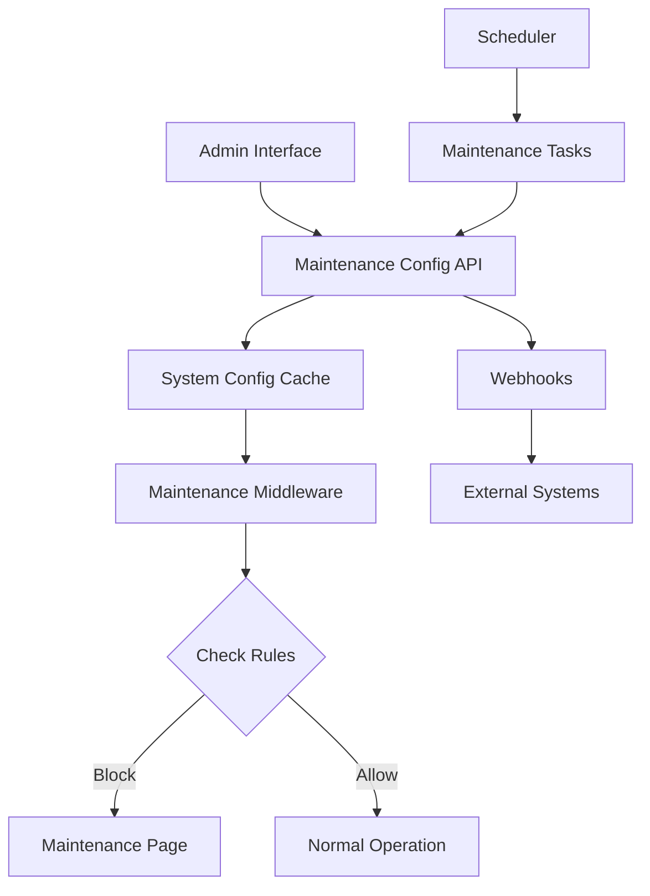

# Guia de Implementação - Modo Manutenção

**Referência técnica detalhada para implementação das melhorias**

## 🏗️ Arquitetura Proposta



## 📁 Estrutura de Arquivos

### **Novos Arquivos**
```
src/
├── app/
│   ├── maintenance/
│   │   ├── page.tsx                 # Página de manutenção
│   │   └── components/
│   │       └── MaintenanceLayout.tsx
│   └── api/system/
│       └── maintenance-status/route.ts (existente - melhorar)
├── components/
│   ├── MaintenanceCheck.tsx (existente - expandir)
│   ├── EmergencyBypass.tsx          # Novo
│   ├── MaintenanceScheduler.tsx     # Novo
│   └── MaintenanceWebhooks.tsx      # Novo
├── services/
│   ├── maintenance-notifications.ts # Novo
│   ├── maintenance-scheduler.ts     # Novo
│   └── maintenance-webhooks.ts      # Novo
└── hooks/
    └── useMaintenanceStatus.ts      # Melhorar
```

### **Arquivos a Modificar**
```
src/
├── app/actions/admin/modules/
│   ├── tenant-module-assignments.ts ⭐ CRÍTICO
│   ├── module-settings.ts          🔥 ALTO
│   └── system-config-utils.ts      🔥 ALTO
├── app/(protected)/
│   ├── layout.tsx                  📝 MÉDIO
│   └── admin/modules/components/
│       └── configurations/
│           └── ModuleSettingsFormContent.tsx 🔥 ALTO
└── middleware.ts                   📝 MÉDIO
```

## 🔧 Implementação por Componente

### **1. Schema de Dados**

#### **Tabela `secrets` - Expandir Configuração**
```sql
-- Estrutura atual expandida
{
  "system_settings_maintenance": {
    "enabled": false,
    "message": "Sistema em manutenção programada",
    "estimatedReturn": "2025-01-22T14:00:00Z",
    "reason": "scheduled",
    "level": "full",
    "blockedOperations": ["create*", "update*", "delete*"],
    "allowedRoles": ["super_admin"],
    "emergencyBypass": true,
    "bypassCode": "EMERGENCY_2025",
    "webhooks": ["https://api.example.com/maintenance"],
    "startedAt": "2025-01-21T10:00:00Z"
  }
}
```

#### **Nova Tabela `scheduled_maintenance`**
```sql
CREATE TABLE scheduled_maintenance (
  id UUID PRIMARY KEY DEFAULT gen_random_uuid(),
  name TEXT NOT NULL,
  scheduled_start TIMESTAMPTZ NOT NULL,
  scheduled_end TIMESTAMPTZ NOT NULL,
  config JSONB NOT NULL,
  auto_enable BOOLEAN DEFAULT true,
  auto_disable BOOLEAN DEFAULT true,
  pre_notification_minutes INTEGER DEFAULT 60,
  status TEXT CHECK (status IN ('scheduled', 'active', 'completed', 'cancelled')),
  created_at TIMESTAMPTZ DEFAULT NOW(),
  created_by UUID REFERENCES auth.users(id)
);
```

### **2. Core Functions**

#### **Verificação Granular**
```typescript
// system-config-utils.ts
export interface MaintenanceContext {
  operation: string;
  module?: string;
  userId?: string;
  userRole?: string;
  bypassCode?: string;
}

export async function checkMaintenanceModeAdvanced(
  context: MaintenanceContext
): Promise<{ allowed: boolean; reason?: string; level?: string }> {
  const config = await getAdvancedMaintenanceConfig();
  
  if (!config.enabled) {
    return { allowed: true };
  }
  
  // Verificar exceções de usuário/role
  if (context.userId && await checkMaintenanceException(context)) {
    return { allowed: true, level: 'exception' };
  }
  
  // Verificar nível de manutenção
  const levelCheck = await checkMaintenanceLevel(config.level, context);
  return levelCheck;
}
```

#### **Sistema de Cache Inteligente**
```typescript
// Cache hierárquico para performance
const maintenanceCache = new Map<string, {
  config: MaintenanceConfig;
  expiry: number;
  version: string;
}>();

export async function getMaintenanceConfigCached(
  userId?: string
): Promise<MaintenanceConfig> {
  const cacheKey = `maintenance:${userId || 'global'}`;
  const cached = maintenanceCache.get(cacheKey);
  
  if (cached && cached.expiry > Date.now()) {
    return cached.config;
  }
  
  const config = await getMaintenanceConfig();
  const userConfig = userId ? await getUserSpecificConfig(userId, config) : config;
  
  maintenanceCache.set(cacheKey, {
    config: userConfig,
    expiry: Date.now() + (60 * 1000), // 1 minuto cache
    version: config.version || Date.now().toString()
  });
  
  return userConfig;
}
```

### **3. Middleware Integration**

#### **Next.js Middleware**
```typescript
// middleware.ts
import { NextRequest, NextResponse } from 'next/server';

export async function middleware(request: NextRequest) {
  const pathname = request.nextUrl.pathname;
  
  // Skip maintenance check for certain paths
  if (shouldSkipMaintenanceCheck(pathname)) {
    return NextResponse.next();
  }
  
  const context = await buildMaintenanceContext(request);
  const { allowed, reason, level } = await checkMaintenanceModeAdvanced(context);
  
  if (!allowed) {
    // Redirect to maintenance page with context
    const maintenanceUrl = new URL('/maintenance', request.url);
    maintenanceUrl.searchParams.set('reason', reason || '');
    maintenanceUrl.searchParams.set('level', level || '');
    
    return NextResponse.redirect(maintenanceUrl);
  }
  
  return NextResponse.next();
}

function shouldSkipMaintenanceCheck(pathname: string): boolean {
  const skipPaths = [
    '/maintenance',
    '/api/system/maintenance-status',
    '/api/auth',
    '/_next',
    '/favicon.ico'
  ];
  
  return skipPaths.some(path => pathname.startsWith(path));
}
```

#### **API Middleware Decorator**
```typescript
// decorators/maintenance-check.ts
export function withMaintenanceCheck(operation: string, module?: string) {
  return function (target: any, propertyName: string, descriptor: PropertyDescriptor) {
    const method = descriptor.value;
    
    descriptor.value = async function (...args: any[]) {
      const context = {
        operation,
        module,
        userId: this.userId,
        userRole: this.userRole
      };
      
      const { allowed, reason } = await checkMaintenanceModeAdvanced(context);
      
      if (!allowed) {
        return {
          success: false,
          error: reason || 'Operação não permitida durante manutenção'
        };
      }
      
      return method.apply(this, args);
    };
  };
}

// Uso:
export class ModuleService {
  @withMaintenanceCheck('create_module', 'admin')
  async createModule(data: ModuleData) {
    // Implementação normal
  }
}
```

## 🧪 Estratégia de Testes

### **Testes Unitários**
```typescript
describe('Advanced Maintenance Mode', () => {
  describe('checkMaintenanceModeAdvanced', () => {
    it('should allow super_admin during admin-only mode', async () => {
      await setMaintenanceConfig({ enabled: true, level: 'admin-only' });
      
      const result = await checkMaintenanceModeAdvanced({
        operation: 'create_module',
        userRole: 'super_admin'
      });
      
      expect(result.allowed).toBe(true);
    });
    
    it('should block regular users during admin-only mode', async () => {
      await setMaintenanceConfig({ enabled: true, level: 'admin-only' });
      
      const result = await checkMaintenanceModeAdvanced({
        operation: 'create_module',
        userRole: 'user'
      });
      
      expect(result.allowed).toBe(false);
      expect(result.reason).toContain('administradores');
    });
  });
});
```

### **Testes E2E**
```typescript
describe('Maintenance Mode E2E', () => {
  it('should redirect users to maintenance page when enabled', async () => {
    // Enable maintenance mode via admin
    await page.goto('/admin/modules/management');
    await page.click('[data-testid="maintenance-toggle"]');
    await page.click('[data-testid="save-settings"]');
    
    // Regular user should be redirected
    await loginAsUser('regular-user');
    await page.goto('/dashboard');
    
    await expect(page).toHaveURL('/maintenance');
    await expect(page.locator('h1')).toContainText('Sistema em Manutenção');
  });
});
```

## 📊 Métricas e Monitoramento

### **Métricas a Coletar**
```typescript
interface MaintenanceMetrics {
  activationsCount: number;
  averageDuration: number;
  blockedOperationsCount: number;
  bypassUsageCount: number;
  userImpactScore: number;
  scheduledVsManualRatio: number;
}
```

### **Dashboards**
- Tempo de atividade vs. manutenção
- Operações bloqueadas por tipo
- Uso de exceções/bypass
- Impacto por usuário/role

## 🚀 Deployment Strategy

### **Rollout Faseado**
1. **Fase 1 → Dev**: Testes internos completos
2. **Fase 2 → Staging**: Validação com dados reais
3. **Fase 3 → Production**: Feature flag para rollback rápido

### **Feature Flags**
```typescript
const MAINTENANCE_FEATURES = {
  ADVANCED_CONFIG: 'maintenance.advanced_config',
  SCHEDULING: 'maintenance.scheduling',
  WEBHOOKS: 'maintenance.webhooks',
  GRANULAR_CONTROL: 'maintenance.granular_control'
};
```

### **Rollback Plan**
```typescript
// emergency-rollback.ts
export async function emergencyRollback() {
  // Disable all maintenance modes
  await disableAllMaintenanceModes();
  
  // Clear all caches
  await clearMaintenanceCaches();
  
  // Notify admins
  await notifyEmergencyRollback();
  
  // Revert to basic maintenance system
  await revertToBasicMaintenanceMode();
}
```

## 📚 Documentação

### **Para Desenvolvedores**
- Como usar `withMaintenanceCheck` decorator
- Estrutura de contexto de manutenção
- Cache e performance considerations

### **Para Administradores**
- Como configurar manutenção granular
- Agendamento e automação
- Troubleshooting de exceções

### **Para Usuários**
- O que esperar durante manutenção
- Como solicitar acesso de emergência
- Canais de comunicação e suporte