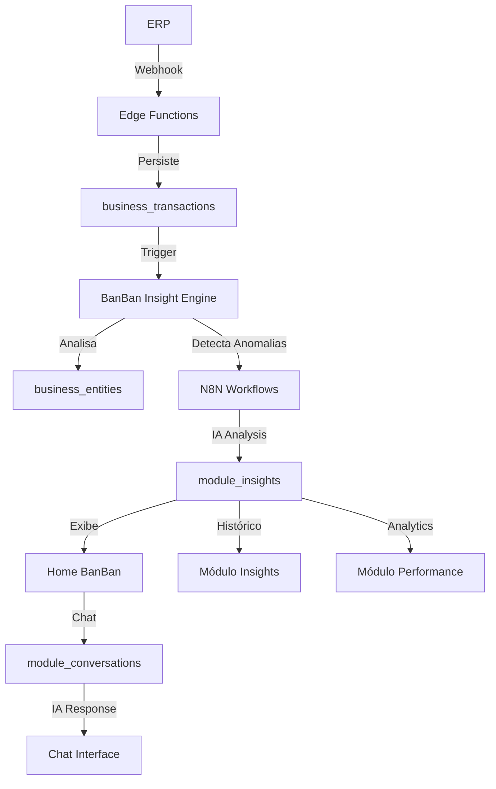

# BanBan - Roadmap Adequado à Arquitetura Genérica

## 📋 RESUMO EXECUTIVO

### **Visão do Projeto**
O BanBan é um sistema analítico especializado em gestão de estoque para varejo de moda, desenvolvido como cliente customizado da plataforma Axon. Utiliza Inteligência Artificial conversacional para transformar dados brutos de ERP em insights acionáveis, permitindo que gestores tomem decisões estratégicas baseadas em análises preditivas e recomendações personalizadas.

### **Problema Resolvido**
- **Gestores de varejo** perdem oportunidades e enfrentam rupturas por falta de insights acionáveis
- **Dados abundantes** mas pouca inteligência para transformá-los em ações práticas
- **Análises manuais** demoradas e propensas a erros humanos
- **Decisões reativas** ao invés de estratégias proativas baseadas em dados

### **Solução Proposta**
Sistema que processa dados de ERP via IA para gerar **8 tipos específicos de insights**:
1. **Ativação de Produtos Parados** - SKUs sem vendas com sugestões de ação
2. **Recomendações de Reposição Inteligente** - Prevenção de rupturas baseada em IA
3. **Análise de Divergências de Estoque** - Detecção automática ERP vs PDV
4. **Otimização de Margem** - Identificação de produtos com rentabilidade baixa
5. **Ponto de Reabastecimento Automatizado** - Alertas proativos de reposição
6. **Promoções Focadas em Slow-Movers** - Estratégias para acelerar giro
7. **Redistribuição Otimizada entre Lojas** - Balanceamento inteligente de estoque
8. **Detecção de Picos de Devolução** - Identificação de problemas de qualidade

### **Diferencial Competitivo**
- **IA Conversacional**: Usuário pode "conversar" com seus dados como se fosse um analista sênior
- **Análises Preditivas**: Não apenas detecta problemas, mas prevê oportunidades
- **Linguagem Natural**: Insights apresentados em português claro e acionável
- **Integração Nativa**: Conecta diretamente com ERPs via webhooks existentes
- **Custo Otimizado**: IA custa apenas $0.18-2.00/mês por cliente (99% de margem)

### **Arquitetura Técnica**
```
ERP → Edge Functions → Dados Estruturados → IA via N8N → Insights Acionáveis → Interface Conversacional
```

**Componentes principais:**
- **Backend**: Node.js + Supabase + N8N para orquestração de IA
- **Frontend**: Next.js + React com interface conversacional
- **IA**: GPT-4o-mini (custo) + GPT-4 (precisão) + Claude (conversação)
- **Dados**: Arquitetura genérica com tabelas JSONB flexíveis

### **Entregáveis do Projeto**
1. **Home Customizada** (`/banban`) - Dashboard com insights diários/semanais
2. **Módulo Performance** (`/banban/performance`) - Análises detalhadas e KPIs
3. **Módulo Insights** (`/banban/insights`) - Histórico e gestão avançada
4. **Sistema de Chat IA** - Conversação geral e contextual por insight
5. **8 Workflows N8N** - Orquestração automática de análises via IA
6. **APIs Especializadas** - Endpoints otimizados para cada funcionalidade

### **Cronograma e Recursos**
- **Duração**: 6 semanas (6 sprints de 1 semana)
- **Equipe**: 2-3 desenvolvedores (1 backend + 1-2 frontend)
- **Budget IA**: $100-300/mês para operação (custo real)
- **Tecnologias**: Stack existente da Axon + N8N + APIs de IA

### **ROI Esperado**
- **Investimento**: ~$50K desenvolvimento + $200/mês operação
- **Economia/Ganho**: R$ 50K-200K/mês para cliente típico
- **Payback**: 2-4 semanas de uso
- **ROI**: 15-50x do investimento

### **Métricas de Sucesso**
- **Técnicas**: Uptime >99.5%, Latência <30s, Taxa erro <1%
- **Funcionais**: 8 insights funcionando, Acurácia >85%, Satisfação >4.5/5
- **Negócio**: ROI >10x, Adoption >80%, Retention >95%

### **Riscos e Mitigações**
- **Custo IA variável**: Mitigado com otimizações (cache, prompts, modelos)
- **Complexidade N8N**: Mitigado com workflows simples e bem testados
- **Adoption do cliente**: Mitigado com UX intuitiva e valor claro
- **Qualidade insights**: Mitigado com validação e feedback contínuo

### **Próximos Passos**
1. **Setup N8N + IA** (Semana 1)
2. **Primeiro insight funcionando** (Semana 2) 
3. **Home + Chat básico** (Semana 3)
4. **8 insights completos** (Semana 4-5)
5. **Produção estável** (Semana 6)

---

## 🏗️ ARQUITETURA DO SISTEMA

### **Estrutura Genérica Existente:**
- **business_entities** - Produtos, lojas, fornecedores, etc.
- **business_relationships** - Relacionamentos entre entidades
- **business_transaction_items** - Itens de vendas, compras, transferências
- **business_transactions** - Transações principais
- **Módulos por tenant** - Cada página é um módulo específico
- **Home customizável** - Recebe widgets ou é totalmente customizada

### **Nova Estrutura para BanBan:**
```sql
-- Tabela genérica para insights de qualquer módulo
CREATE TABLE module_insights (
  id UUID PRIMARY KEY DEFAULT uuid_generate_v4(),
  tenant_id UUID NOT NULL,
  module_name TEXT NOT NULL,           -- 'banban', 'performance', etc.
  insight_type TEXT NOT NULL,          -- 'SLOW_MOVING', 'LOW_MARGIN', etc.
  insight_data JSONB NOT NULL,         -- Dados do insight em formato flexível
  severity TEXT NOT NULL,              -- 'CRITICAL', 'WARNING', 'OPPORTUNITY'
  generated_at TIMESTAMPTZ DEFAULT now(),
  expires_at TIMESTAMPTZ,              -- Quando insight perde validade
  is_read BOOLEAN DEFAULT FALSE,
  is_resolved BOOLEAN DEFAULT FALSE,
  ai_analysis JSONB,                   -- Análise da IA em formato estruturado
  created_at TIMESTAMPTZ DEFAULT now()
);

-- Tabela genérica para conversas com IA de qualquer módulo
CREATE TABLE module_conversations (
  id UUID PRIMARY KEY DEFAULT uuid_generate_v4(),
  tenant_id UUID NOT NULL,
  user_id UUID NOT NULL,
  module_name TEXT NOT NULL,           -- 'banban', 'performance', etc.
  conversation_type TEXT NOT NULL,     -- 'general', 'insight_specific'
  context_reference UUID,              -- ID do insight se conversation_type = 'insight_specific'
  messages JSONB NOT NULL,             -- Array de mensagens
  metadata JSONB DEFAULT '{}',         -- Metadados da conversa
  created_at TIMESTAMPTZ DEFAULT now(),
  updated_at TIMESTAMPTZ DEFAULT now()
);

-- Configurações por módulo/tenant
CREATE TABLE module_configurations (
  id UUID PRIMARY KEY DEFAULT uuid_generate_v4(),
  tenant_id UUID NOT NULL,
  module_name TEXT NOT NULL,
  config_data JSONB NOT NULL,          -- Configurações específicas do módulo
  updated_by UUID NOT NULL,
  created_at TIMESTAMPTZ DEFAULT now(),
  updated_at TIMESTAMPTZ DEFAULT now(),
  UNIQUE(tenant_id, module_name)
);
```

---

## 📱 ESTRUTURA DE PÁGINAS/MÓDULOS

### **Home Customizada BanBan (`/banban`)**
*Não é um módulo, é uma instância customizada*
```typescript
// Página home concentra insights do dia/semana
interface BanbanHomePage {
  insights_summary: DailyInsights[];
  chat_general: ChatInterface;
  quick_actions: ActionButton[];
  streak_info: StreakData;
}
```

### **Módulo Performance (`/banban/performance`)**
*Módulo específico para análises detalhadas*
```typescript
interface PerformanceModule {
  charts: PerformanceChart[];
  kpis: KPICard[];
  filters: FilterOptions;
  export_options: ExportButton[];
}
```

### **Módulo Insights (`/banban/insights`)** - NOVO
*Módulo para histórico e gestão avançada*
```typescript
interface InsightsModule {
  historical_insights: InsightHistory[];
  insight_filters: FilterOptions;
  bulk_actions: BulkActionOptions;
  analytics: InsightAnalytics;
}
```

---

## 🎯 BACKLOG ATUALIZADO

### **ÉPICO 1: ADAPTAÇÃO À ARQUITETURA GENÉRICA**

#### **US1.1 - Estrutura Genérica de Dados**
```
COMO sistema
QUERO usar estrutura genérica para insights
PARA manter consistência com arquitetura existente

CRITÉRIOS:
- [ ] Tabela module_insights criada
- [ ] Tabela module_conversations criada  
- [ ] Tabela module_configurations criada
- [ ] RLS policies implementadas
- [ ] Migrations testadas com dados sample
```

#### **US1.2 - Integração com business_entities**
```
COMO módulo BanBan
QUERO mapear produtos/lojas para business_entities
PARA reutilizar dados existentes sem duplicação

CRITÉRIOS:
- [ ] Mapeamento de produtos (business_entities.entity_type = 'PRODUCT')
- [ ] Mapeamento de lojas (business_entities.entity_type = 'STORE')
- [ ] Queries otimizadas para buscar entidades
- [ ] Cache de mapeamentos frequentes
- [ ] Documentação do modelo de dados
```

#### **US1.3 - Processamento de Transações Existentes**
```
COMO sistema de insights
QUERO analisar dados de business_transactions
PARA gerar insights baseados em vendas/movimentações reais

CRITÉRIOS:
- [ ] Query para vendas por produto/loja
- [ ] Query para movimentações de estoque
- [ ] Query para análise de margem
- [ ] Query para detecção de divergências
- [ ] Índices otimizados para performance
```

### **ÉPICO 2: HOME CUSTOMIZADA BANBAN**

#### **US2.1 - Interface Home Insights Diários**
```
COMO usuário BanBan
QUERO ver insights concentrados na home
PARA tomar decisões rápidas sobre meu negócio

CRITÉRIOS:
- [ ] Cards de insights por severidade (Crítico/Atenção/Oportunidade)
- [ ] Seletor de período (hoje/esta semana)
- [ ] Botão "Ver mais insights" linkando para módulo
- [ ] Chat geral integrado
- [ ] Streak de resolução de insights críticos
```

#### **US2.2 - Chat Geral Contextual**
```
COMO usuário
QUERO conversar sobre meus dados gerais
PARA obter insights personalizados

CRITÉRIOS:
- [ ] Interface de chat limpa e intuitiva
- [ ] Acesso a TODOS os dados do tenant
- [ ] Sugestões de perguntas baseadas nos insights atuais
- [ ] Respostas com visualizações quando apropriado
- [ ] Histórico de conversas acessível
```

#### **US2.3 - Chat Contextual por Insight**
```
COMO usuário
QUERO conversar especificamente sobre um insight
PARA entender detalhes e decidir ações

CRITÉRIOS:
- [ ] Botão "Conversar" em cada card de insight
- [ ] Contexto pré-carregado do insight específico
- [ ] Dados de suporte (produtos/lojas relacionados)
- [ ] Sugestões de ações baseadas no insight
- [ ] Possibilidade de marcar insight como resolvido
```

### **ÉPICO 3: MÓDULO PERFORMANCE**

#### **US3.1 - Análises Visuais Detalhadas**
```
COMO usuário
QUERO visualizar performance detalhada
PARA análises profundas do negócio

CRITÉRIOS:
- [ ] Gráficos de vendas por categoria/período
- [ ] Análise de margem por produto
- [ ] Performance comparativa por loja
- [ ] Tendências temporais (daily/weekly/monthly)
- [ ] Filtros dinâmicos e drill-down
```

#### **US3.2 - KPIs em Tempo Real**
```
COMO usuário
QUERO acompanhar KPIs atualizados
PARA monitorar performance continuamente

CRITÉRIOS:
- [ ] Cards de KPIs principais (vendas, margem, giro)
- [ ] Comparação com períodos anteriores
- [ ] Metas vs realizados
- [ ] Alertas quando KPIs fogem do alvo
- [ ] Export de dados para relatórios
```

### **ÉPICO 4: MÓDULO INSIGHTS (NOVO)**

#### **US4.1 - Histórico Completo de Insights**
```
COMO usuário
QUERO acessar histórico de todos os insights
PARA acompanhar evolução e padrões

CRITÉRIOS:
- [ ] Lista paginada de insights históricos
- [ ] Filtros por tipo, severidade, período
- [ ] Status de resolução (pendente/resolvido)
- [ ] Busca por texto livre
- [ ] Exportação de relatórios
```

#### **US4.2 - Analytics de Insights**
```
COMO usuário
QUERO analisar padrões nos insights gerados
PARA melhorar operação do negócio

CRITÉRIOS:
- [ ] Gráficos de insights por tipo/período
- [ ] Taxa de resolução de insights críticos
- [ ] Tempo médio de resolução
- [ ] Insights mais frequentes
- [ ] Impacto financeiro dos insights resolvidos
```

#### **US4.3 - Gestão Avançada de Insights**
```
COMO usuário
QUERO gerenciar insights em lote
PARA otimizar fluxo de trabalho

CRITÉRIOS:
- [ ] Seleção múltipla de insights
- [ ] Ações em lote (marcar resolvido, arquivar)
- [ ] Priorização manual de insights
- [ ] Atribuição de insights para equipe
- [ ] Comentários e anotações
```

### **ÉPICO 5: WORKFLOWS N8N ADAPTADOS**

#### **US5.1 - Workflow Produtos Parados**
```
COMO sistema
QUERO identificar produtos sem movimento
PARA alertar sobre necessidade de ação

CRITÉRIOS:
- [ ] Query em business_transactions para identificar produtos parados
- [ ] Análise via IA considerando sazonalidade
- [ ] Geração de insight em module_insights
- [ ] Sugestões de ações específicas
- [ ] Cálculo de impacto financeiro
```

#### **US5.2 - Workflow Análise de Margem**
```
COMO sistema
QUERO identificar produtos com margem baixa
PARA sugerir otimizações de preço

CRITÉRIOS:
- [ ] Cálculo de margem por produto
- [ ] Comparação com margem alvo configurável
- [ ] Análise de elasticidade de preço via IA
- [ ] Sugestões de ajuste de preço
- [ ] Simulação de impacto na receita
```

#### **US5.3 - Workflow Recomendações de Reposição**
```
COMO sistema
QUERO prever necessidades de reposição
PARA evitar rupturas de estoque

CRITÉRIOS:
- [ ] Análise de velocidade de vendas
- [ ] Previsão de demanda via IA
- [ ] Cálculo de ponto de reposição
- [ ] Consideração de lead time do fornecedor
- [ ] Alertas proativos de reabastecimento
```

---

## 🗂️ ESTRUTURA DE CÓDIGO ATUALIZADA

```
src/
├── core/modules/banban/
│   ├── index.ts                    # Registro do módulo
│   ├── data/
│   │   ├── queries.ts              # Queries para business_* tables
│   │   ├── mappers.ts              # Mappers entity -> produto/loja
│   │   └── cache.ts                # Cache de consultas frequentes
│   ├── insights/
│   │   ├── engine.ts               # Motor de geração de insights
│   │   ├── detectors.ts            # Detectores de anomalias
│   │   └── formatters.ts           # Formatação para module_insights
│   ├── ai/
│   │   ├── n8n-client.ts           # Cliente N8N
│   │   ├── workflows.ts            # Triggers para workflows
│   │   └── chat-service.ts         # Serviço de chat com IA
│   └── __tests__/
├── app/
│   ├── banban/                     # Home customizada (não é módulo)
│   │   ├── page.tsx                # Página principal
│   │   ├── components/
│   │   │   ├── InsightCard.tsx     # Card de insight
│   │   │   ├── GeneralChat.tsx     # Chat geral
│   │   │   ├── InsightChat.tsx     # Chat contextual
│   │   │   └── StreakCounter.tsx   # Contador de streak
│   │   ├── performance/            # Módulo performance
│   │   │   ├── page.tsx
│   │   │   └── components/
│   │   │       ├── PerformanceCharts.tsx
│   │   │       └── KPICards.tsx
│   │   └── insights/               # Módulo insights (NOVO)
│   │       ├── page.tsx
│   │       └── components/
│   │           ├── InsightHistory.tsx
│   │           ├── InsightFilters.tsx
│   │           └── InsightAnalytics.tsx
│   └── api/banban/
│       ├── insights/route.ts       # CRUD de insights
│       ├── chat/route.ts           # Chat com IA
│       ├── performance/route.ts    # Dados de performance
│       └── config/route.ts         # Configurações do módulo
```

---

## 📊 ESTRUTURA DE DADOS DOS INSIGHTS

### **Formato Genérico em module_insights.insight_data:**
```typescript
interface InsightData {
  // Dados base do insight
  title: string;
  description: string;
  impact_financial?: number;
  entities_affected: {
    type: 'PRODUCT' | 'STORE' | 'CATEGORY';
    ids: string[];
    details: any[];
  };
  
  // Dados específicos por tipo
  specific_data: {
    // Para SLOW_MOVING
    days_without_sale?: number;
    last_sale_date?: string;
    suggested_actions?: string[];
    
    // Para LOW_MARGIN
    current_margin?: number;
    target_margin?: number;
    price_suggestions?: PriceSuggestion[];
    
    // Para RESTOCK_NEEDED
    current_stock?: number;
    reorder_point?: number;
    suggested_quantity?: number;
    estimated_stockout_date?: string;
  };
  
  // Análise da IA
  ai_analysis?: {
    reasoning: string;
    confidence_score: number;
    recommendations: Recommendation[];
    follow_up_questions: string[];
  };
}
```

### **Formato de Conversa em module_conversations.messages:**
```typescript
interface ConversationMessage {
  id: string;
  role: 'user' | 'assistant';
  content: string;
  timestamp: string;
  metadata?: {
    query_cost?: number;
    processing_time?: number;
    data_sources?: string[];
    visualizations?: ChartData[];
  };
}
```

---

## 🎯 CRONOGRAMA ATUALIZADO

### **SPRINT 1 (Semana 1): Estrutura Genérica**
- **Dia 1-2:** Criar tabelas genéricas + migrations
- **Dia 3-4:** Mappers para business_entities
- **Dia 5:** Queries base para análises

### **SPRINT 2 (Semana 2): Home Customizada**
- **Dia 1-2:** Interface home com cards de insights
- **Dia 3-4:** Chat geral + contextual
- **Dia 5:** Integração com dados reais

### **SPRINT 3 (Semana 3): Workflows IA**
- **Dia 1-2:** Workflow produtos parados
- **Dia 3-4:** Workflow margem + reposição
- **Dia 5:** Testes e ajustes

### **SPRINT 4 (Semana 4): Módulo Performance**
- **Dia 1-2:** Gráficos e KPIs
- **Dia 3-4:** Filtros e drill-down
- **Dia 5:** Otimização de performance

### **SPRINT 5 (Semana 5): Módulo Insights**
- **Dia 1-2:** Histórico de insights
- **Dia 3-4:** Analytics e gestão
- **Dia 5:** Funcionalidades avançadas

### **SPRINT 6 (Semana 6): Polimento**
- **Dia 1-2:** Testes end-to-end
- **Dia 3-4:** Otimizações e UX
- **Dia 5:** Deploy e documentação

---

## 🔄 FLUXO DE DADOS ATUALIZADO



---

## 🎯 PRÓXIMOS PASSOS IMEDIATOS

### **Esta Semana:**
1. **Criar migrations** para tabelas genéricas
2. **Implementar mappers** business_entities → produtos/lojas
3. **Setup N8N** + APIs de IA
4. **Página home** com layout básico

### **Decisões Técnicas:**
1. **Índices:** Quais índices criar nas tabelas genéricas?
2. **Cache:** Redis ou cache em aplicação?
3. **N8N:** Cloud ($20/mês) ou self-hosted?
4. **Performance:** Batch processing ou real-time?

**Está alinhado com essa abordagem adaptada à sua arquitetura?** 🚀